# What is Superdesk?

Superdesk is a powerful, extensible, end-to-end news production and distribution platform. It is a collaborative tool for curating, sorting and publishing news with contributors from around the world. With an intuitive user interface, Superdesk makes the life of newsroom staff easier by enabling journalists to focus on creating and producing high-quality content. With Superdesk, all of the newsroom tasks are brought together in one platform. Superdesk makes publishing across multiple media outputs easy.

Superdesk enables multiple users to collaborate within the same application, at the same time. All users are able to search and read the content on the Desks to which they are assigned, but roles can be assigned to limit the actions of specific users. Superdesk has a customisable interface in which all the roles and Desks are configurable.

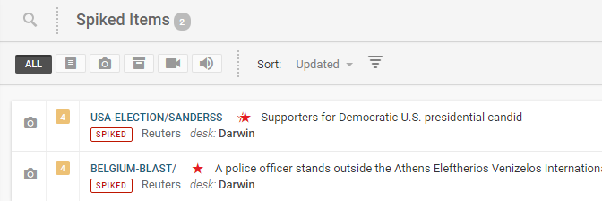

This manual covers the Superdesk core, and the optional Planning module. Superdesk can also be integrated with Superdesk Publisher. Superdesk Publisher delivers multimedia content through a variety of channels and it provides content management and monitoring from a single point of editorial control. Superdesk Publisher is not covered in this manual.

Before jumping into the main content of the Superdesk manual, we suggest that you familiarise yourself with our terminology guide: [GLOSSARY OF TERMS](#superdesk---glossary-and-terminology-guide)

## The Basics

In Superdesk:

- All users can search and read all content in Superdesk, except for individual Personal Spaces (and deliberately hidden Stages/Desks).
- Users can edit content in Desks they are a member of.
- Users can perform only the actions allowed by their role.
- Desks can be configured with two or more Stages to manage how content flows on the Desk.
- All Desks, all Stages, and all user roles are configurable. (This means that your individual instance of Superdesk might vary from the examples presented in this documentation.)

## Superdesk Navigation

This section introduces the most important menus in Superdesk: The Desks menu, The Hamburger Menu and the Workspace Panel.

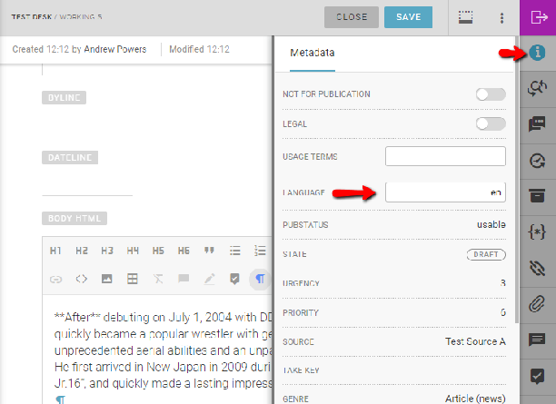

##### Desks Menu and Desk Switching

Desks are the way teams are organised within Superdesk. They can be similar to desks that would be found in a traditional newsroom; for example sports desks, foreign desks, editor’s desks, etc. Desks can be configured to contain different stages and assigned users.

The **Desks menu** is the blue drop-down menu found at the top of the Superdesk interface, to the right of the Hamburger Menu icon. It always displays the name of the desk you are currently working on. Users can only view and edit articles on the desks to which they are assigned.

When you switch Desks using the Desks menu, the Dashboard tab, Monitoring tab, Highlights, and Spike will reflect the Desk that you have navigated to. The Search feature, on the other hand is Desk-independent. If you want to search only your current Desk, you can either use the Advanced Search features, or you can search keywords using the search bar at the top of the Monitoring pane. (All of the icons in the Workspace Panel are described in detail in this chapter.) The configuration of each Desk is controlled by the Desk administrator. They control which Widgets you see on the Dashboard and what appears in the Monitoring pane. Any changes made to the Desk Dashboard and Monitoring pane configuration will be visible to all users on that Desk.

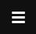

Each user also has an option to create a private Custom Workspace within the Desks menu. In this menu, desks are in blue and Custom Workspaces are in purple.

Custom Workspaces are useful for working with multiple desks at one time. Upon creating a Custom Workspace, users can set up their own personal configuration for monitoring any number of desks, stages and saved searches. These can be displayed in their Custom Workspace Monitoring view or on their Custom Workspace Dashboard.

If you are assigned to more than one desk, you might be assigned a default desk in your user profile. This will affect which desk you are directed to when you log in. Depending on how your Superdesk is configured, logging into the system will take you to either your private workspace, to your most recently used Desk, or to whichever Desk is assigned as your default desk in your profile settings. Be sure to check which Desk you are directed to when you log in.

In the Monitoring tab, Desks are divided into Stages, which are areas set up to receive content, to organise it in workflow (for sub-editing, revision etc), and to display the desk’s incoming and output content.

##### Hamburger Menu

The Hamburger Menu, in the top-left corner of the Superdesk interface, allows users with appropriate permissions to access the master settings for all the desks, users and news sources.

  This is the Hamburger Menu icon.

Depending on your permissions, you will see different items in the Hamburger Menu. Below is an example of a typical items that you will see in a Hamburger Menu.

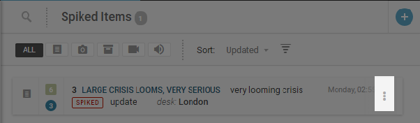

Clicking on the **Hamburger Menu** icon will open a new menu panel on the left of the Superdesk interface. This Hamburger Menu is also where you can access master desk settings, Ingest Sources, Dictionaries, Publishing Queue, etc. Each item in the Hamburger Menu is explained in detail in subsequent parts of this manual.
In general, most of the tools in the Hamburger Menu will be accessible only to users with administrative privileges.

To exit the Hamburger Menu, click on the *Workspace* link at the top of the menu, or click on any of the icons in the Workspace Panel to the right of the Hamburger Menu.

##### Workspace Panel

Below the Hamburger Menu icon is the Workspace Panel which allows you to navigate within the currently selected desk (as denoted by the title displayed on the Desks menu). You will see a column of various blue and white icons:

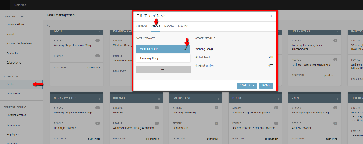 **Dashboard** \- The Dashboard provides an overview of the current desk (or Custom Workspace) through widgets selected by the desk manager: monitoring, activity stream, ingest stats, world clocks, routing etc.

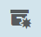 **Monitoring** \- This is the main tab for item creation and workflow monitoring. It can be configured by a desk manager to show any number of Stages for the selected desk as well as Saved Searches, with a desk-specific search available at the top. New news items can be created using the Create icon in the top right corner of this panel.

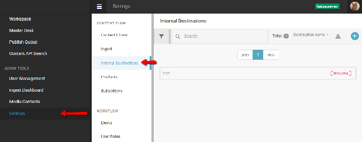 **Assignments** \- If the Supedesk Planning Component is installed, you may see this icon in your Workspace Panel. Track your assigned tasks here.

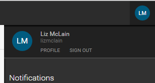 **Highlights** \- Highlights are most commonly used for content indexes, top-10 lists, section highlights and all manner of user-curated lists. Highlights can also be generated automatically against user-defined metadata, manually curated or scheduled for publication/distribution. Highlight lists can be easily turned into a Package. All users can view the Highlight list, but only users with appropriate permissions may add news items to a Highlight list.

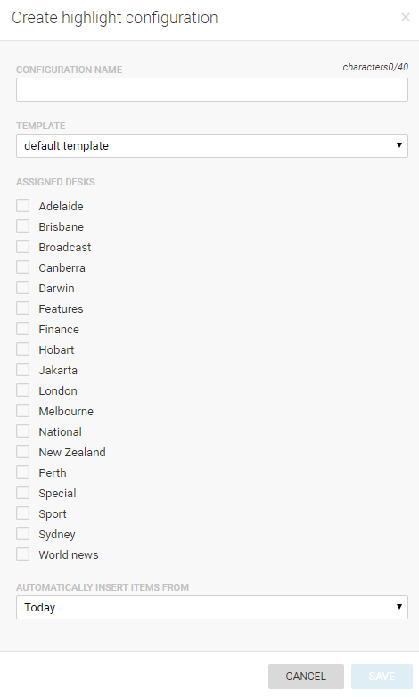 **Spike** \- Shows news items that have been removed from the workflow of the selected desk. Spiked news items can be returned to the desk workflow if necessary. News items that expire are not sent to the Spike, but rather deleted permanently.

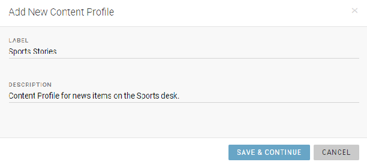 **Personal Space** \- Private space for creating items that cannot be viewed by other users. Items created here can be sent to other desks when they are ready to be reviewed by your peers. Items in personal space cannot be seen by your fellow desk members, desk managers, or desk admins, and your content is invisible to any Superdesk search. Do not leave content here that is needed in workflow/production. Your Personal Space can also be accessed from the Hamburger menu.

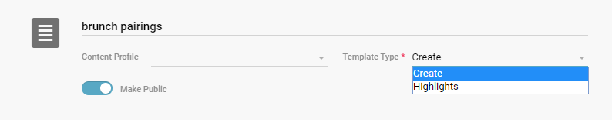 **Search** \- Allows you to search and browse articles in Superdesk’s internal repository,   third-party content feeds (or any other content repository Superdesk is aware of). You can also create Saved Searches from this tab.

## Superdesk behaviours and icons

###### User icon

In the top-right section of the Superdesk interface you’ll find your user icon.

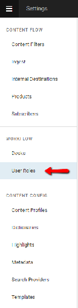

By default, your user icon will show a blue circle with your initials, but this can be changed to an avatar of your choosing in your profile settings. Clicking on your user icon gives you the option to log out of Superdesk, or to edit your user profile.

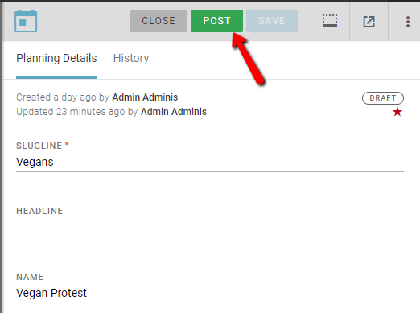

Click Profile, under your username to change your profile picture, input contact information, set personal preferences and change your Superdesk login password. To close the User panel, click on your user icon a second time.

###### Create icon

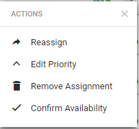This is the Create icon.

In the Superdesk main interface, you will find the blue Create icon. It will usually be in the top-right below your user icon. The function of the Create icon will vary depending on which panel you have navigated to.

On your Dashboard, the Create icon will allow you to add widgets to your desk or Custom Workspace Dashboard.

In the Monitoring tab, the Create icon allows you to make new articles, new packages, or to upload items from your personal computer to Superdesk. As of Superdesk v1.33, the option to create items is available in the bottom right corner of the Superdesk interface, regardless of which pane you are in (excluding the planning component).

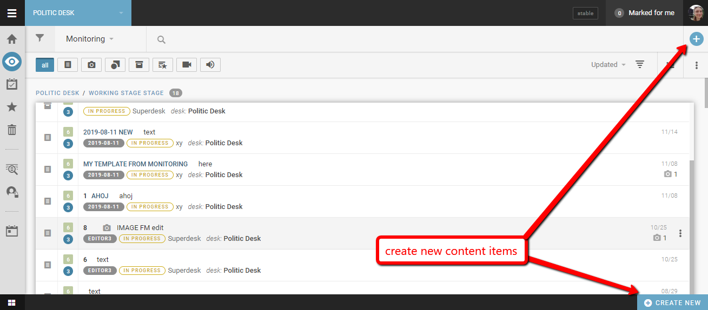

You will also sometimes find the Create icon in the various parts of the Hamburger Menu, where the uses may vary. In general, the use of the Create icon is context-dependent.

###### Action menus

You will find action menus in various parts of Superdesk. Below is an example of an action menu in the Monitoring view. In the Monitoring pane, the action menu will appear when you mouse-over any of the news items in the pane.

In the Monitoring view, clicking on an action menu to an item’s right will bring up a list of actions that you can affect on it. The actions available will depend on your role, permissions, and whether the item is already opened by other users.

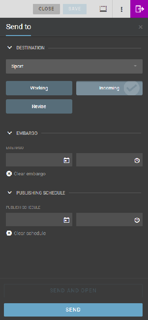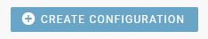 These are action menus.

You will also find action menus in other various locations throughout the Superdesk interface, for example, in the Content Profile settings, master desk settings, etc. The actions available in each action menu will be context dependent.

###### Basic controls in the Monitoring view

The Monitoring view is where most of your news items are created or edited. Clicking on a news item *once*, will open a preview of the article on the right. *Double-clicking* on an article in the Monitoring view will open the article for editing in a pane on the right. New content items can be created using the Create icon in the top right corner of the pane.

You can filter the Monitoring pane to show specific stages using the drop-down menu at the top of the pane:

The list view in the Monitoring pane can be hidden using the the chevrons that appear as you mouse over the Workspace Panel when an item is open for editing. This allows users to have news items that are open for editing front and center in the user’s focus.

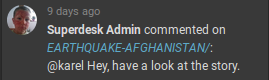

Similarly, the list view can be expanded again by clicking the chevron to return the list to its original position. This action can only be used when news items are open for editing.

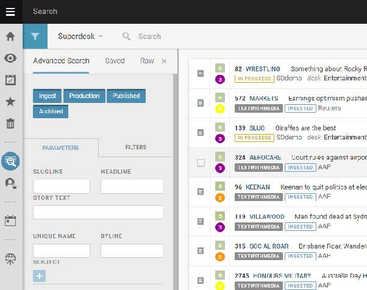

###### Workspace Bar

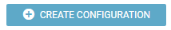

At the bottom of the Superdesk interface you’ll find your Workspace Bar where you can navigate between items you’re currently working on. An item will remain open until you close it. If you navigate away from the article that you are editing (without closing it) it will automatically minimise to the Workspace Bar and it will be locked to other users.

###### Locked Items

Items that are opened by one user become locked from other users until they are closed, or unlocked by a desk manager. Locked articles cannot be opened or edited by other users unless they are manually unlocked by a person with “unlock” permissions; this would usually be a senior producer or similar. The article’s locked status is denoted by a vertical red stripe that appears beside it in the monitoring pane.

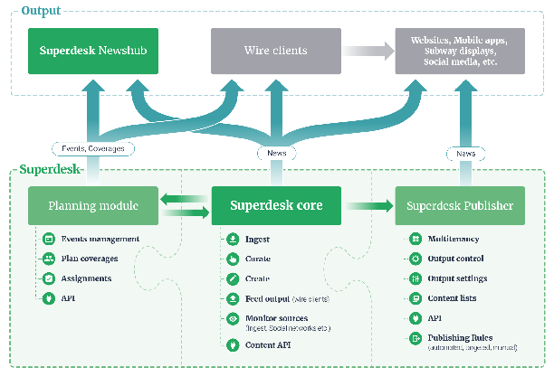

However, even if an article is locked, the article preview is available for other users to see, even if the option to edit the article is not.

In the screenshot below, a user is working on an item in the right-hand panel. Notice in the list view on the left that the item is marked on its left border with a red line. This is the lock indicator in that view.

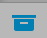

But another user looking at this item while it is being edited will also see a lock notice at the top of the item in preview:

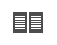

The lock notice also says who has the document open for editing, whether they are actually actively editing or not.

If another user clicks the action menu against the item, there are options to “open”, but not to edit:

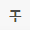

If we choose to open the item from the action menu, we’ll see it in a larger panel, but it will not be editable. Also, in the grey strip at the top of the item, the avatar of the user with the item open for editing (the user with the lock) will be on the left, displaying a red badge.

A user with sufficient privileges can unlock the item by clicking on the avatar of the user with the lock; this will trigger a little window with an unlock button:

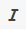

The usurped user will be informed via a pop-up message that the item has been unlocked:

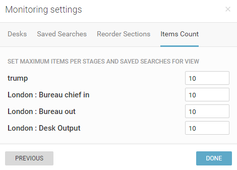

When a Superdesk user opens a news item for editing, that article is locked to any other users until the item is closed. However, the article preview is available for other users to see.

Here is a user working on an item in the right-hand pane. Notice in the list view on the left that the item is marked on its left border with a red line. This is the lock indicator in that view.

But another user looking at this item while it is being edited will also see a lock notice at the top of the item in preview:

The lock notice at the top of the article preview also denotes which user is currently editing the document \- or who has the document open for editing, whether they are actually actively editing or not.

When an article is locked, if another user clicks the action menu against the item, there are options to “open”, but not to edit:

If we choose to open the item from that action menu, we’ll see it in a panel on the right, but it will not be editable. Also, in the grey strip at the top of the item, the avatar of the user with the item open for editing (the user with the lock) will be on the left, displaying a red badge.

A user with sufficient privileges can unlock the item by clicking on the avatar of the user with the lock; this will trigger a little window with an unlock button:

The usurped user will be informed via a pop-up message that the item has been unlocked:

