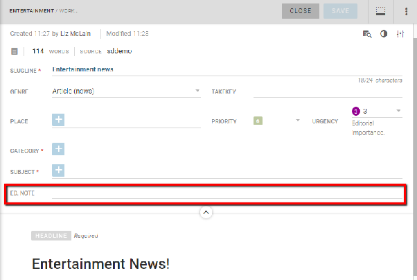
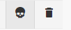
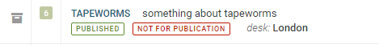
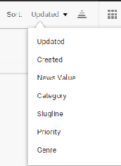
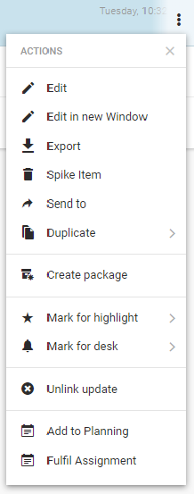
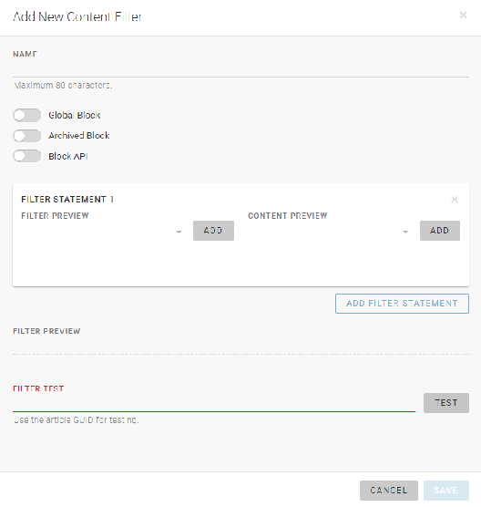
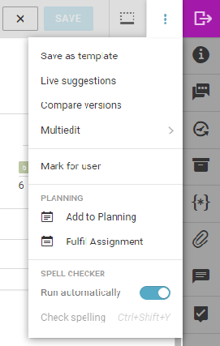
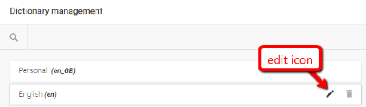
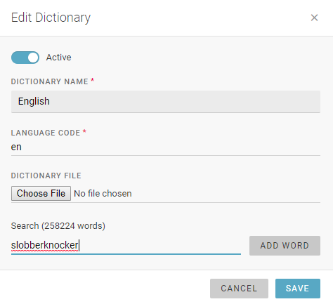

# Desks and Custom Workspaces

Desks are the basic organisational units in Superdesk. Desks are like the departments that you might find in a traditional newsroom. Desks could be separated by topic, function, media type or seniority, etc. Desks are configurable and customizable to suit the needs of your organization.

All users are assigned to a Desk. Some users may be assigned to multiple Desks. News items that users create, fetch, edit, spike or publish become associated with their current Desk. Users may be assigned to more than one desk at a time.

The Desks menu is beside the Hamburger Menu in the top-left corner of the Superdesk interface. It always displays the name of the desk or workspace that you’re currently working on.

Clicking on the Desks menu will show a list of desks that you currently belong to, as well as your Custom Workspaces. Desks you belong to are displayed in blue and Custom Workspaces are displayed in purple. It’s possible to have more than one Custom Workspace. Multiple Custom Workspaces are especially useful if you’re working on more than one desk or project at the same time.

Some news items arrive at a desk after they have been selected by a user from an external source in the Search tab. Many of the news items in the Search tab may have been authored by outside sources (such as news agencies). The process of moving an article from the Search tab to a desk is called **fetching**. It is not possible to fetch articles from external sources to your Custom Workspace. You can only fetch articles to a Desk. It is possible that the same news item could be fetched to multiple desks.

This is the Dashboard icon from the Workspace panel.

Users working on the same desk will see the same widget configuration on their desk Dashboard. Only administrators can add or change widgets on a Desk Dashboard.
Custom Workspaces also have Dashboards. If a user would like custom widgets, they can set them up using their Custom Workspace Dashboard.

This is the Personal Space icon found on the Workspace Panel.

Personal Space is a place where journalists can create items in full privacy. Articles that are created in your Personal Space tab are not visible to anyone but you, and will not show up in Global Searches. They will not be visible to anyone else until you choose to send them to a Desk. Your Personal Space can also be accessed from the Hamburger menu.

This is an Action menu icon.

You will find Action menus in various locations throughout the Superdesk interface.

When you hover over an item that you saved either in your Personal Space or on a Desk, an Action menu icon will appear on the right. Click on the Action menu to perform actions such as editing, copying and spiking.

This is the Spike tab in the Workspace Panel.

When you spike an item from your Personal Space, it will not show up in the spiked items section and it cannot be recovered.
When you spike a news item from a desk, it will show up in the Spiked items tab associated with that desk. The Spike tab is equivalent to a trash bin or recycle bin on your operating system of choice. Spiking can be reversed and news items can be restored to the workflow at any time.
If your Desk has a content expiry, and the news item reaches the expiry limit, it will be deleted permanently if it remains on the Desk past the expiry deadline.

You will find the *Send To* icon in the top right corner of items that are open for editing.

To send an article from your Personal Space to a Desk, click *Edit* in the Action menu, then in the article window, click the purple *Send To* button. It’s possible to send news items that you have created in your Personal Space to Desks that you are not a member of, but if you do, you will not be able to access the article when it is on a Desk that you are not a member of.

When you are editing articles, if you do not click the *Close* button but navigate away from the article, it will automatically minimise at the bottom of the Superdesk interface in the Workspace Bar. Minimised articles remain locked from other users until they are closed (either by the current user, or manually unlocked by a desk manager).

This is the Open Items icon.

You can view all your currently open items in a grid-view by clicking on the Open Items icon in the Workspace Bar at bottom left of the Superdesk interface.

Clicking on the *Open Items* icon will navigate you to a new window showing all your open articles. Clicking on one of the articles will take you back to the main Workspace and open the article that you’ve selected. You can exit the *Open Items* view by clicking on the *X* in the top right corner of the main window.
