# Dashboards and Widgets

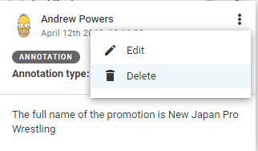

You will find your Dashboard icon on your Workspace Panel.

The Dashboards for shared Desks are pre-configured by administrators (or other users with the required privileges, such as bureau chiefs, desk heads, etc). The Dashboard is designed to give a quick overview of information that matters for the respective desk’s members. Users are able to configure the Dashboards in their Custom Workspaces. You can return to your Dashboard by clicking the home-shaped icon in the Workspace Panel, on the left.

You can only view the Dashboards for Desks to which you are assigned. Every user can also  have a Custom Workspace which is only accessible to them, on which they can have customized widgets to suit their needs, for example monitoring several different Desks in one place. Standard Dashboard widgets are explained in detail in this section of the Superdesk manual. Your Superdesk instance might also have custom widgets.

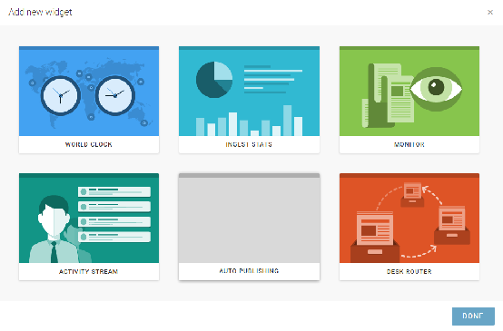

Beside the Hamburger Menu, you’ll see the blue drop-down Desks menu. It will display the name of the desk you’re currently working on. Click on the desk name and you’ll be able to view all desks you’re assigned to. Desks can be configured by editors/managers to have different Dashboard setups depending on the needs of your team.

Changes that are made to a Dashboard on a Desk will be visible to all users assigned to that Desk. Widgets on the Dashboard of your Custom Workspace are visible only to you.

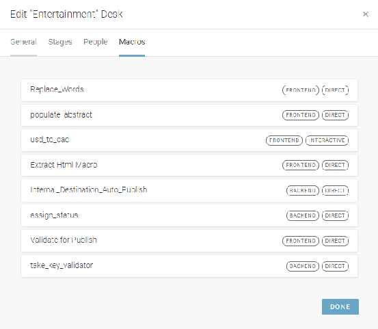

This is the Create icon.

When you are on a Dashboard, you will see the Create icon in the top right corner of the Dashboard pane, just below your user icon.

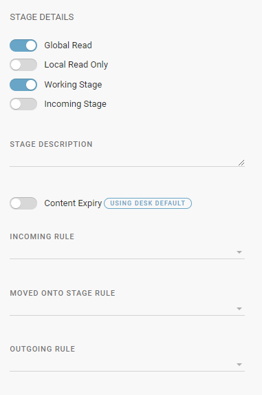

If you have the appropriate privileges, you can customise the widgets on your Desk Dashboard by clicking the Create icon at the top-right section of the pane. When you click the Create icon, a new window with widget options will open. Select the widget that you would like to add to your Dashboard, then click *add this widget.* Once you’ve selected the widget you would like to add, click the *Insert this Widget* button to place the widget on your Dashboard. You can add multiple displays of the same type of widget to any Dashboard.

You can arrange the widgets on your Dashboard in any configuration you like.

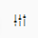

This is the Rearrange Widgets icon.

Click the *Rearrange Widgets* button at the top-right corner of the main interface, then select and drag a widget to the desired area of your Dashboard to place it.

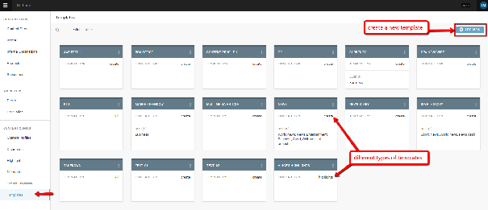

The *Rearrange Widgets* button also allows you to delete widgets that you have inserted. To delete a widget, click *Rearrange Widgets* and you’ll see an x appear in the top-right corner of each widget. Click the ‘x’ on each widget you’d like to delete.

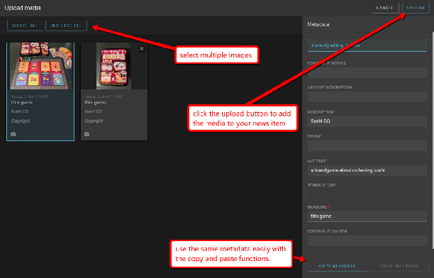

You can also resize widgets by clicking the grey arrows that appear at the edges of each widget when you hover over them.

Click and drag the body of the widget to move it to a different spot on the Dashboard. The widgets will fill the space as efficiently as possible. If there is a gap above one of the widgets, it will automatically move up to fill the space.

Each widget also has several settings associated with it. Click the gear icon in the top-right corner of a widget to adjust the individual settings for that widget.

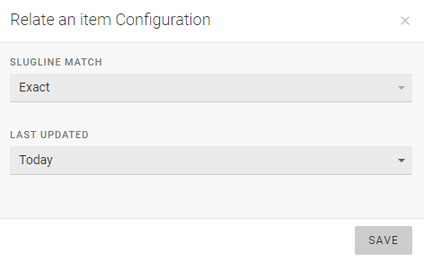

When you are satisfied with the size and layout of your widgets, click the blue checkmark in the top-right of the Superdesk interface to keep these changes.

#### World Clock Widget Settings

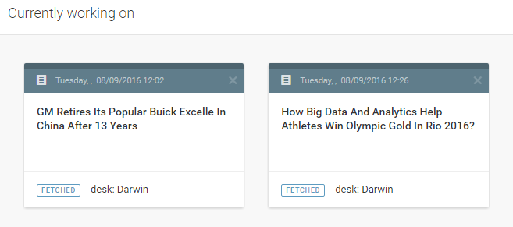

To add a World Clock Widget, click the Create icon in the top right corner of the Dashboard pane, then select the World Clock option. Click the ADD THIS WIDGET button to confirm your choice.

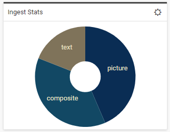

The World Clock widget has customisable clocks for all time zones. Click the gear icon in the top-right corner of the widget to open the World Clock Configuration window.

The *Your Clock* tab in the World Clock Configuration Window displays the clocks that are currently used in your World Clock widget.

To remove a clock from the widget, click the *x* beside the clock name.
To add different clocks, click on the *Available Clocks* tab and scroll through the time zones. When you click on a time zone, it will automatically add itself to the *Your Clock* tab. If you set more than three clocks, you will have to adjust the size of your widget to display them all at the same time. In the World Clock Configuration window, you can switch between digital and analog displays under the Your Clock tab. When you are satisfied with the clocks you have chosen, click the *Save* button at the bottom of the window.

####

#### Monitoring Widget Settings

The Monitoring widget allows for an overview of the Desk and its Stages. Stages are the way in which content items are sorted and tracked within a Desk. For example, the Stages of a Desk might include an input Stage (destination for articles created in or fetched to a Desk), a working Stage (articles in progress), an editing Stage, or an output Stage (items ready to be published). Monitoring widgets can also be set up to show *Saved Searches*. Note that the general Stages of a Desk can be created and edited by users with the appropriate privileges in *Hamburger menu \> Settings \> Desks*. To add a Monitor Widget to your Dashboard, click the Create icon in the top right corner of the Dashboard pane:

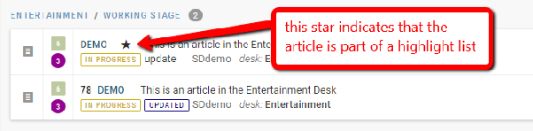

To adjust the Monitoring widget settings, click the gear icon in the top-right corner of the monitoring widget. Because you can have several Monitoring widgets on the same desk at the same time, the first text box in the Monitoring settings window gives you the option to rename your Monitoring widget.

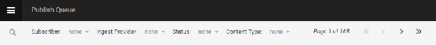

In the Monitoring settings window, under the Desks tab, you can select the Stages that you wish to view in your Monitoring widget. You can only select the Stages in Monitoring Settings associated with the current desk. (The only exception to this occurs if a Stage is marked for Global Read by an administrator in the *Hamburger Menu \> Settings \> Desks*, in the Stage options. Stages that are marked for Global Read can be added to any Monitoring window in any Desk.) If a Stage is currently empty, the Monitoring widget will not show any information from that Stage.

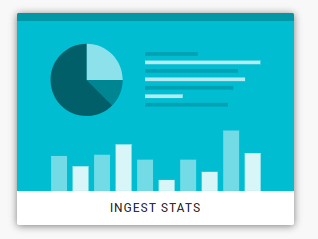

In addition to Stages, Monitoring widgets can also be set up to display *Saved Searches*. Searches can be saved from the Search icon in the Workspace Panel. To select which searches you’d like displayed in your Monitoring widget, click the *Saved Searches* tab in the Monitoring Settings window. Here you will see a list of *Saved Searches*. To add one to your Monitoring widget, toggle the switch beside the *Saved Search* to the blue *on* position. Only searches that are marked for Global Read will show up as options here.

When you are creating a *Saved Search* in the Search tab, and you want to use it in your Monitoring widget, make sure that you toggle the Global Read to the *on* position before you click *Save*.

You can arrange Stages and Saved Searches under the *Reorder Sections* tab of the Monitor settings window. Drag and drop the order of the Searches and Stages to arrange the order that suits your needs.

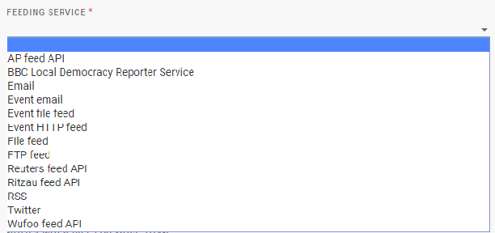

The Items Count tab in the Monitor Settings window allows you to set how many items appear in each section of the Monitoring widget. You can adjust the number of items by typing them into the text box or by clicking the up and down arrows that appear when you hover over the text box. Once you are satisfied with your Monitoring settings, click the *DONE* button at the bottom of the Monitoring Settings window.

#### Ingest Stats Widget Settings

The Ingest widget allows you to track information about the types of news items that are being ingested into your Superdesk interface. Clicking on the gear icon in the top right corner of the Ingest widget will allow you to change what information is displayed in your Ingest widget.

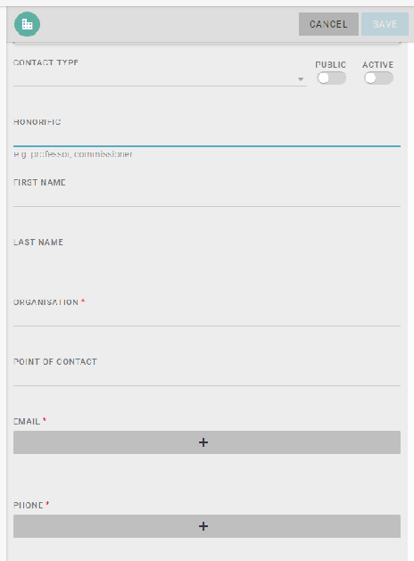

To add an Ingest Stats Widget to your Dashboard, click the Create icon in the top right corner of the Dashboard pane, then select the Ingest Stats option, and click ADD THIS WIDGET.

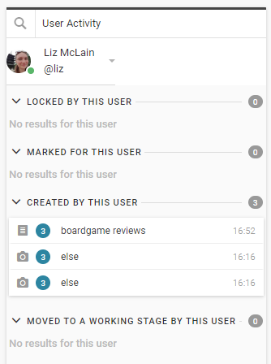

In the Ingest Stats Configuration window, select a source type from the first drop-down menu:

**Source stats** \- What is the distribution of sources among the ingested articles?
**Urgency stats** \- What is the urgency distribution among ingested articles?
**Item type stats** \- What is the distribution of item types among ingested articles?

In the second drop-down menu on the Ingest Stats Configuration window allows you to choose a colour scheme for your Ingest Stats graph. The choice of colour is purely cosmetic.

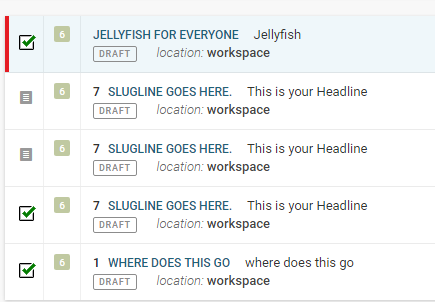

Once you have adjusted your Ingest widget settings to your liking, click the *SAVE* button.

The information on the Ingest Widget is presented as a graph. In the source example above, you can see that the majority of the ingested articles are coming from Forbes.

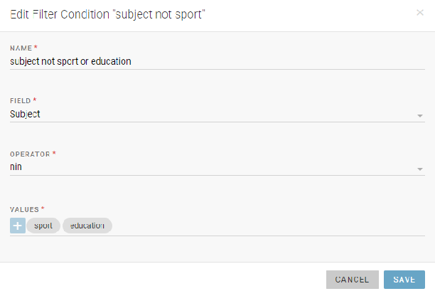

If all of the items are from the same source, urgency or item type, you will only see one colour on your graph. In the item type example above, you can see text, picture and composite items have been ingested.

#### Activity Stream Widget Settings

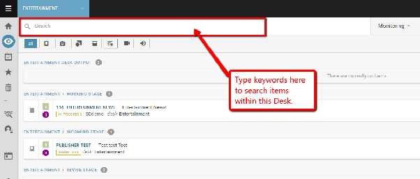

To add an Activity Stream Widget to your Dashboard, click the Create icon in the top right corner of the Dashboard pane, then select the Activity Stream option, and click ADD THIS WIDGET.

The Activity Stream widget allows you to stay up-to-date on progress being made on all Stages, from all users across Superdesk. The displayed Activity Stream is the same, regardless of which desk the widget is on.

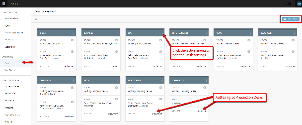

By clicking the gear icon in the top-right corner of the Activity Stream widget, you can adjust the number of items that appear in your widget. In the Activity Stream Configuration window, select the number of items you wish to see, then click the *SAVE* button.

#### User Activity Widget

This widget is used to display the actions of a single user. The User Activity widget tracks four different activity criteria:

1) Items are currently **locked** by that user.
2) Items **marked** for that user.
3) Items that have been **created** by that user.
4) Items that have been **moved** to a working stage by that user.

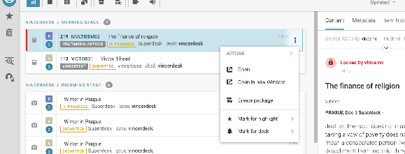

To add a User Activity Widget to your Dashboard, click the Create icon in the top right corner of the Dashboard pane, then select the User Activity option, and then click ADD THIS WIDGET.

Once the widget has been created on the Dashboard, you will need to select a user to monitor using the drop-down menu at the top left of the widget.

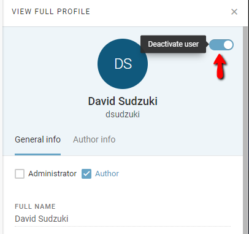

Only users who are members of the Desk are shown in the drop-down menu.

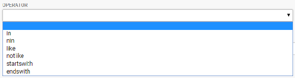

In the example of a User Activity Widget, shown above, the only activity that the above user has done is create a new item, and attach photos to it. Each uploaded photo appears as a separate entry in this case.

#### Desk Routing and Other Widgets

Your Superdesk instance may contain widgets other than those already described in this chapter. You can read about the [Desk Routing widget](#desk-routing) in a subsequent chapter because of its more complex nature. For information about further widgets, please consult the documentation for your specific Superdesk instance.
