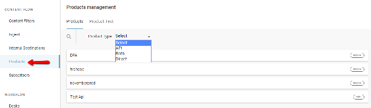
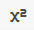
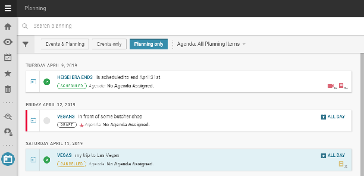
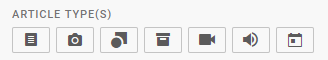
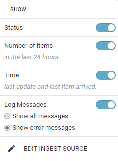
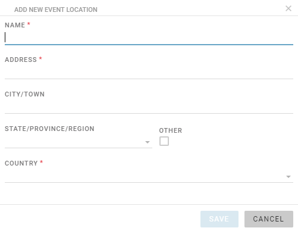
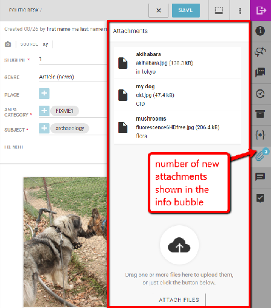
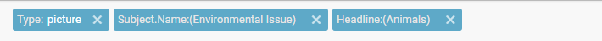

# Monitoring Tab

This is the Monitoring icon on the Workspace Panel.

The Monitoring View is the main workspace for production-side journalists. The content presented in the Monitoring View is controlled from the Hamburger Menu. The idea is to present an overview of the content in each stage of the Desk’s workflow. The Monitoring pane will display the same information to every user on the same Desk. Stages and Saved Searches for the Monitoring pane can be configured by users with the correct permissions from the Desk section of the Hamburger Menu.

This is the Create icon.

New news articles can be created, previewed and edited from the Monitoring pane. To create a new news item, click the Create icon in the top right corner of the Monitoring pane. (As of Superdesk version 1.33, users can now also create new content items from any pane using the new Create icon in the bottom of the Superdesk interface on any pane, not just the Monitoring pane).

Each user may configure personal Monitoring Views in their Custom Workspaces. A custom Monitoring view can show stages from any Desks the user has permission to see, and views of news items available in Superdesk, including those arriving in ingest feeds matching user-created Saved Searches, however, the Monitoring pane on Desks is set by the desk manager.
The Monitoring Tab in a Custom Workspace enables users whose duties require them to monitor content and activity in more than one desk to do so in a single view, rather than having to switch between the standard views set for each Desk.

The Monitoring View will usually be broken up into Desk Stages. Stages are the way in which content is sorted within a Desk. Stages are set by the administrator in the Hamburger Menu Desk settings and could vary from desk to desk. Stages could be set to include an input stage, an output stage and a stage for published work, for example. Depending on how your Monitoring has been configured in the Settings menu, you might also see Saved Searches in your Monitoring window.

The Monitoring window has a search feature at the top to help you quickly locate content within your selected desk. You can type keywords from headlines, sluglines or body text into the text box that appears when you click on the search icon, or you can use the filter buttons located just below the search icon.

The buttons allow you to filter for a specific type of news item. By default the ALL button is selected which means every item is shown. Beside the ALL button from left to right, the buttons let you filter for articles that are just text, photos, graphics, packages (or items that contain both text and images, highlight packages, just videos, or just sound files).

This is the Create icon.

In the top-right of the Monitoring interface, you can use the Create icon to make new articles, packages or to upload media from your computer into Superdesk. (See the [Creating New Articles](#making-new-articles) section in the Superdesk manual.)

As of Superdesk version 1.33, the Monitoring pane now features an Advanced Search icon, which allows users to filter content by the content profile used in the item creation, as shown below:

This new feature allows users to browse and find the content they need in a much easier way. It is especially important for newsrooms that make use of multiple content profiles when creating content. New filters added to the Monitoring view in future versions will also be placed in the same widget.

As of Superdesk version 1.33, the Monitoring pane also contains a ‘Marked for Me’ button in the right corner. Clicking on this ‘Marked for Me’ button allows you to view items in that Desk that have been tagged for you.

If your Monitoring view is set up to show Saved Searches, items in your Saved Search that have been fetched to your desk will be highlighted in light blue with a check mark.

