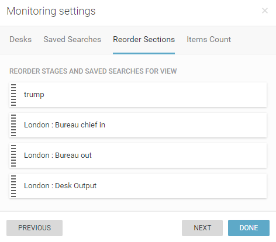
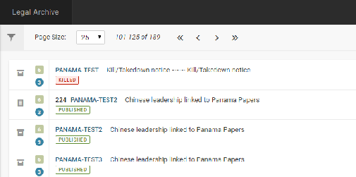
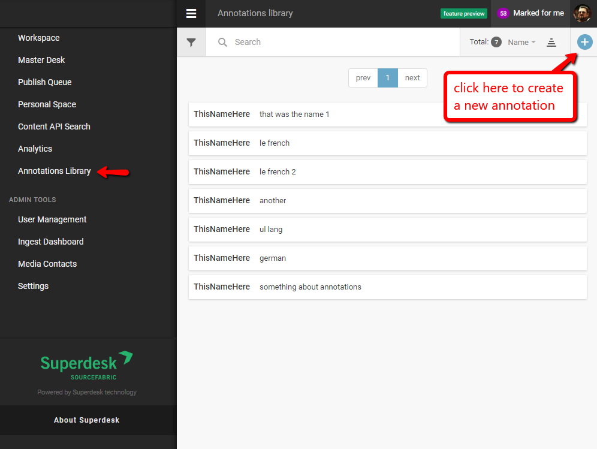
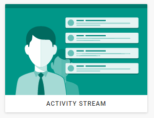
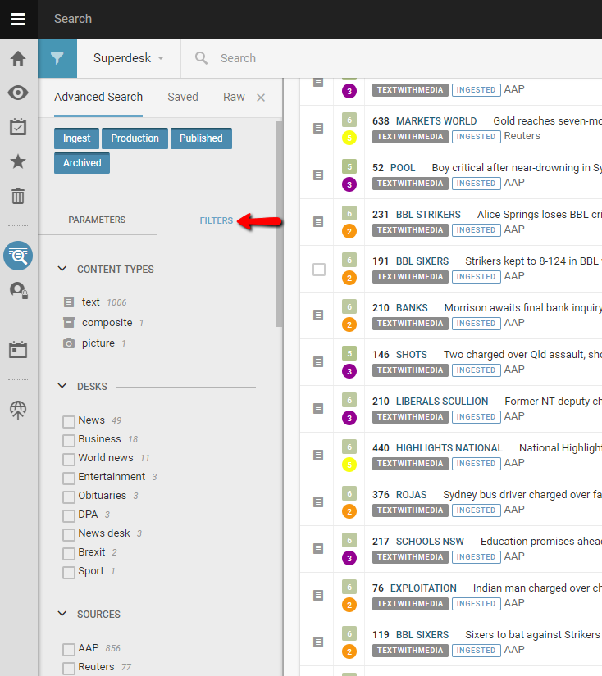
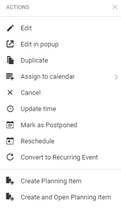
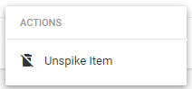
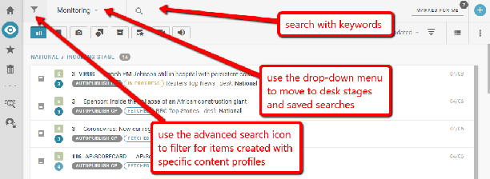

# Searching Content in Superdesk

## Searching Content in the Search Tab

Superdesk has a convenient built-in search function for finding news items. The Search function is also how you can view all the newly ingested articles, photos, videos and content packages. Each desk has a desk-specific search located in the monitoring pane. If you would like to search the entire content of Superdesk, click the Search tab located on the Workspace Panel.

This is the Search icon on the Workspace Panel.

Clicking the Search icon in the Workspace Panel enables you to browse all the news items. You can browse all types of items using the Search feature. This includes published, killed, ingested or archived items.

You can perform a search by typing in keywords related to the article you’re looking for in the text box beside the search icon.

If you type multiple words, Superdesk will search for items containing all of those words simultaneously. In the example above, we are searching for an article that contains both ‘giraffes’ and ‘IWGP’.

This is the Advanced Search icon.

You can apply additional filters and parameters to your search by clicking on the Advanced Search icon. Inside the Advanced Search menu, you will find several ways to refine your search.

You can define the Stage of the content item you’re looking for: ingested, production, published or archived. You can choose multiple selections for a single search. When the buttons turn white, articles in those states will not be included in your search. To search only for newly ingested articles, for example, leave only the *Ingest* button in blue.

Below the production stage buttons there are two tabs, one for parameters, and one for filters.

Parameters:

- **Slugline**: Input a slugline associated with the news item. This will only search words in the slugline field.

- **Headline**: Search by article title. You may enter either a full article title, consecutive or non-consecutive words.

- **Story text**: Search for words within the main body of the text. You may enter either consecutive or non-consecutive words. Enter three words for the most accurate search.

- **Unique Name**: Search by article uniqueID. You can view the article's unique name at the bottom of an article’s Metadata tab using the Info button in the Editor Sidebar. By default, an article’s unique name is a unique number identifier, but the unique name can be edited. Enter the unique name exactly as it appears in the info tab.

- **Byline**: Search by author’s full name (must be written exactly as it appears in the author's profile).

- **Subject**: Click the blue \+ button and select from a number of subjects that pop up in the Subject window (i.e. sports, politics or weather).

- **From desk**: Select desk of origin from a drop-down list.

- **To desk**: Select a Desk from the drop-down list to search for articles sent to the selected desk.

- **Creator**: Select article originator from a drop-down list of all users in your instance of Superdesk.

- **Marked Desks**: Desks can be marked, either manually, or through the use of the Desk Routing widget. If you are using the Desk Routing widget, you will need to use this Marked Desks parameter to create a Saved Search to monitor the results of the Desk Routing. A bell icon will appear next to items that have been marked.

- **Spiked Content**: Choose whether to include spiked content, exclude spiked content, or search only spiked content in this query.

- **Provider**: Select source from which the item was ingested. There is a drop-down menu of current ingest sources to choose from.

Once you have input all the applicable information into the search parameters, you can click the *Search* button to run the search.

To the right of the Parameters tab, you will also see a Filters tab. This can help you further refine your search:

For content types filters, you can search for articles containing just pictures, just text, or both by clicking on *composite*. You could also search for audio or video files.

Advanced search filters include: Content types, Desk, Ingest Source, News Category, Genre, Urgency, Priority and Flags. In the Desks section, you can further refine your search by checking off the boxes beside particular desks, to make your search desk-specific.

          

The final filter is by date. You can set a date range to search for articles created or modified between particular time periods by clicking on the calendar icons and inputting specific dates, or by selecting the pre-made buttons for *LAST 24 HOURS, LAST 7 DAYS* or *LAST 30 DAYS*.

If you find yourself searching the same parameters over and over again, you can choose to save the search using the *SAVE SEARCH* button. In addition to saving the parameters in the Advanced Search menu, it also makes the search available for use in the Monitoring widgets on your Desk Dashboard.

When you have input your search information, blue boxes will appear at the top of the results window. If you’re searching for multiple parameters at the same time, you will see multiple blue boxes. You can remove a parameter and widen your search by clicking on the *x* in the blue box to remove the filter.

         

In the top-right section of the search results window, you have the option to rearrange your search results. The drop-down sort menu allows you to arrange by most recent, date created, news value, category, alphabetically by slugline, priority, or alphabetically by genre. Clicking on the reverse pyramid beside the sorting options will allow you to view your results in reverse order.

By default, the search results appear in a list view. You can switch to a grid-view by clicking on the grid icon in the top-right corner. The grid view is especially useful for viewing news items with images because it allows space for thumbnail views of the pictures.

##   **Searching Content on your Desk**

You can easily search content on your current Desk by using the search textbox at the top of the Monitoring Pane. This will search all content in that Desk’s workflow. If you type multiple words, Superdesk will search for items containing all of those words simultaneously.

You can also similarly search content in a Desk’s Spike tab by using the search textbox at the top of that pane.

Use the drop-down menu at the top of the Monitoring pane to skip between the Stages and Saved Searches. The Advanced Search Icon can be used to filter for content that was created using a specific content profile.
