# Highlights

Highlights are collections of news items from a desk. Highlights are most commonly used for content indexes, top-10 lists, section features and all manner of user-curated lists. Highlights can be automatically generated against user-defined metadata, or manually curated. They can also easily be published as a unit using the bulk edit actions described in the following sections.

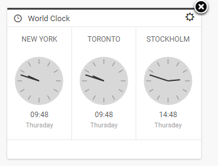

If you are unable to add articles to a Highlight, or create a new one, check with your Superdesk admin to verify your account has the correct privileges. New Highlights can only be created in the Hamburger menu.

You can view the Highlights for your desk by clicking on the star-shaped Highlights icon in the Workspace Panel. This will then prompt you to choose from a list of available highlights. In the example above, there’s only one highlight list available: Top Stories.

You can have several Highlights at a time to deliver relevant content organised by priority, topic or interest. Articles can be added to Highlights from various stages such as published articles, rough drafts, or simply items that have been recently fetched to a desk. Note that newly ingested articles must be first *fetched* to a Desk before they can be included in a Highlight.

### Adding articles to a Highlight List

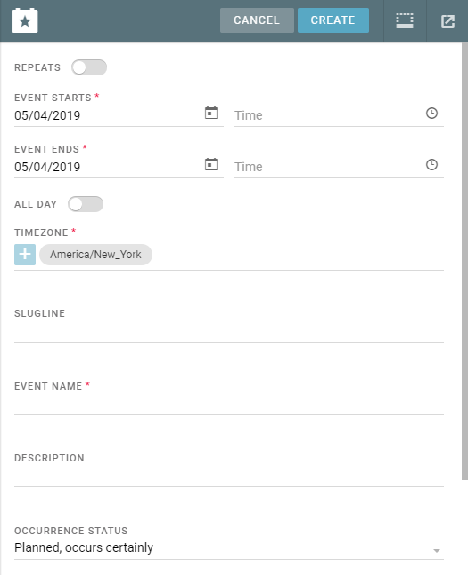

This is the Action Menu.

To add a news item to a Highlight List, find the article that you wish to add in either the Monitoring, Search or Content sections of the Workspace Panel. When you hover over the news item, the Action menu will appear.

When you find a news item you would like to add to a Highlight, hover over the article to display the Action Menu on the right. Hover over ‘*Mark for highlight’* and choose the Highlight to which you’d like to add the article. Note that Highlights can only be created (and curated) by users with the correct permissions in the Settings menu.

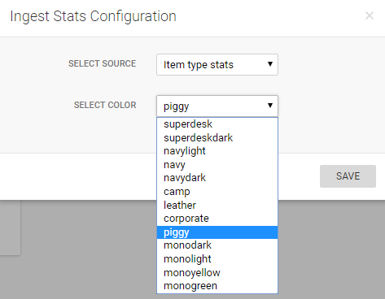

A single article can be part of multiple Highlights. A star will appear beside the article title to let you know that the article has been added to a Highlight list. If the article appears in more than one Highlight list, you will see a double star beside the article title.

####

### Actions for news items in Highlight Lists

As with the Monitoring list view, clicking on news items in the Highlights pane will prompt an action menu on the right. Users with appropriate permissions can perform actions, just as they would be able to do from the Monitoring view.

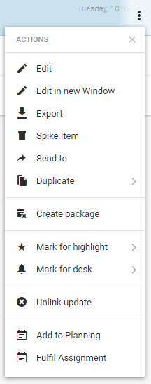

It’s also possible to select multiple items in the Highlights by using the icons on the left side of the entry as checkboxes.

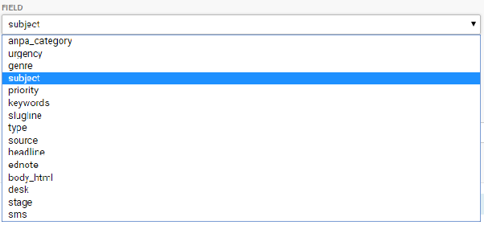

Once you have selected items using the checkboxes, you can click the icons that appear in the top right of the pane to perform actions such as export, multi-edit spike, sent to, publish, create packages and mark for user provided you have the permission to do so.

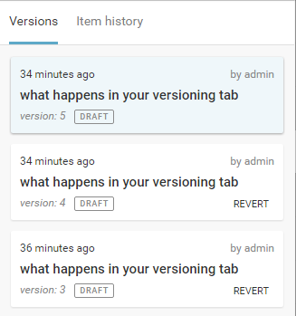

Export ‐ Download the news item to a Superdesk-external location.

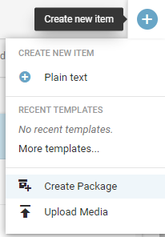

Multiedit ‐ Select items to open side-by-side for simultaneous editing.

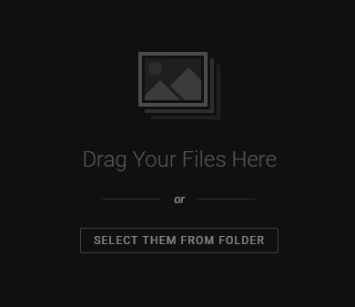

Spike ‐ Remove the selected item from the desk workflow.

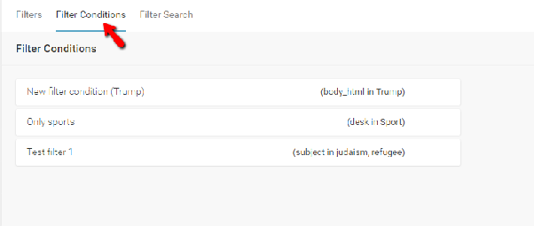

Send to ‐ Move the news item from its current stage to another desk or stage.

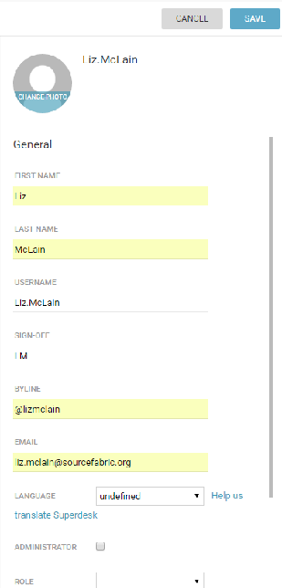

Publish ‐ Publish this item

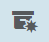

Create Package ‐ Combine the selected items into a new package.

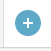

Highlight Item ‐ Add the selected item to a different Highlight.

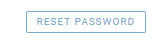

Mark for User ‐ The user will receive a notification to follow up on the selected item.

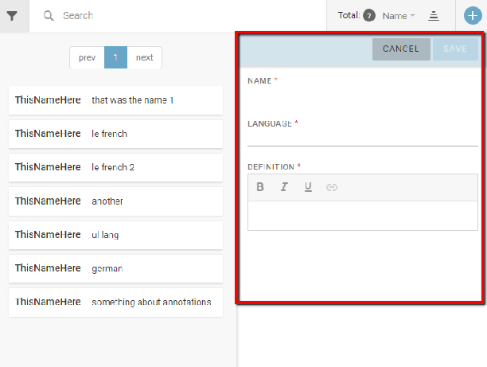

Duplicate ‐ Make a copy in the same location, or a different location.

### Creating a new Highlight Configuration in the Settings menu

New Highlights are created in the Hamburger Menu. Not all users will be able to make Highlights. To make a Highlight, select *Hamburger Menu \> Settings \> Highlights*.

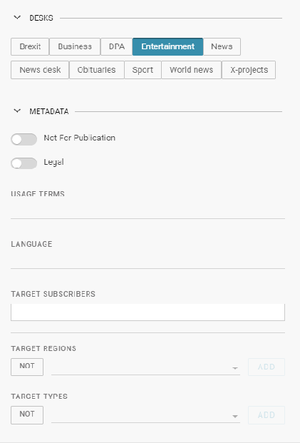

Click the CREATE CONFIGURATION icon in the top right corner of the pane. This will open a new window where you can set up your new Highlight settings.

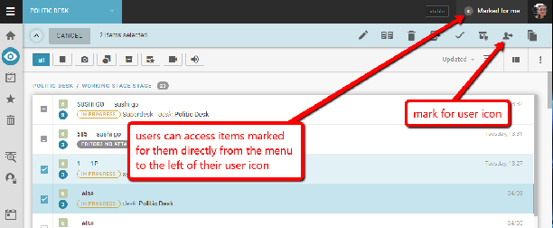

Name your Highlight. Select a Template. (This type of Template can be created in the *Hamburger Menu \> Settings \> Templates*). Choose Desks that have access to your new Highlight. Upon creation, you can have certain items automatically inserted into your Highlights using the drop-down menu at the bottom of the window.
