# Creating and Editing Content Items

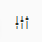

This is the Create icon.

On your Dashboard the Create icon allows you to add widgets. On the Monitoring tab, or in your Personal Space, the Create icon allows you to make new articles, new packages or upload audio, pictures, and video from your computer into Superdesk. On the Dashboard tab, the Create icon only allows you to add widgets to your Dashboard. In versions of Superdesk 1.33 and later, you will also find the option to create new content items using the new icon in the bottom right of the Superdesk interface.

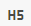

This upgrade allows you to create new content items in all panes, not just the Monitoring tab.

## Making New Articles

To start writing a news item, or to upload some media from an external source, click the Create icon in the top right corner of the Monitoring Pane, or Personal Space. In versions of Superdesk after 1.33, you will also find the option to create items in the bottom right corner of the interface, regardless of which pane you’re on. Clicking the Create icon in either of these locations will open a menu:

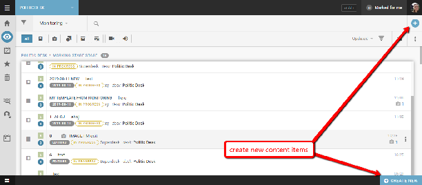

**CREATE NEW ITEM:**  Select which Content Profile you will use for your new item. In the example below, there is a content profile labelled ‘Plain Text’. The names of the Content Profiles will vary depending on your settings.

**RECENT TEMPLATES**: Select a template from which to create a new item. Templates can be configured with metadata fields already filled in. Once you have used a template a few times, it will appear in this Recent Templates section. In the example above, there is a frequently used template labelled ‘box office’. Other than the metadata from the template already being filled in, the news item will have the same interface for editing.

**CREATE PACKAGE**: Make a new empty package. A package is a grouping of related news items. Creating a package this way will remain empty until you add news items to it.

**UPLOAD MEDIA**: Upload a news item from your computer to Superdesk.

The content items that you can create in Superdesk have configurable metadata. Users with the appropriate permissions can dictate which metadata fields are available, and which metadata fields are required for new content items. The metadata configurations can be changed in the Settings section of the Hamburger Menu, under *Settings \> Content Profiles*.
When you choose to create a new item, a new pane will open on the right side of the Superdesk interface.

In the example below, there is a full set of metadata fields, but the fields in your instance may differ from the example below:

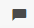

When you have chosen to create a new plain text item, for example, you may see a pane with text boxes for article metadata such as Slugline, Genre, Place, Headline and the Body. The BodyHTML field is where you create the main text for your article.

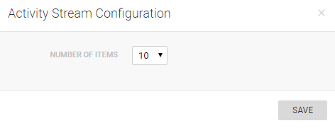

When you type in the Body HTML box, you will see a blue bar with icons above the textbox .This is where you are able to add formatting to your text.

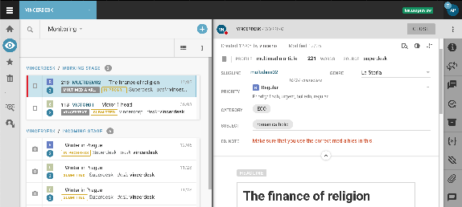

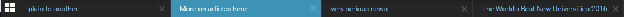

These buttons will make highlighted text into a heading.

This button places all the text on the current line into a special formatting for quotes.

This button adds a bulleted list formatting to your cursor location or highlighted text.

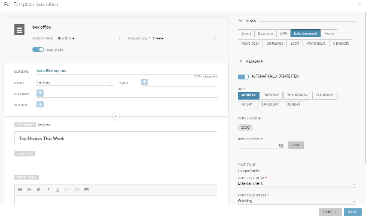

This button adds a numbered list formatting to your cursor location or highlighted text.

If you are pasting text from another source, and you want to preserve the formatting from the original source, select this button to keep the formatting from the original source.

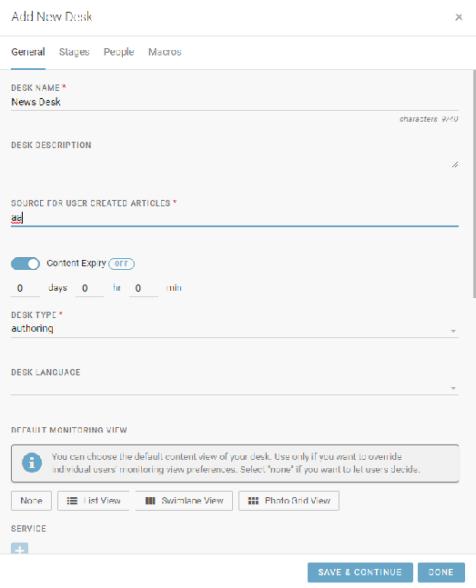

This button will make highlighted text **bold**.

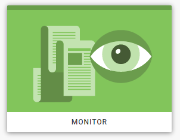

This button will make highlighted text *italic*.

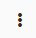

This button will make highlighted text underlined.

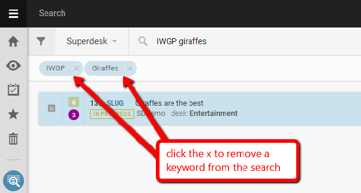

This button will make the highlighted text ~~strikethrough~~.

This button will add a superscript to the highlighted text, for example: 4**2** \= 16

This button will add a subscript to the highlighted text, for example: H**2**O
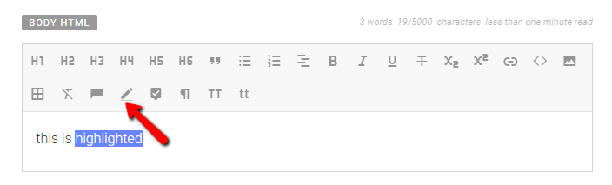

This button allows you to add a website link or link an attachment.

This button allows you to add an embed. Enter a URL or code to embed.

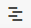

This button allows you to add media into the body text field. Depending on your Content Profile settings, there might also be fields specifically for feature media.

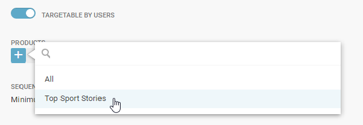

This button allows you to add a table. Once the table is inserted, you can add additional rows, columns and formatting. While editing the table, these options are available at the top of the Body Html field.

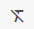

To remove formatting from a section of text, highlight the text and click this button.

This button allows you to add [Comments](#using-the-inline-comments-feature). If you use the @ symbol, you can notify selected users of your comments. Comments can be viewed using the Editor Sidebar.

This button allows you to add [Annotations](#using-the-annotations-feature).

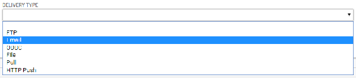

This [Suggestions Mode](#using-the-suggestions-mode) button allows users to collaborate on an article but proposing changes, while leaving the original text intact.

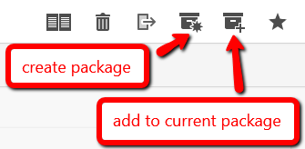

This button allows you to view formatting, which would otherwise be invisible, for example line breaks, which become highlighted in blue.

Note: If you are using an older version of the Superdesk editor that doesn’t have the *remove formatting* button, you will need to select the text and click the same button as you used to add the formatting. For example, to remove the quote formatting from a line in an older version of the editor, put your cursor on the line containing the quote formatting, then deselect the quote button above the text.

As shown above, Superdesk tracks the word count and character count of your article just above the main body text box.

##### Using the Suggestions Mode

When adding text in the Body HTML field, users have the option to toggle the Suggestions Mode using the button displayed above.

When Suggestions Mode is active (blue), text that is added will appear in green, and text that is deleted will appear in red with a strikethrough. Changes in formatting will be highlighted in green.

Changes can be accepted or rejected by clicking on the altered text and selecting ‘accept’ or ‘reject’ in the pop-up that appears. Suggesting Mode is a great tool for editors and journalists to work together to create quality content.

##### Using the Annotations feature

The Annotations button may appear in the formatting options at the top of the Body HTML field when editing a news item.

The Annotations feature allows journalists to provide additional contextual information on statements or events mentioned in their article. Your article can have any number of Annotations.

To use the annotations feature, highlight some text you would like to expand on from the body of your article, then click the annotations button in the toolbar at the top of the Body HTML field, as shown below.

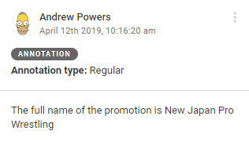

Pieces of text that already contain annotations are underlined in green.

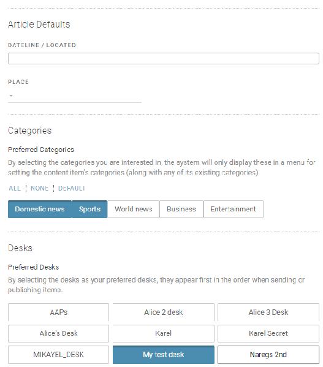

Once you click the annotations button, a window will open prompting you to choose an annotation type, and enter some text in the *Annotation Body* field. You can optionally also add some formatting to your text here.
The Annotations pop-up window has two halves: New Annotation and Annotations Library. The Annotations Library will contain all of the previously used annotations for your Superdesk instance. You can read more about the Annotations Library below.

To reuse an annotation that you have used previously, highlight the text in the Body HTML field, then within the pop-up window in the Annotations Library tab, you will see options. Note that the options displayed will only be those that are related to the same highlighted text that previously.

The *Annotation Type* field allows the newsroom to make use of text annotations for different purposes (e.g. footnotes, jargon buster, remark, etc.). These types are not enforced by Superdesk, it is up to the newsroom to configure the different types to be used depending on their editorial needs.

Clicking the SUBMIT button on the annotation window will close the window and create the Annotation that you have entered.

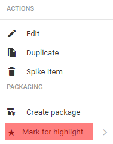

Annotations can be viewed by clicking on any text that is underlined in green.

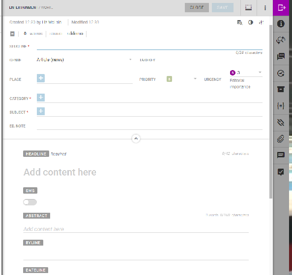

When viewing an annotation, you can use the action button in the top-right corner of the pop-up to edit or delete the Annotation.

##### Annotations Library

Annotations can also be created in the Annotations Library, which can be accessed from the Hamburger menu.

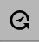

To create a new annotation in the Annotation Library, click the create button in the top right corner of the Annotations Library pane.

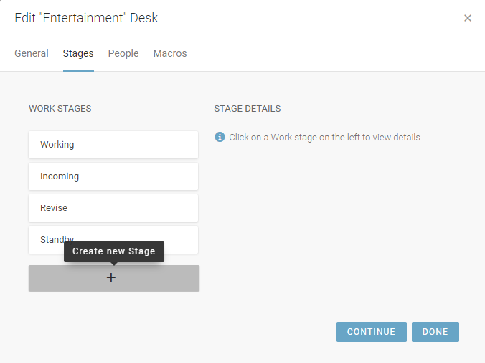

In the pane that opens when you click the Create icon, you are prompted to add a Name, Language and Definition. Each field is mandatory. In the NAME field, add the text that you will be annotating. Enter the Language code in the LANGUAGE field. In the DEFINITION field, add your annotation content. As of Superdesk version 1.33, the Annotations Library allows for multiple annotations with the same name. This allows writers to be able to choose which annotation best fits their article. In addition, the Language field is now prefilled when creating a new annotation, so be sure to change it if the annotation you’re creating does not match the default language.

Once you hit the SAVE button, your annotation will be available to select using the annotation button above the BODY HTML field in the article editing window, under the Annotations Library tab. Note that the option to select the annotation will only show up if the highlighted text is exactly the same as the NAME field.

##### Using the Inline Comments feature

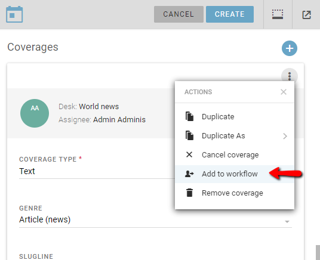

Users can add comments to the body of news articles using the Inline Comments feature in the toolbar at the top of the Body HTML field.

To add a Comment, highlight some text in the Body HTML field of an article, then click the Comments button in the toolbar above.

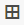

Type your Comment in the pop-up provided. Use the @ symbol and the username to notify them of Comments that need immediate attention. Upon submitting the Comment, the tagged user might be notified through the Superdesk-internal notifications or by email, depending on the user’s preferences.

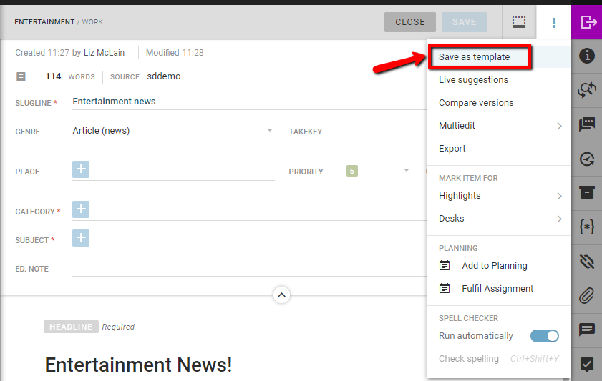

All of the Comments, both resolved and unresolved, can be viewed by clicking the Comments icon in the Editor Sidebar when an article is open for editing.

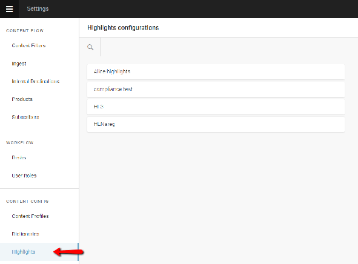

The two buttons at the top of the Inline Comments pane allow you to view both resolved and unresolved Comments.

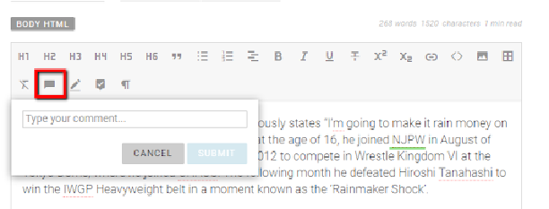

To resolve a Comment, click on the highlighted text in the Body HTML field and click the RESOLVE button, or write a reply in the textbox provided.

##### Adding Media to the Body of your Article

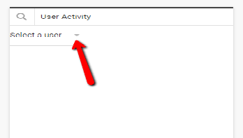

This button allows you to add media into the body text field.

Clicking on the media icon at the top of the Body text field will prompt you to upload a media item from your computer. You can select multiple media items to upload at the same time.

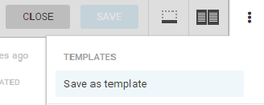
You might need to enter a title, description or headline for your media. Necessary fields are marked by a red star. If you have selected multiple pieces of media to upload at the same time, you can add the same metadata for all the media items using the SELECT ALL button at the top of the Upload Media pane, or you can enter custom metadata for each item by clicking on each item one at a time.

Click the *Upload* button in the top right corner of the pane to insert your selected media. You will be prompted to edit the image by rotating, adjusting crops, brightness etc. All these options are explained in further detail below. Be sure to click the DONE button in the top right corner to insert your media.

The media upload is not limited to photos. It is also possible to upload audio and video if your publishing destinations support it.

In the Editor, if you have inserted a photo, you can click on the photo in the body of the article in order to edit it. Click the ‘x’ that appears in the top right corner when you mouse-over the image in order to remove it.

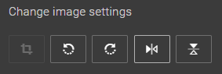

Regardless of which button you click to edit the image, all three options will still be accessible to you in the image editing interface. In the image editor, you will see three buttons at the top of the pane: **Details / Metadata**, **Edit Image** and **Edit Crops**.

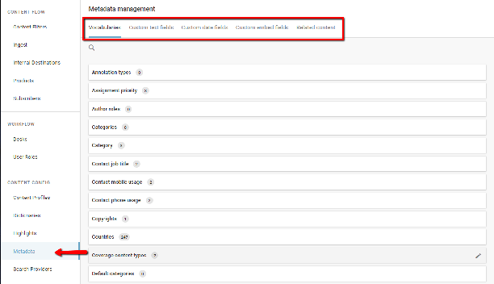

Clicking the ***Details / Metadata*** button will allow you to change any of the text associated with the image.

Using the ***Edit Image*** button, you can crop the image, rotate left, rotate right, flip it vertically, or flip it horizontally.

You can also adjust the brightness, contrast and saturation of the image using the toggles pictured below.

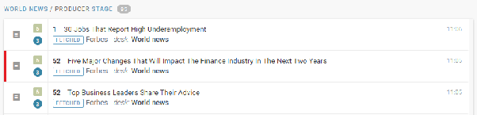

If you selected the crop button, you can crop the photo by clicking and dragging the edges in. Darkened areas will be cropped out of your photo. When you are satisfied with your cropping, click the *DONE* button in the top right to save your changes.

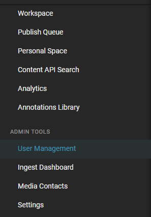

When you select the Edit ***Crops*** button at the top of the pane, you will be able to select from some predetermined image sizes. You can change the area of interest by moving the crosshairs on the image at the top.

## Creating Packages

Packages are groupings of several news items. There are several ways to create a Package. You can create an empty package from the Create icon in the top right corner of the Monitoring Pane (or Custom Workspace), as in the screenshot below:

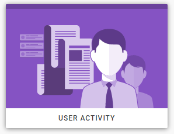

Creating a Package in this manner will produce an empty Package. You can add metadata to the header, just as you would with any other news item creation. Packages have their own metadata, independent of the metadata of their individual pieces.

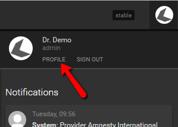

You can choose articles to add to your package from the Search or Monitoring tabs of the Workspace Panel. To add content to the package you’ve created, hover over the icons to the left of each article to turn them into checkboxes (as shown above). To add articles to the package that you have open, select articles by clicking the checkbox. Then you can choose the *Add to Current Package* button in the top-right corner of the Monitoring or Search window.

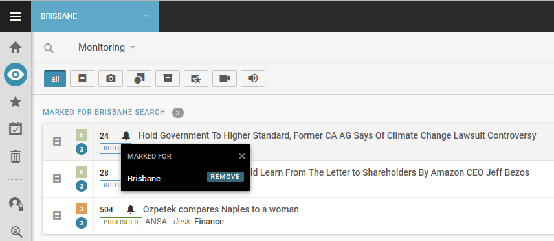

You can also choose to create a new package with selected content items using the ‘*Create Package’* button to the left of the ‘*Add to Current Package’* button. Clicking on the *Create Package* button will open a window with the selected articles already attached. You can then enter the metadata for your package. Note that you cannot create packages in the Personal Items tab (Personal Space).

See the Packaging section in the Superdesk Manual for more ways to create packages here: [Packages](#packages).

## Moving Items between Desks and Stages

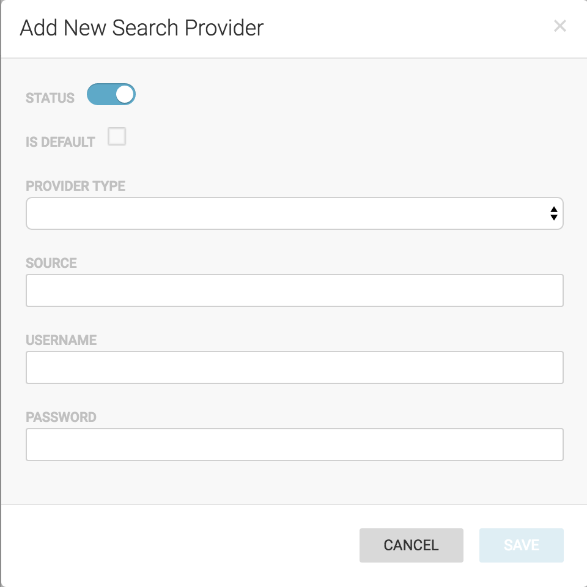

This is the '*Send To'* button.

If you created an article in your Personal Space, when you are satisfied with your article, you can choose to send it to a Desk to be reviewed by others by clicking the *‘Send To’* button in the top-right corner of the article editing window. If you created an article on a Desk, it will automatically be visible to others.

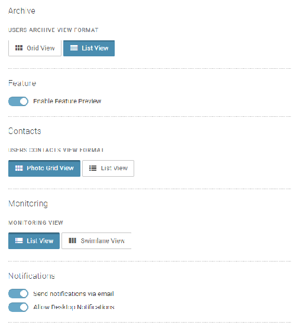

Depending on your user permissions, you can also send the news item for publishing using the ‘*Send To’* button in the article editing window.

If you are not ready to send it to publishing or to a Desk, you can click the blue *SAVE* button in the top-right corner of the article editing window*, then* click *CLOSE* to revisit the article at a later time.

## Editing and Re-opening Existing Items

You will find item list views in the Monitoring pane, Search pane, or in your Personal Space tab. Mousing over any item in a listview will reveal an Action menu on the item’s right.

This is an Action menu.

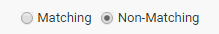

When you wish to continue writing your article, hover over it, click the Action menu in the list view and then select *Edit*. (Note that the items that are available in an action menu will depend on the news item’s current status, your permissions and whether you have the planning component as part of your Superdesk instance.)

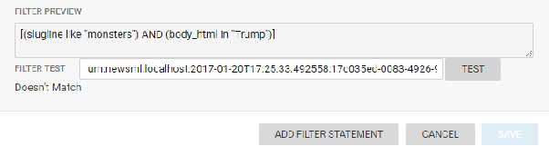

Along the top of the editing window, you will find several tools.

Minimise icon.

The first button allows you to minimise your current article. A shortcut to the article will appear at the bottom of the Superdesk interface in the Workspace Bar.

The second icon is an Action menu. Selecting it opens a pop-up menu with options to save the formatting as a template, open the item in the Multi-edit side-by-side editing mode, run a spell check, etc. Dictionaries for your spell check can be set up in the settings section of the Hamburger menu in the top-left corner of the Superdesk interface. In this action menu you can find the Multiedit option, which allows you to have more than one article open side by side. Selecting the Multiedit option will make the article available to be viewed in the Multiedit mode. Multiedit mode can also be accessed from the Monitoring tab by selecting multiple articles using the checkboxes and then clicking the Multiedit button in the top-right corner.

This is the *Send to* button.

The third icon is the *Send to* button. It allows you to send your article to a particular Desk, Stage or to publish it, depending on your user permissions.

## Editor Sidebar

The Editor Sidebar provides additional options for items that are opened for editing. Note that different items might appear in your Editor Sidebar, depending on which Content Profile you are using.

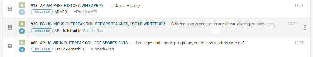

This is the Editor Sidebar.

When a tab in the Editor Sidebar is open, the icon will be blue. To close the tab, mouse over the blue icon, and it will turn into an ‘x’. Click the ‘x’ to close the tab.

#### Info Button

Below the ‘*Send to’* button you’ll find the Editor Sidebar. The first button below the ‘*Send to’* button is the Info button.

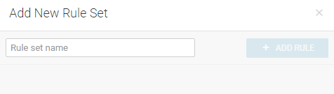

The *Info* button allows you to add metadata to your article, view the article expiry, and change the unique name for your article.

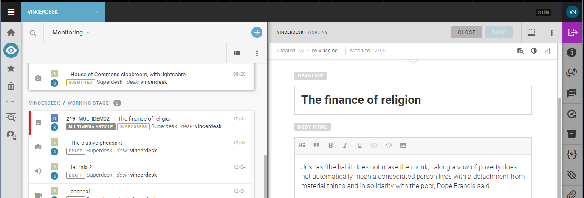

In the Metadata tab of the Editor Sidebar, you will find the following:

**Not for Publication**: A flag that when switched on will appear beside the slugline in the article entries window. This flag lets users know that the article is not fit for publication. Any attempt to publish an item that is flagged with Not for Publication will result in failure until the flag is purposefully switched off. Occasionally the articles that are marked Not for Publication are used internally for briefings or for content which shouldn’t be included in the editorial system.

**Legal**: A flag that when switched on appears beside the slugline in the article entry window. This flag lets users know that the article contains legally sensitive information, requires extra caution and needs to be reviewed before being published. Unlike the Not for Publication flag, the Legal flag will not prevent the story from being published.

**Usage terms**: A field for notes about publishing conditions. These terms can be inherited from the Ingest source or edited within Superdesk.

**Language:** A place for entering a language code. This could be inherited by the Ingest Source or set locally. This language code determines the dictionary and abbreviations dictionary will be applied to the item.

**PubStatus**: Usable or Unusable. Stories that have the pubstatus set to unusable should be killed and deleted.

**State**: Displays all the current article status flags, for example: legal, fetched, not for publication, takes, corrected, published, etc.

**Expiry**: Desks can optionally have an auto-expiry set up. This line tells you when the article expires. When an article expires, it gets deleted and you can no longer edit or publish it.

**GuID**:  This field provides a unique global identifier for your item. It cannot be changed or edited.

**Unique Name**: Each item is assigned a unique number in this line, based on its GuID, but you can change the unique name to a more intuitive, easily searchable string. It is possible to search by Unique Name in the Advanced Search pane.

**Note that the *Not for Publication* toggle does not actually stop a user from publishing the article but rather marks it with a tag denoting its status, as shown below:**

      

In the info tab of the Editor Sidebar, you will also find data about version, source, urgency, genre, type, and when the article was last updated.

#### Find and Replace

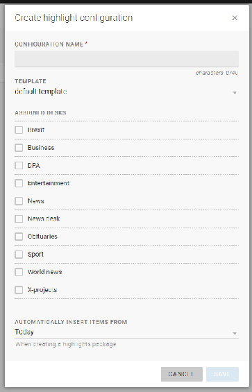
The Find and Replace feature allows you to locate and update specific words and phrases. It can be a great time-saving feature for editors and journalists.

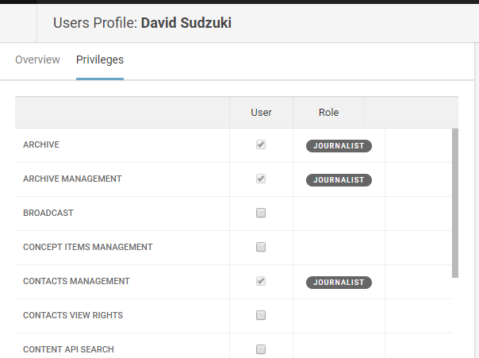
Type the word you wish to adjust in the *FIND* text box, then type your new word in the *REPLACE WITH* textbox. The *REPLACE ALL* button will replace every instance of the word with what you put in the *REPLACE WITH* textbox. You can also replace them one at a time with the *REPLACE* button, instead of *REPLACE ALL*.

#### Comments

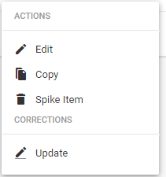
Clicking on the Comments icon allows you to have general discussions about the news item’s content with other users. Note that these Comments are different from the Inline Comments feature. [Inline Comments](#inline-comments) are used in the Body HTML field to make specific comments about parts of the news item’s content and can be found in the Inline Comments tab of the Editor Sidebar.
This Comments tab is designed for more general types of discussions.

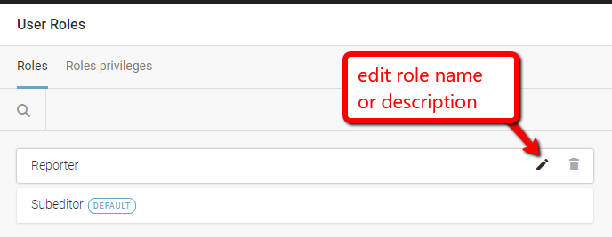

The number of new comments is shown in the info bubble. New comments can be added at the bottom of this Comments pane. Type your comment in the textbox, then click the POST button.

#### Versioning

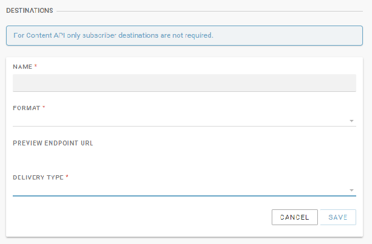

If you are writing and editing your article over multiple sessions, every time you save your article, Superdesk will retain a copy. In addition to user initiated saves, Superdesk will perform an autosave after you stop typing for 3 seconds. You will see the most recent autosave in your Versions tab in addition to your previous saves.

You can access previous versions in your versioning tab. Clicking *REVERT* lets you continue writing from a previous version, while still preserving all the other versions as well.
The Item History tab will let you see who created the item, when the item was updated and by whom.

#### Packages Info

Clicking on the Packages tab in the Editor Sidebar will let you know if the item that is currently open is part of any packages. If the article you selected belongs to any packages, a link to the packages will be displayed here, along with the date and time that it was added to the package.  In the example below, the headline of the package that the item is a part of it ‘GET YOUR PACKAGE HERE’. Clicking on the package will allow you to view the Package, or edit it, if you have the appropriate permissions.

#### Macros

While Marcos are created in the backend of Superdesk, you can view the macros and apply them here. Macros can be grouped using the toggle at the top of the tab to help you find the one you’re looking for faster.

#### Attachments

The attachments tab allows you to add files, and view files that are attached to the news item. Clicking on the attachments tab will open a new pane, from which you can add new attachments.

Click the ATTACH FILES button to upload new attachments. Clicking on the ATTACH FILES button will open a new pane from which you can select files to upload. Note that these attachments can be Superdesk internal, or published with the news item. Use the toggle on the Attach Files pane to set this parameter:

You may also need to add a title and description for your attachment. Depending on your Superdesk settings, there may be a size restriction for uploaded files.

#### Inline Comments

This tab allows you to view the Inline Comments that have been submitted for this item. These Inline comments are not transmitted in publication but will remain associated with an article even if it is sent to another desk, or published.

To add Inline Comments, highlight text in the Body Html textbox when you are creating a news item. Select the Comments icon in the toolbar above them in the text box, then click the blue *SUBMIT* button.
If you want to make sure that your Comments are read by a specific user, you can type their @username in the comment feature to send them a notification. Comments are not transmitted on publication, they are for workflow/newsroom use only. Editor’s notes field in the metadata header should instead be used for information to be transmitted with the content beyond publication, for third-party/client editorial teams. [Read more about using the Comments feature](#using-the-inline-comments-feature).

#### Related Items

The *Related Items* tab allows you to view items that share the same slugline or keywords. In the Related Items tab, you can also relate news items together. In the Superdesk backend, the Related Items tab can be configured to allow fields other than the slugline to be used to relate items.

Once you click on the Related Items icon in the Editor Sidebar, you can type keywords into the search bar of the Related Items pane to generate a list of items that share the same slugline (or other configured field).

Note that the Related Items tab only displays while you edit *text* items, not packages or media.

Clicking on the action menu of an item in the Related Items tab will allow you to open the item, associate the metadata for the items, or associate the item as an update.

The gear icon in the Related Items pane allows you to configure complete or partial matches of the sluglines, as well as limiting the recency of the articles.

If an item in the Related Items tab is locked, you will see that information in the Related Items tab.
