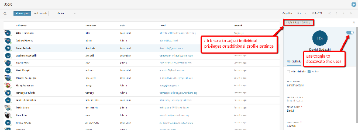
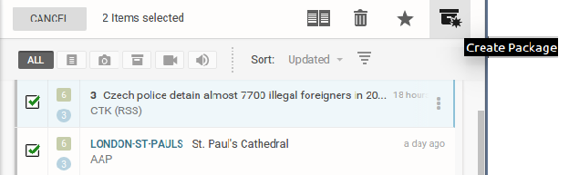
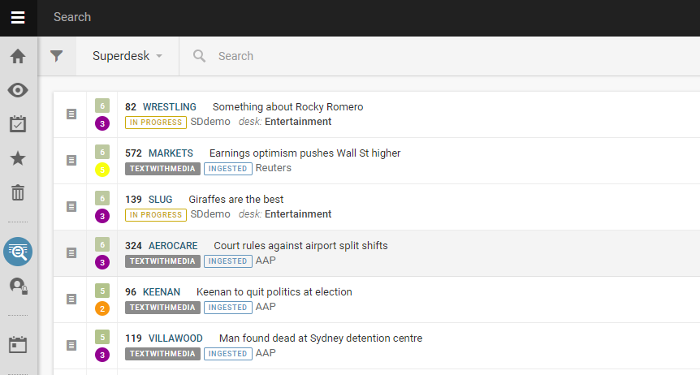
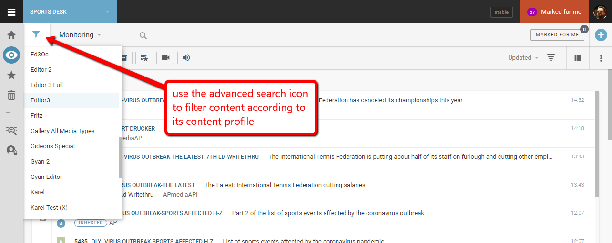
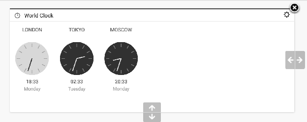
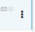
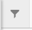

# Packages

A Package is a container consisting of various news items, sometimes you might pair plain text items and image(s) or you might group several related articles together to be published as one. Packages have their own metadata, independent of the metadata of its individual news items. There are several ways to create a package.

### Creating an empty Package

This is the Create icon.

Users can create a package by clicking on the Create icon in the top-right corner of the Monitoring pane.

Clicking on the Create icon will open a drop-down menu from which you can select the ‘*Create Package’* option. (Note that Content Profile names in your Superdesk instance may vary from those in the screenshot above.) Packages have their own metadata, independent of the metadata in its individual pieces.

While this empty Package is still open, you can add news items to it by selecting articles from any article list window (such as the Monitoring pane, or Search pane) and clicking the *Add to Current Package* button at the top of the window.

### Creating a Package from a single item

In the Monitoring tab or Search tab of the Workspace Panel, users can choose a news item to start creating a new package from by clicking on the item’s Action menu icon. From the menu that pops up, you can select *Create Package*.

This will create a package containing the original news item and the item’s headline is copied to the package headline.

You can also click the Create Package icon which appears once you select the checkbox beside an item (see Creating a package from multiple items).

### Creating a Package from multiple items

In any list view (for example the Monitoring tab or Search tab of the Workspace Panel), users can select multiple items by hovering over the item’s icon on the left side of the article entry, which turns into a checkbox. Check off the boxes of the desired items, and click on the Create Package icon in the top-right corner of the window to create a package with these items in it. If you are creating a package from the Search tab, note that you cannot use Ingested articles to create a package. Articles must be fetched to a Desk before they can be added to a package.

A new Package is then created with empty metadata but a copy of the headline from the first  item you selected.

###

### Adding items to an Existing Package

While working on the package (i.e. having it open) users can add more news items to it.

*A single item* can be added to a Package by clicking on the item’s Action menu and selecting the *Add to current* option and then choosing whether it should be featured as main, story, sidebars or fact box.  If you create a Package and add items to it one at a time, the headline does not automatically get filled in.

### Adding multiple items to a Package

Multiple items can be added to a package by selecting their checkboxes and clicking on the Add to Current Package icon in the top-right corner.

Note: The only reason that an item cannot be added to a package are: if it is killed, or it is an ingested item that has not yet been fetched to a desk.

### Packages Tab in the Editor Sidebar

When an article is open in editing mode, selecting the Packages tab will display whether the article belongs to a Package and the name of that Package to which it belongs.

