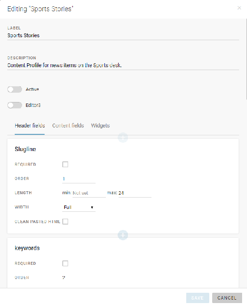
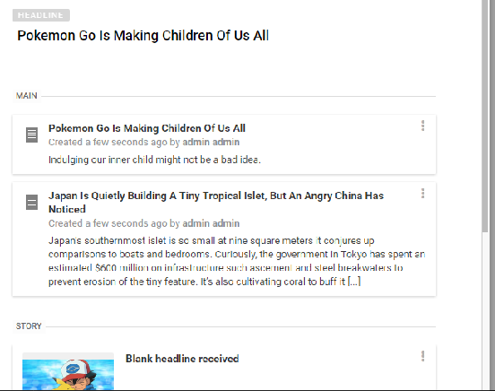
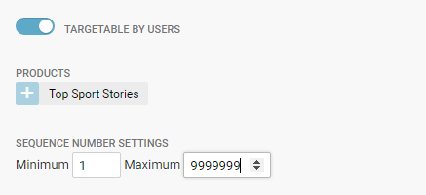

# Spiked Items

Spiked items are articles and news items that have been removed from the current Desk’s workflow. Note that spiking an item is different from killing an article. (Published articles cannot be spiked, but must be killed instead). Spiking an item is reversible, unless you are spiking an item from your Personal Space, in which case spiking an item will permanently remove it from Superdesk.

Spiked items from your Desk can be viewed by clicking on the Spike icon in the Workspace Panel. Each Desk has its own associated Spike tab.

Items can be spiked from any list view, such as the Monitoring pane, your Custom Workspace, or your Personal Space, etc. Articles spiked from your Personal Space will never be shown in the Spiked Items tab, but rather permanently deleted.

This is the Action menu.

To spike an item, hover over the item and click the Action menu that appears on the right side of the article entry.

From the Action menu, select the *Spike Item* option. Items can be spiked from any Stage prior to publishing. (Note that published items cannot be spiked and must be killed instead.) Killing an item sends out notifications to all the content subscribers of the published article notifying them that the article is no longer fit for publication and has been recalled.

It is not possible to spike an item that is part of a package. You must first remove the item from the package before you can spike it. You also cannot spike items that are currently open, or are locked by another user.

You can search through the spiked items using the article type filter buttons or by clicking on the search icon and typing keywords into the text box. Spiked items are desk-specific so you will only see items that have been spiked from your current Desk (as denoted by your Desks menu).

Spiking items from a Desk is not permanent. If you find an article that you wish to return to the desk workflow, hover over the article in the Spiked items section. The Action menu will appear. From there, you can choose the *Unspike Item* option. This will return the article to the Stage and Desk from which it was spiked.
