# Journalist Workflow Tools

As a reporter, you will likely spend most of your time creating and revising content within Desks or your Custom Workspace(s), in addition to monitoring and searching content for research purposes. Once an admin creates an account for you in Superdesk, you will receive an email with login instructions.

If you haven’t already done so, it would be useful to familiarise yourself with the following chapters:

* [What is Superdesk?](#what-is-superdesk?)
* [Dashboards & Widgets](#dashboards-and-widgets)
* [Monitoring](#monitoring-tab)
* [Superdesk Glossary](#heading=h.augg1lln53l3)

When you click on *Select Workspace* (the Desks menu) in the upper-left corner beside the Hamburger menu, a drop-down list of desks you’ve been assigned to should appear. If you don’t see any Desks in this menu, contact your administrator to set them up.

The Dashboard for each Desk will display widgets configured by your editor or admin. You can customise the Dashboard widgets on your Custom Workspace Dashboard.

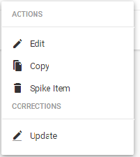

The Monitoring View is a space where journalists or production staff can keep up-to-date on the content in each work Stages, create new items and move content between stages. The Monitoring View can also be set up to show Saved Searches. The content of the Monitoring View tab is set up by your desk administrator, in the Desks section of the Hamburger menu.

### Content Workflow

To create a new news item, first make sure you’re on the Desk where the item should be created. (You can check which Desk you are on by referencing the Desks menu at the top of the Superdesk interface). Alternatively, you can create a new item in your Personal Space if it’s not intended to be shared right away.

Click the *Monitoring* icon (second icon on the Workspace Panel) to enter the *Monitoring* workspace. Click the Create icon located in the upper-right corner of the Superdesk interface. Depending on which content profiles are assigned to your desk, the new items that you can create will vary.

To create an article, select a content profile or a template you’d like to create from. Once you enter metadata and some text, you can hit the *SAVE* button in the top-right corner to save it as a draft. Articles will be saved to the Desk you are currently working on. If you are working in a custom workspace, the article will be saved to the current user’s default desk.

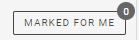You can keep an article open but minimise it by clicking the *minimise* icon located beside the *SAVE* button at the top of the article editing pane.

Note: If you don’t close the article, it will lock, preventing other users from updating it (though senior staff can override this). All your open items remain visible in the Workspace Bar located at the bottom of the Superdesk interface. If a user session hasn’t been updated in four hours, the session is terminated and the lock is dropped. While you are editing an item, it is locked, preventing any other users from making changes to it. This is denoted by a red stripe that appears next to the article entry in the Monitoring tab.

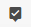

As you work, changes are autosaved both on the server and locally. If you lose internet connection, you can restore your work once a connection to the server is re-established, though there may be some issues if the file has been modified during the disconnection.

### Research & Multi-Pane Workflow

The Search feature allows users to navigate through multimedia from any repository Superdesk is aware of various news agency feeds, RSS, emails and other sources. These sources are set up by the Superdesk administrator. If you cannot find items from a desired source, notify your administrator.

Superdesk’s multi-pane workflow enables users to have a Monitoring or Search window for research open at the same time as an article entry. This makes it convenient to work on an article and easily switch context to look up information in an archive, for example. Users can also have multiple article entry windows open simultaneously.

### Monitoring Issues & Saved Searches

If you are interested in monitoring incoming RSS content and content being produced about a particular issue, you can set up a Monitoring widget in your Custom Workspace.
To do this, first click the *Search* icon on the Workspace Panel and set the parameters for your Advanced Search. When you input your desired Search parameters and perform the search, a blue button reading ‘*Save Search’* appears at the bottom of the screen.

Make sure you turn on the Global Read toggle to make the Saved Search available for use in a Monitoring widget that is not in your Custom Workspace. Saved Searches do not need to be saved as a Global Read if you are only using it in your Custom Workspace.

You should now see the Saved Search by clicking on the Saved tab of the Advanced Search panel. Note: If your search does not return any content, you can still save the search and be alerted when new content corresponding to the search comes into the system.

To set up a widget showing a Saved Search, click the house-shaped Dashboard icon on the Workspace Panel, and then click the blue *Create* button in the top-right corner to add a new widget. Select *Monitoring Widget*, then *Add this Widget*, then click *Done*.
To adjust the Monitoring widget settings, click the gear in the top-right corner of the widget on the Dashboard. Select the *Saved Searches* tab and select from the list of Global Saved Searches. Click the button beside a Saved Search to turn it on (blue means on, grey means off). You can arrange the order you’d like multiple searches and desk Stages listed in the widget by clicking the Reorder Sections tab and dragging and dropping them into place. You can also adjust the number of items you’d like to display for each section of the Monitoring widget.

### Updating Content

To resume working on an article after it’s been closed, journalists can find any content they need to update using the search feature on the Monitoring view of the Desk.

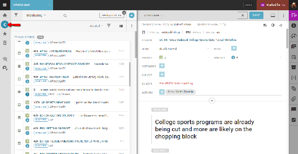

From the Monitoring View, users can also use the Quick Search Filter from the Monitoring View (click the search icon in the top-left corner of the Monitoring pane). This can save journalists a lot of time when tracking down content as it can quickly filter through thousands of items in a Saved Search, for example, to see all items with mentions of the search term(s).

Once the desired article comes up in a list, hover over it, and an Action Menu will appear. Click the *Edit* option to open the item in a new pane.

### Bundling Images and Text Items Together

There are several ways to bundle images and text together. You can create a package and insert both images and text items to the package. Alternatively, you can insert images into the main body of an article directly. Ask your Editor for which method of bundling they prefer. You can read about [creating Packages](#packages) and [inserting media in the body of an article](#making-new-articles) in other parts of this manual. You can also add images as [attachments](#attachments) when an article is open for editing.

### Sending Drafts

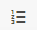

This is the Send to/Publish icon.

If you created an item in your Personal Space, when you are satisfied with your article, you can choose to send it to a Desk to be reviewed by others by clicking the *‘Send to’* button in the top-right corner of the article editing window. If you created an article on a Desk, it will automatically be visible to others. Depending on your permissions, you may be able to send it to the publishing queue using the *Send to/Publish* button as well. If you are not ready to send it to publishing or to a Desk, you can click the *SAVE* button*, then* *CLOSE* to revisit the article at a later time.

When you are ready to move a content item into another stage of the content workflow, click the ‘*Send to’* button on the right-hand corner of the article editing window. A pop-up menu then appears with options to select the destination Desk and work stage (i.e. Bureau chief in, Bureau out, etc.) you’d like to submit to.

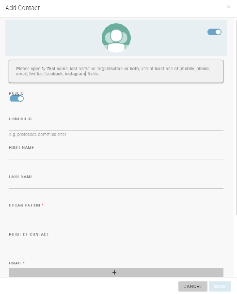

You will also use this *‘Send to’* button to move news items between States of a Desk. Stages are set up by your administrator and are used to organise items within a Desk. You can also use this pane to set an Embargo notice on the item until a certain date and time as well as a publishing schedule. **Note that an Embargo does not prevent an article from being published**.

The news items (or packages) can be sent to a different stage of the Desk (for sub-editing for example) or to another desk using this *‘Send to*’ button. It can also be published. Publishing can be scheduled to a later time. Once Published items can only be updated or killed.

If new information has surfaced regarding an article, an Update can be created to replace its previous version. When you choose *Update* from the Action menu, a new article is created with the same metadata, bylines, dateline, headline, abstract, priority, urgency, place, subject and category. The takekey will become “update”. Note that you cannot perform updates on picture items or packages.

Kills are used to stop clients from using content you sent them (they are required to remove the content once you do this). This is especially useful for court stories that suddenly issue a non-publication order after a journalist has been reporting throughout the day.

### Spiking

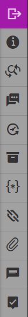

Spiking an item means marking it for removal from the Desk workflow (without actually deleting the information, in case it needs to be used in the future). To view all spiked items, click on the Spiked Items icon on the Workspace Panel.

To Spike an item, click on the Action menu of the article and select *Spike Item*. Note that published items cannot be Spiked. Items that are spiked from your Personal Space are permanently deleted.

### Other Useful Features & Tools

#### Templates

A time-saving feature for journalists, the templates feature enables users to save any article with a complete copy with all its metadata by clicking on the Action menu at the top of the article editing window and selecting ‘*Save as template’*.

When selecting the ‘Save as Template’ option, a new window then opens up prompting users to name the template and assign it to a Desk.

Creation templates create content with a specific profile. If you’re a court reporter, for example, you might have a general news template and a court template, which would save you from having to enter repetitive metadata. Highlights templates configure elements like Headline, Byline, Abstract, etc. from multiple articles to be displayed as flat/digest files.

#### Multiedit

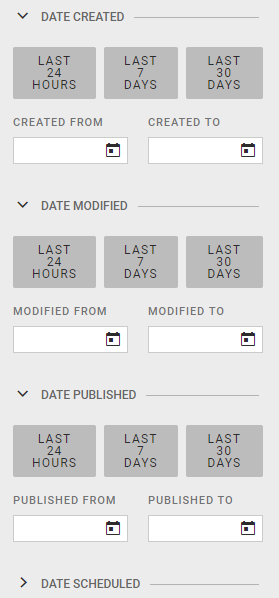

This is the Multiedit button.

You will see the Multiedit button at the top of the article editing window. The *Multiedit* button allows you to toggle between multiple open content items, as well as to display two news items side-by-side in editing mode. You can enable the Multiedit mode for an article in the action menu at the top of the article editing window. You will find the Multiedit button at the top of the article list. You can select up to 12 articles to open in Multiedit mode at the same time.

#### Highlights

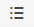

The Highlight icon located on the Workspace Panel allows you to view Highlight lists. Highlight lists are most commonly used for content indexes, top-10 lists, section features and all manner of user-curated lists. Highlights can be generated automatically against user-defined metadata, or set up for manual curation. Highlight lists can be scheduled for publication or distribution. Most journalists will not have permission to add items to a Highlight list.

#### Versioning

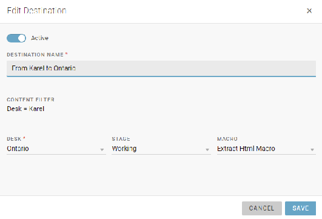

While an item is open for editing, you can click the *Versioning* icon located in the Editor Sidebar on the right-hand side of the article editing pane to display previous saves or revert back to earlier versions of a content item.

#### Annotations

Annotations are a useful Superdesk feature that allows journalists to add additional information to their articles. Annotations are specially designed for information that is often appended to specific text items. Annotations can either be created in the Hamburger menu, within the Annotations Library, or within the editor while creating an article.

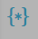

To add an annotation to text in the body of your article, highlight the text and click the annotations button. [Read more about Annotations](#using-the-annotations-feature).

### Custom Workspaces and Personal Space

Custom Workspaces are configurable individual workspaces accessible from the Desks menu. Custom Workspaces have their own Dashboards and Monitoring tabs, which make it possible to monitor several Desks in one place so they are ideal for users that are working on more than one Desk.

Customising your Custom Workspace Dashboard is a great way to monitor several projects in one spot, without having to click back and forth between Desks.  Only you can access your Custom Workspaces, so you can customise your Custom Workspace Dashboard and Custom Workspace Monitoring tab to suit your individual workflow. Dashboard of Desks have widgets that are determined by the Desk manager.

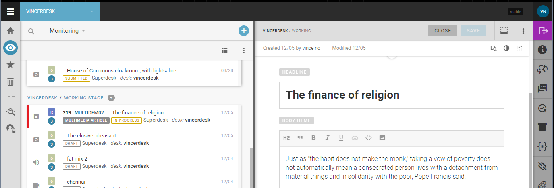

Personal Space is an icon located on the Workspace Panel.

Clicking on this icon in the Workspace Panel displays all the articles and items you have created in your Personal Space. Only you can view or edit items in your Personal Space. To create a new Personal Item, click the Create icon in the top-right corner of the Personal Space. You can send your Personal Items to a Desk workflow using the purple ‘*Send to’* button in the article editing window.

### User Profile Settings

To view and adjust any of your profile settings, click on your user icon located in the upper-right corner of the Superdesk interface. When you select *Profile*, an Overview of your profile information is displayed. You can also set your preferences and contact information, view your privileges and view your activity stream. User privileges are set by administrators.

### Comments

When an article is open for editing, users can add Comments to each news item with Twitter-like @mentions.

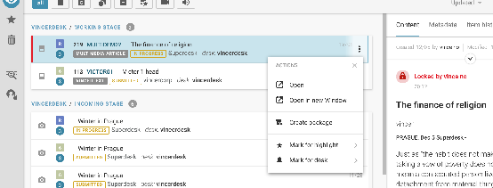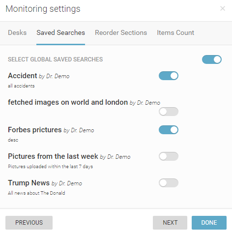

This feature is useful for alerting other Desks or users to the content in a hurry.

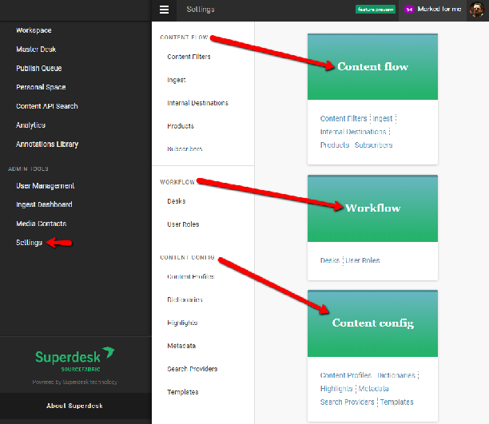 This is the Comments button in the Editor Sidebar.

Comments can be viewed in the Editor Sidebar, when an article is open for editing, using the Comments button displayed above. These Comments can be used for general feedback about the news item. Inline Comments can also be added to the Body of a news item using the [Inline Comments feature](#using-the-inline-comments-feature). Inline Comments can be used to reference specific parts of the text.

### Mark for User

As of Superdesk version 1.33, Superdesk now includes a ‘Mark for User’ feature. This allows users to keep track of news items that require their attention. News items can be marked for users in several ways:

- From the action menu of an item in any list view (such as Monitoring or Highlights).
- From the action menu of an item in the Editor or Preview pane.
- Using the icons at the top of the Monitoring pane if multiple items are selected.

Users can access items that are marked for them directly from the menu to the left of their user icon, or by clicking on the ‘Marked for Me’ button at the top of the Monitoring pane for their current Desk.  The info bubble on the ‘Marked for Me’ button lets you know how many items have been assigned to you in general, or within your current Desk on the Monitoring pane.

Clicking on an item in the ‘Marked for Me’ list will open it in the Editor, unless the item is locked by another user.
Spiked items and locked items cannot be marked, and only users with the mark for user privileges will be able to use this action.
When marking content for a user, the online status indicator is shown on the user avatars in the list of users, so that the user can easily see whether the target user is currently online or not. The marked user will receive a notification in the Superdesk interface, as well as an email notification. When an item is marked for a user, a new version of the content item is automatically created. By doing so, Superdesk makes sure that the user receives the latest copy of the item and that "dirty changes" are not lost on the way.
