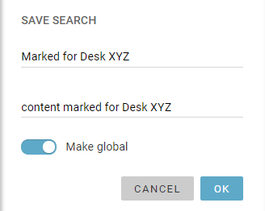
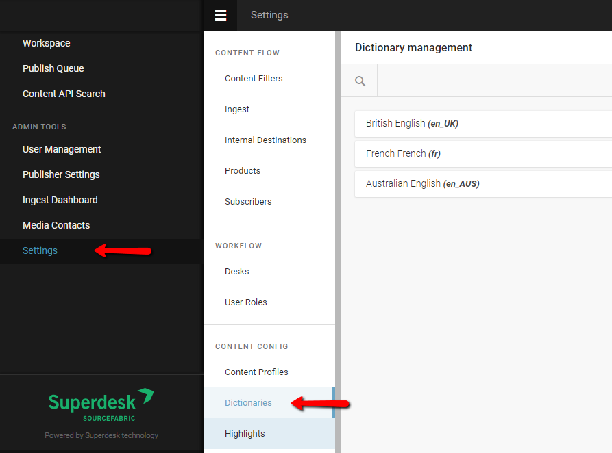
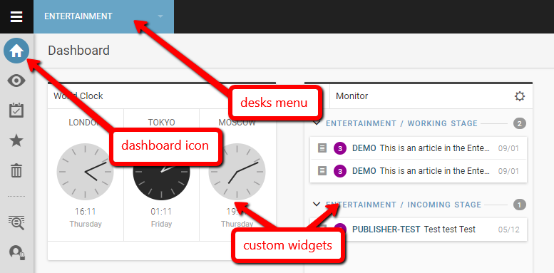
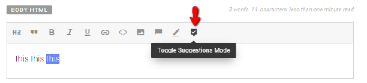
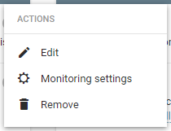
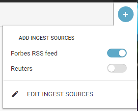
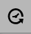
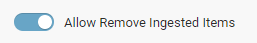
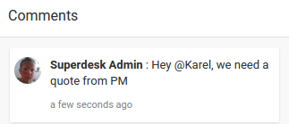
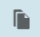

# Editor Workflow Tools

As an editor for a particular news beat or Desk, you will likely spend most of your time monitoring issues, editing content submitted by reporters, and publishing content. This section of the Superdesk manual outlines the most useful tools and time-saving features for editors within Superdesk.

Once an admin creates an account for you in Superdesk, you will receive an email with login instructions. The admin will also assign you to the appropriate desk(s) and set your permissions and privileges within Superdesk.

### Editorial Notes

A section for Editorial Notes in a news item’s metadata provides Editors with a means for adding notices to content that will be sent to subscribers. The Editorial Notes is a metadata text box in the article editing window, just above the Headline. In order to use the Editorial Notes, please ensure that the field is enabled in the [Content Profile](#content-profiles) that you are using.

Editorial Notes can be entered anytime before an article is published, by entering text in the Editorial Notes line of the article metadata.

### Moving Through Workflow & Publishing Content

To publish content or send it to a particular Stage in the content workflow, click the purple *Send To/Publish* button on the right-hand corner of the article editing window.

A pop-up menu will appear with options to select the destination Desk and Stage (i.e. Bureau chief in, Bureau out, Revise etc.), to set an Embargo until a certain date and time, to set a publishing schedule or to publish the content item directly.

Stages for each Desk are set up by users with the appropriate permissions in the Hamburger menu.
Note: Setting an embargo date does not prevent an item from being published, but marks it with a date and time before which the item should not be published.

### Customised Workflow

Based on workflow configuration (Desks, Stages, etc...) the content can go through various steps of editing and approvals, or it can be published directly if the authors have the appropriate rights/privileges.
Workflow is Desk-specific, so you can have some Desks with users who can publish directly and other desks with a more complex workflow that suits your newsroom.

### Monitoring Content & Issues on the Dashboard

*Monitoring* enables you to easily observe desk activity, incoming RSS content and items being produced about a particular issue. This can be done via the Monitoring view (clicking the Monitoring icon on the Workspace Panel) or by setting up Monitoring widgets on your  desk Dashboard.

To set up a widget, click the house-shaped Dashboard icon on the Workspace Panel. If you are assigned to multiple desks, make sure you select the correct desk from the Desks menu, and then click the Create icon on the top-right corner of the screen. Select *Monitoring*, *Add this Widget*, and then click *DONE*. To modify the settings of the new widget, click the gear icon located on the top-right corner of the widget. In the monitoring widget settings, you will see a list of desks. You can switch the toggles on for the desks you wish to monitor (blue means on, grey means off) and select the Stages within each desk that you want to include in the display. You can arrange the order of the Saved Searches and Desks Stages listed in the widget by clicking the *Reorder Sections* tab and dragging and dropping them into place. You can also adjust the number of items you’d like to display for each section of the Monitoring widget. Read more about [Dashboard Widgets](#heading=h.mie6mqlwhwp5) in other parts of this manual.

### Monitoring Saved Searches

Saved searches are a great time-saving feature. To create a Saved Search, first click the *Search* icon on the Workspace Panel and set the parameters for your Advanced Search. When you input your desired Search parameters, click the blue SAVE SEARCH button that appears at the bottom of the Advanced Search parameters pane after the search has been completed. Remember to toggle Global Read to the on position in the Saved Search window to make it available for your Monitoring widgets, described above.

To set up a widget monitoring a Saved Search, follow the same instructions to add the Monitoring widget. This time when you modify the settings, click the *Saved Searches* tab and select from the list of Global Saved Searches.

### Spiking Items

Spiking an item removes it from the desk workflow. It is not a hard deletion, but a reversible removal. To view spiked items for your current desk, navigate to the Spiked Items icon via the Workspace Panel. To Spike an item, click on the article Action menu and select ‘*Spike Item’*. Spiked items can be Unspiked unless they were spiked from a Personal Space.

###  **Other Useful Features & Tools**

#### Templates

Any article can be saved as a Template (a complete copy with all metadata) by clicking on the Action menu at the top of the article editing window and selecting ‘*Save as template’*.

There are a few different types of Templates. ‘Creation templates’ create content with a specific profile. ‘Highlights templates’ configure certain elements from multiple articles to be displayed as flat/digest files. These Templates can include the essentials, like Headline, Abstract and Byline of a group of highlighted stories.

New Templates can be created in the *Settings \> Templates* section of the Hamburger menu. Once the Template is created, you can easily generate the Highlights daily/weekly/hourly etc. You can also send out digests with a list of all the items in a Highlight so that subscribers can go through the wire to find the original files. Additionally, you can schedule Templates to automatically generate articles.

Administrators can set up Templates so that they can be used by all members of a Desk. To do this, admin users select the ‘*Add New’* button in the top right corner from the Templates tab in the Settings section of the Hamburger menu. This is where admin users can also edit existing templates.

Another useful Templates feature is that Templates can be assigned to a Stage, and can be generated at predefined dates and times. When this scheduling option is turned on, a new item is automatically created and sent to the specified Desk and Stage. For example, the Entertainment Desk might schedule a box office report to drop into the working stage at 6am every Monday for a reporter to pick up.

#### Multiedit

The *Multiedit* button allows you to toggle between multiple open content items, as well as to display two plain text items side by side in editing mode. You can enable the Multiedit mode for an article in the action menu at the top of the article editing window. You will find the Multiedit button at the top of the article list. You can select up to 12 articles to open in Multiedit mode at the same time.

#### Highlights

Highlight lists are desk-specific curated lists of important news items. As an editor, Highlights can be used to keep the Desk members up-to-date on the day’s top stories. The Highlights icon located on the Workspace Panel allows you to view all the items you have highlighted and Highlights for the desk you’re currently on. They are commonly used for making top 10 lists, section features and other types of user-curated lists. Highlights can be automatically generated against user-specified metadata, or manually curated. Highlight lists can be easily published, or simply used for Superdesk internal communication of important news items.

To create a new Highlight, go to the settings section from the Settings menu in the top-left corner of the Superdesk interface. There you can select the Highlights tab and hit *CREATE CONFIGURATION* to make a new Highlight. Highlight lists are desk-specific.

To add a news item to a Highlight list, click on the Action menu for a particular item and select ‘*Mark item for’* option and then select the Highlight to which you would like to add the item.

#### Versioning

While an item is open for editing, you can click the *Versioning* icon located on the Editor Sidebar on the right-hand side of the article editing window to display and revert back to previous versions. Every time an article is saved, Superdesk will retain a copy of the article in its previous forms. These copies can all be accessed from the versioning icon. Reverting to a prior form of an article will not delete the version from which you just reverted.

The Versioning tab also contains information about the history of the article. By clicking on the *Item history* tab in the Versioning window, users can see who created and updated the article, as well as to which desks and publish queue it was sent.

### Custom Workspaces and Personal Space

Custom Workspaces are private view configurations accessible from the Desks menu. In Custom Workspaces, you can set up widgets and monitoring for your own customized workflow. Unlike Desks, which have a single Dashboard that is uniform for all users of that desk, your Custom Workspace has its own Dashboard with widgets that only you can see.

In your Custom Workspace Monitoring view, you can select the Desks, Stages and Saved Searches that you want to place in your custom monitoring view by selecting the gear icon located in the top-right corner. This is especially useful for monitoring several Desks in a single place.

Personal Space is an icon located on the Workspace Panel. Your Personal Space can also be accessed from the Hamburger menu.

Only you can view or edit items created in your Personal Space. To create a new Personal Item, click the Create icon in the top-right corner of the Personal Space pane.

### Comments

When an article is open for editing, users can add Comments to each news item with Twitter-like @mentions.

This feature is useful for alerting other Desks or users to the content in a hurry.

This is the Comments button in the Editor Sidebar.

Comments can be viewed in the Editor Sidebar, when an article is open for editing, using the Comments button displayed above.
Comments can be added to the Body of a news item using the [Inline Comments feature](https://docs.google.com/document/d/1chk8SglS6yZCwqhMLo37mvF5HsZ6iv6Z-x3ASgC4l-0/edit?disco=AAAACmwuhN4&usp_dm=false&ts=5caf5429#heading=h.xfv1omnhpquh).

###  **User Profile Settings**

To view and adjust any of your profile settings, click on the User icon located in the upper-right corner of the Superdesk interface. When you select the *profile* link under your user name, an overview of your profile information is displayed. You can also set your preferences and contact information, view your privileges and view your activity stream.
User privileges are set by administrators by selecting *Hamburger menu \> User Management*.

### Suggesting Mode

When a news item is open for editing, you can use the Suggesting feature to collaborate with the article’s author to make changes to the text while preserving the content in its original form. (Suggesting mode is available in the full version of editor 3\. Older versions of the editor may not have access to Suggesting mode.)
To make use of the Suggesting feature, use the Suggesting mode button in the toolbar above the Body HTML textbox.

When Suggesting mode is turned on, additions to the text will be shown in green and deletions will be shown in red. [Read more about using Suggesting mode](#using-the-suggestions-mode).

### Mark for User

As of Superdesk version 1.33, Superdesk now includes a ‘Mark for User’ feature. This allows users to keep track of news items that require their attention. News items can be marked for users in several ways:

- From the action menu of an item in any list view (such as Monitoring or Highlights).
- From the action menu of an item in the Editor or Preview pane.
- Using the icons at the top of the Monitoring pane if multiple items are selected.

Users can access items that are marked for them directly from the menu to the left of their user icon, or by clicking on the ‘Marked for Me’ button at the top of the Monitoring pane for their current Desk.  The info bubble on the ‘Marked for Me’ button lets you know how many items have been assigned to you in general, or within your current Desk on the Monitoring pane.

Clicking on an item in the ‘Marked for Me’ list will open it in the Editor, unless the item is locked by another user.
Spiked items and locked items cannot be marked, and only users with the mark for user privileges will be able to use this action.
When marking content for a user, the online status indicator is shown on the user avatars in the list of users, so that the user can easily see whether the target user is currently online or not. The marked user will receive a notification in the Superdesk interface, as well as an email notification. When an item is marked for a user, a new version of the content item is automatically created. By doing so, Superdesk makes sure that the user receives the latest copy of the item and that "dirty changes" are not lost on the way.
