# Desk Creation and Desk Management

New Desks can be created, and existing Desks can be edited in the Hamburger Menu by Superdesk admins, or users with the appropriate permissions. To get started with Desk configuration, select *Hamburger Menu \> Settings \> Desks*.

In the Desk Management pane, you can create a new Desk by clicking on the ‘+ ADD NEW’ button in the top right corner of the pane.

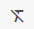

This panel is also where you can edit existing Desks.  Click the Action menu icon in the top right corner of the desk name to edit an existing Desk.

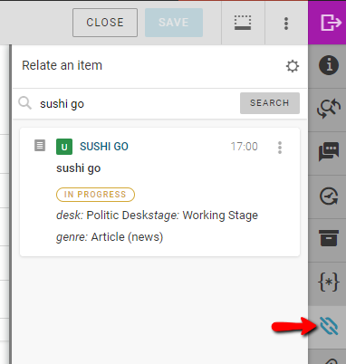

In the Action menu, select the *Edit* option and a new window will open.

Whether creating a new Desk, or editing an existing desk, you will see the same window:

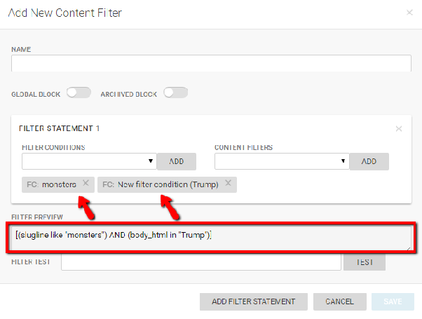

#### General Desk Settings Tab

DESK NAME allows you to change the name of the selected desk. This is the name all users within Superdesk will see. The maximum length for a desk name is 40 characters.

DESK DESCRIPTION provides information to other users about the desk.

SOURCE FOR USER CREATED ARTICLES is a field used to populate the Source field in every article created in that desk. The text that you input in the SOURCE FOR USER CREATED ARTICLES text box will appear in the metadata for all the articles produced from this Desk.

CONTENT EXPIRY sets the amount of time before any item in the desk is deleted. Deleted items can no longer be seen in a desk and cannot be searched in the archive. If an expiry is set to 0 days, 0 hours and 0 mins, it will be preserved indefinitely. The content expiry can be switched on and off using the blue content expiry toggle.

DESK TYPE can be set to either **Authoring** or **Production**. An authoring desk only produces content but does not publish it directly. For articles on an authoring desk to be published, they will need to be sent to a production desk first.

DESK LANGUAGE can be configured here. This will set the default language field for content created on this Desk.

DEFAULT MONITORING VIEW. You can choose the default content view of your desk. Use only if you want to override individual users' monitoring view preferences, but the user can manually change it. Select "None" if you want to let users decide.

DEFAULT CONTENT TEMPLATE Selecting a Template from this drop-down menu will make that Content Profile available by clicking the Create icon in the Desk’s Monitoring pane and all content created on this desk will have the information in this template filled in.

DEFAULT CONTENT PROFILE Selecting a Content Profile from this drop-down menu will apply this Content Profile to all new items created on this Desk that aren’t created from a Template. Additionally, news items that are fetched to this Desk will receive this Content Profile.

#### Stages Tab

In the Edit Desk / Add New Desk window, you will also find a Stages tab. Stages reflect the workflow of each Desk. Sometimes Stages are steps an article must go through in order to be published. For example, an article might go through more than one phase of editing before it is sent off to be published.

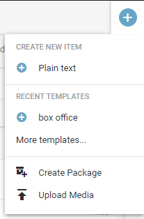

From this Stages tab, you can make new Stages to a Desk by clicking the grey ‘+’ button in the Work Stages section. If you add a new Stage, the maximum length for the name is 40 characters.

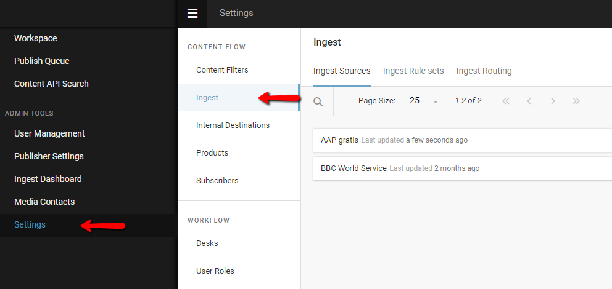

You can edit the current Stages by hovering over the stage you wish to edit and clicking the pencil icon that appears to the right of the Stage name.

The GLOBAL READ toggle allows items that are in this Stage to be read by all users. If GLOBAL READ is turned off, only users assigned to the Desk will be able to see content from that stage. If GLOBAL READ is turned on, the Stage will be available for use in any Monitoring view on any Desk. You can also use the LOCAL READ ONLY toggle to ensure that items in this Stage cannot be edited.

If the WORKING STAGE toggle is set to blue, it indicates that any news item or package created in this Desk will be sent to this Stage.

 If INCOMING STAGE toggle is blue, any item that is fetched to this desk will be put into this Stage.

The CONTENT EXPIRY can be set to a number of days, hours or minutes to ensure that the most current news is being published. When the content expiry limit is reached, the article is permanently deleted and can no longer be accessed. Leaving the expiry at 0 days, 0 hours and 0 minutes will mean that the content will be there indefinitely.

The INCOMING RULE drop-down menu allows for standardised modifications to be made on articles that are being fetched to this Desk. This could include modifications like automatically filling in a dateline or an abstract, or converting currencies. These rules are set up in the Macros tab of the Edit Desk window. An example of a standard Incoming Rule would be ‘validate for publishing’ which would check to see if all the required fields are filled out and that it meets other standards for publishing, as mandated by your organization.

The OUTGOING RULE and MOVED ONTO STAGE RULE will also apply a selected macro to any item that leaves the Stage, or is sent to the Stage from another Stage, respectively.

#### People Tab

In the People tab of the Edit Desk window, you can add or remove users from the Desk. To add a user, type their name into the search bar. When you select the name of the person, they will be automatically added to the Desk, just click the ‘SAVE & CONTINUE’ button to confirm the team changes.

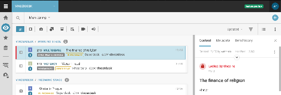

To remove a user from a Desk, hover over the user and click the *x* that appears on the right.

#### Macros Tab

The final tab in the Edit Desk window is for Macros. All of the available macros are displayed here. You will need the assistance of a programmer to create your Macros.

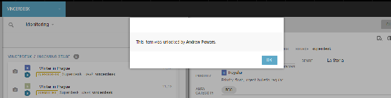

When you choose a Macro for your incoming rule in the General Tab, it will be one of these Macros.

## Desk Routing

The Desk Routing feature allows Desks to be temporarily closed, and the incoming content to be marked for another Desk until the Desk is reopened.

The Desk which is going to be closed is called ***Source Desk*** and the Desk for which the content is marked for is called ***Target Desk*** in the following description:

**How Desk Routing works:**

The purpose is to allow journalists to temporarily close their Desk and make sure all incoming content is highlighted (marked) for another Desk until the Desk is reopened. The content stays in the Source Desk all the time, it is only *marked* for another Desk. If the target desk is closed too, the content is marked for its own target desk \- i.e. if content is "routed" from desk A to B and B is closed and the content is marked for C, the content from A is marked for C.

####

#### Source Desk Configuration

**Step 1\)** Select **routing macro** for the Desk Stage:

You need to activate the *Desk Routing* macro for each stage of the *Source Desk* which is expected to receive new content when the desk is "closed". The macro is run on incoming content and it simply checks the status (open/closed) of the Desk and if the Desk is closed, it marks the content for the *Target Desk*.

To add a routing macro, select *Hamburger menu \> Settings \> Desks*. Select your *Source Desk* and then click the Stages tab in the Edit Desk window.

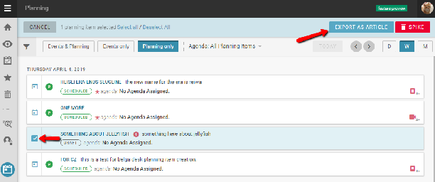

Click the edit icon for each Stage of the Source Desk that will receive content. In the INCOMING RULE drop-down menu select the Desk Routing macro, then click the SAVE button.

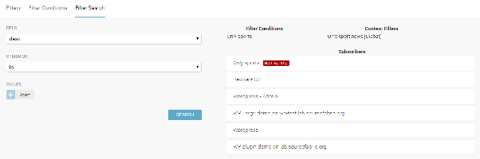

**Step 2\)** Add **Desk Router widget** to the *Source Desk*’s Dashboard by clicking the Create icon in the top-right corner of the Dashboard pane. This will open a new window from which you should select the Desk Router widget:

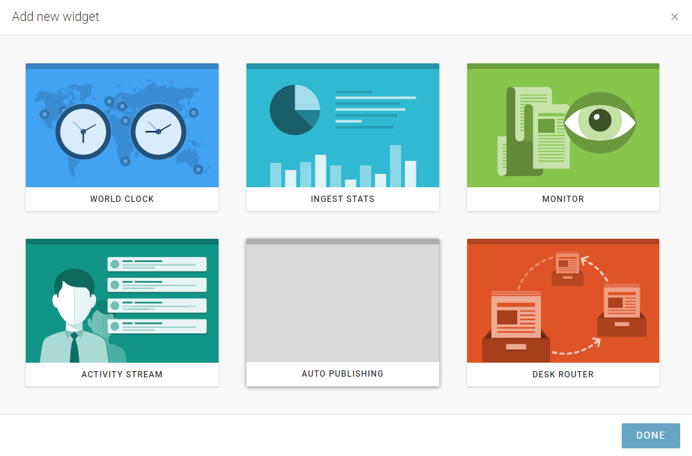

**Step 3\)** In the Desk Router Dashboard widget, select the ***Target Desk*** from the list under ‘*route incoming content to’.* In the example below, the Target Desk is called “National”:

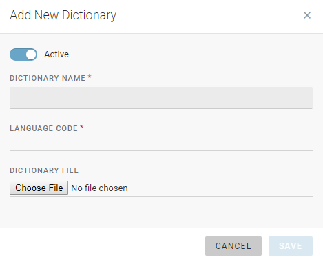

#### Target Desk Configuration

 You need to create a Saved Search for content which is marked for the Target Desk and add it to the Monitoring pane or the Dashboard of the Target Desk.

**Step 1\)** Create a **Saved Search**

On the Target Desk, select *Search → Advanced Search* and find **Marked Desks** in Parameters tab.

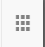

Select the Target Desk from the list of available Desks, click "Search", and then "Save Search". Name the search, and do not forget to make it “global”.

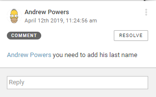

**Step 2\)** Adding the Saved Search to the Target Desk’s **Monitoring View**

Go to *Hamburger menu* \> *Settings \> Desks,* and open ***Monitoring Settings*** of the Target Desk.

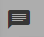

Open the *Saved Searches* tab and activate the search that you created in the previous step. You can also select the *Reorder Sections* tab to place the Saved Search at the top of the screen, if needed.

Users will see the following in the monitoring:

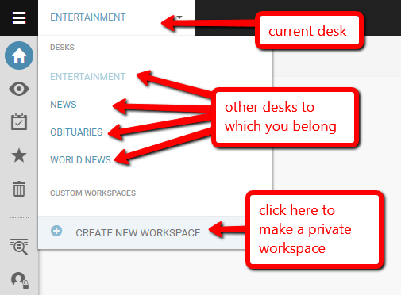

The articles from the Source Desk will have the bell icon next to them and clicking it you can see for which Desk(s) the story has been marked.

#### Closing the Source Desk

Go to the Source Desk dashboard and click the ‘*Start Routing’* button in the desk router widget. Make sure the Target Desk is selected. From now on all incoming content will be marked for the Target Desk.

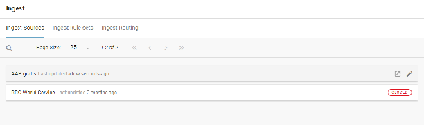

Users of the Target Desk can check the same widget to see from which desk the content is being "routed". In the picture above, there is an active routing from *Adelaide* and an inactive from *Broadcast* desk.

#### Reopening the Source Desk

Go to Desk Dashboard and click the ‘*Stop Routing’* button in the desk router widget:

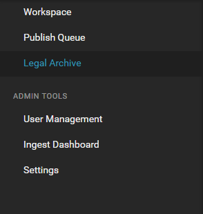

The "marked for" attribute of all stories which were marked by this feature (i.e. not the ones marked manually by users) will be removed by this action.
