# User Management and User Roles

The User Management section of the Hamburger menu allows administrators to create new users, disable current users, and edit user profiles.

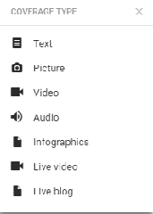

Admins can access the User Management settings from the Hamburger menu in the top-left corner of the Superdesk interface.

When you open the User Management menu, you will see a complete alphabetical list of all the active Superdesk users for your news organisation. You can search for a specific user using the search bar at the top of the window.

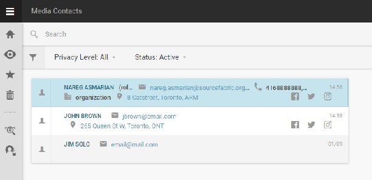

Beside the search icon, there are filters. Toggle between ‘All user types’ or ‘Authors only’ using the blue buttons provided. To the right of those buttons, you will find a drop-down menu that allows you to filter by user status: Choose between Active, Online, Pending, Inactive, Disabled, or All. Pending users are users that have been created within Superdesk, but have not yet confirmed their email to login for the first time.

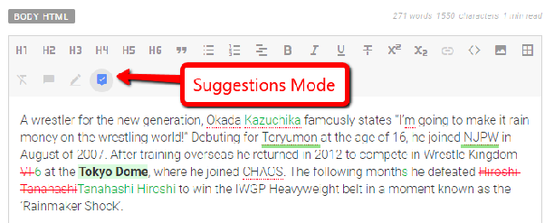

In the User Management list view, online users are marked with a solid green circle next to their User icon. Admins are marked with a gear icon on the top-left of their User icon. Special notes about inactive or disabled users will appear in pink text next to the user names.

### Adding New Users

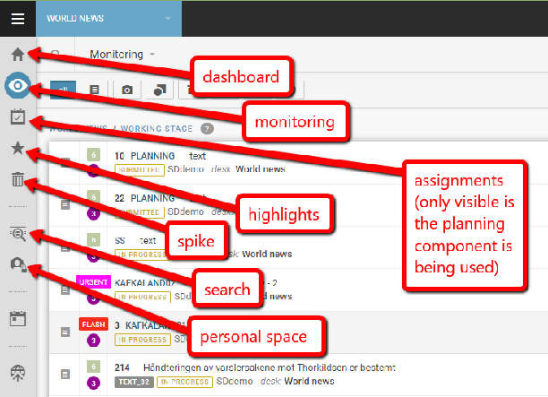

This is the Create icon.

In the top-right corner of the User Management window, you can use the Create icon to add new users to your Superdesk instance. Clicking the Create icon will open a pane on the right where you can input all the information for your new user:

You can change the new user profile picture by clicking on the round grey User icon.
You must input all the mandatory fields before you can save the new user profile. In the blank form, mandatory fields are marked by a red asterisk.

Note that legal usernames can only contain letters and numbers, as well as underscore (\_), apostrophe (‘), dash (-) and period (.). Once the user profile is created, usernames cannot be changed, so choose carefully.

Once you click the blue *SAVE* button that appears at the top of the pane, an email will be sent to the user with instructions to set up their password and login information.

### Disabling Users and User Clearing Sessions

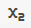

There is a blue toggle at the top of each user profile tab. Switching the toggle to the *off* position will set the user as **inactive**. This prevents them from logging in to Superdesk. Deactivating a user is similar to deleting a user, except that it preserves a minimal amount of information such as their name and username. The username and entity remains in the system such that you can search for articles that they contributed to and edits that they made to news items.

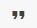

Users can be **disabled** by hovering over the user entry in the User Management list, and selecting the trash icon that appears to the right of the user entry. Disabled users will not be able to sign in to Superdesk, but all their profile information is preserved such that they can be reactivated at a later time. The disable function is especially useful for freelance or seasonally contracted users who require intermittent access to Superdesk.

The skull icon that appears in the User Management list view when you hover over a user in the list, allows you to **clear all** the user sessions. Clearing all the sessions kicks the selected user out of their current user session. If they were logged in anywhere, they will no longer be logged in after clicking this *Clear All* skull icon. They will need to re-login to continue any work.

### Editing User Profiles

If you have sufficient permissions, clicking on an entry in the User Management list will open a preview tab on the right of the Superdesk interface. You can change the contact information in the text boxes, and then click the *SAVE* button that appears at the top of the user profile tab once changes have been made. **Note that usernames cannot be edited.**

Changing a user’s role will affect the permissions and privileges of the user. User roles within Superdesk are configurable. Individual permissions can also be adjusted in the full profile view, which can be accessed by clicking the VIEW FULL PROFILE button at the top of the pane, as pictured below:

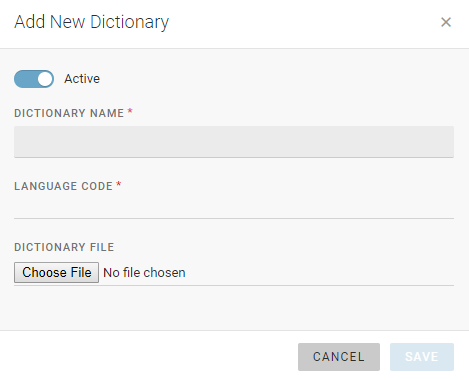

Clicking on the *VIEW FULL PROFILE* link at the top of the user profile tab will open a new window where you can see the user’s activity stream. This is also where admins can edit specific user permissions by clicking on the Privileges tab. The information displayed in the Overview tab is the same as what was visible in the previous user information tab.

###### Overview tab

The top half of the Overview tab contains basic contact information such as your display name, sign-off, email address, and your contact phone number. You can edit these fields directly from this Overview tab. Note that you cannot change your username once the account is created, so be sure to choose the username carefully.

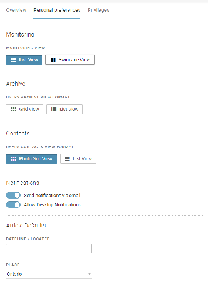

In the bottom half of the Overview tab, you can change your Superdesk display language. This will translate the Superdesk user interface to a language of your choosing. You can help us translate Superdesk by visiting this website: [https://www.transifex.com/sourcefabric/superdesk/](https://www.transifex.com/sourcefabric/superdesk/)

In the Overview tab you can also change your login password. Click on the *reset password* button. This feature can be used by admins to reset the password of a user.

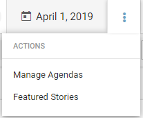
Remember to click the blue SAVE button to confirm your changes. Click the CANCEL button to discard your changes without saving.

Your **Default Desk** is the desk that you will be taken to when you log in to Superdesk. You will find the default desk setting towards the bottom of the Overview tab. It is a good idea to set your default desk as the desk that you use the most.

######

###### Privileges tab

Admins can adjust individual privileges in the full profile view by clicking the Privileges tab.

These individual permission adjustments can be outside of the large scope of user roles. Admins can use the checkboxes in this pane to add or remove specific permissions.

### Viewing your own Profile settings

Each user can view and edit their own profile settings by clicking on their user icon in the top-right corner of the Superdesk interface, then clicking on the Profile link.

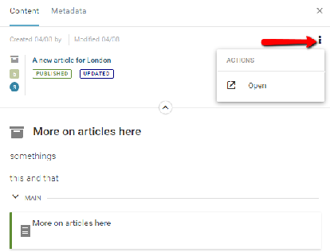

You might see three tabs along the top of your profile: Overview, Preferences and Privileges. The Overview and Privileges tab are described in the previous section. The Personal Preferences tab is accessible only to you.

###### Personal Preferences tab

In the Personal Preferences tab, you can adjust your profile defaults and time saving features.

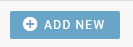

The first three options will let you customize your *default* view of lists in the Monitoring pane, Archive and Contacts. You can still switch between the two views on the actual panes by selecting the grid view or list view icon in the top right corner of each.

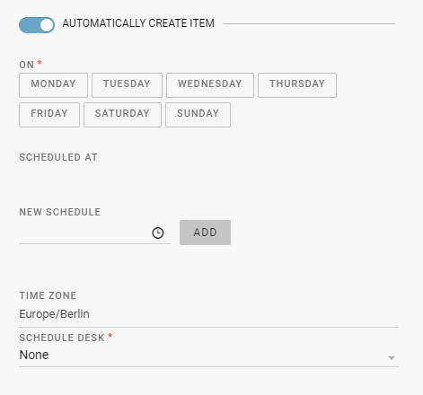

You can choose to have email notifications enabled or disabled using this blue toggle. If the toggle is grey (off) you will not receive the system notifications by email. Same for the Desktop Notifications.

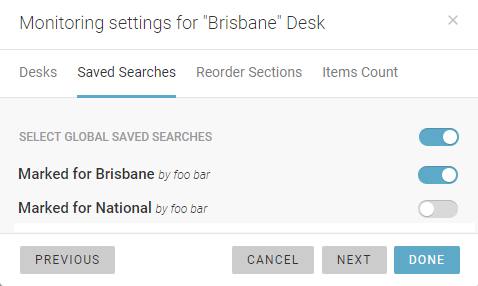

As a content producer, you might often find yourself reporting regularly from the same location. The article defaults help you pre-populate the dateline and place fields in news items that you create. This can be a great time-saving feature. It is possible to modify these fields again once the news item is created.

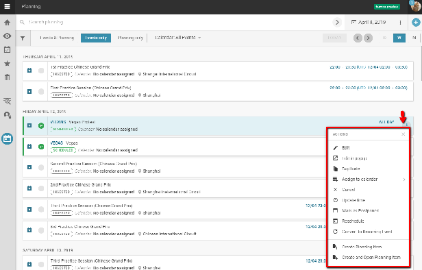

You might also find that you are using only a handful of categories in your item creation. There are some categories that you might never use. By selecting categories from the preferred categories list, you can create a shortlist of frequently used categories such that you would not need to scroll through ones that you never use.

Preferred Desks allow you to customise which desks appear first in your workflow for sending drafts and publishing items.

### Resetting a User’s Password

If a user has forgotten their Superdesk password, admins can open the user profile tab and click the *reset password* link to send the user an email to the user with instructions on resetting their password.

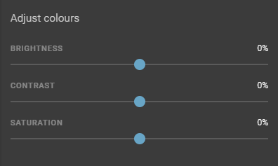

## User Roles

Just as all of the Desks, Stages, and Content Profiles are configurable in the Superdesk interface, so too are the User Roles. The User Roles menu item allows you to define the user types and permissions associated with each of those user types.

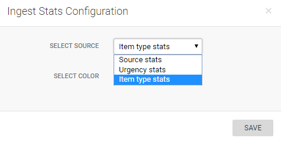

Admins can access the User Roles settings from the Hamburger menu in the top left corner of the Superdesk interface.

The User Roles pane is where you will control users’ access to different functions within Superdesk on a large scale. Individual user privileges can also be edited from each individual’s [full profile view](#privileges-tab).

From the User Roles panel, you will be able to rename and change the description of each role within Superdesk by clicking the pencil icon that appears when you mouse-over each role.

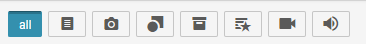

Selecting the *Set as default* checkbox in the Edit Role window will set that role as the top pick in new user creation.

The Roles Privileges pane allows you to choose which roles are eligible for which privileges. Note that the Admin role is missing from these pages because by default admins have all permissions and that cannot be changed.

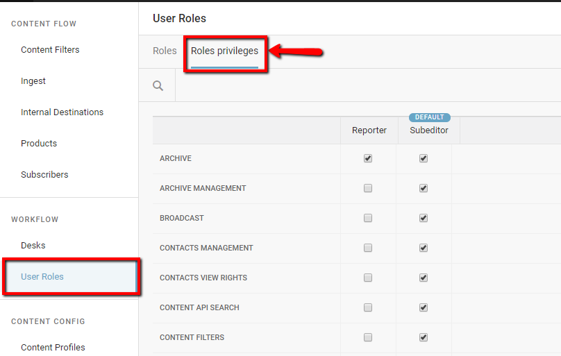

You can use the checkboxes to add or remove privileges from the user roles. Users may need to log out and log back in to update any changes you have made to their user roles.

## Media Contacts

Superdesk has an internal repository for Media Contacts. These contacts can be created and edited by users with the appropriate permissions. Media Contacts can be accessed through the Hamburger Menu, as shown below:

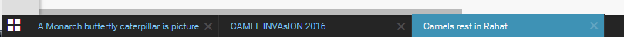

The Superdesk-internal Media Contacts are a great time-saving feature for journalists and editors. Without having to leave the Superdesk interface, users can find important contact information for their media sources, contributors or subscribers.

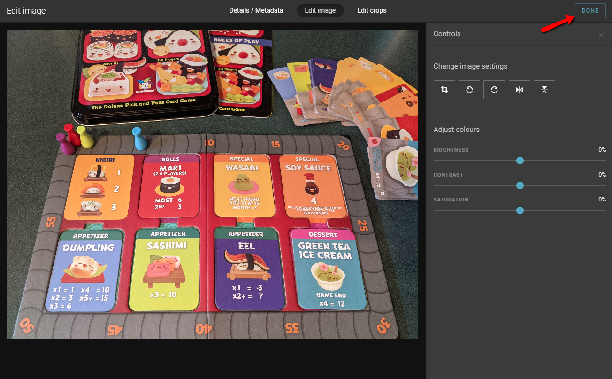

New Media Contacts can be added using the Create icon in the top right corner of the Media Contacts pane. Clicking on the Create icon will open a new pane on the right of the Superdesk interface:
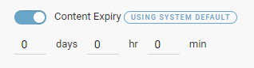

Required fields are marked with a red asterisk. Click the SAVE button in the top right corner of the pane to add your new Media Contact. In addition to phone and email contact information, you can also add fax, twitter, facebook, instagram and street address.

In the Media Contacts pane, clicking on the mail, twitter, facebook or instagram icons will send you directly to those websites, or open your computer’s mail program.
