# Defining Publishing in Superdesk

There are several steps to defining publishing in Superdesk. This chapter provides an overview of all the various modules to consider when publishing from Superdesk. This chapter is presented independently from the Superdesk Publisher component, which is an optional add-on to Superdesk.

The first step to publishing in Superdesk allows users to create automatic rules that are used to group published news items together. This means that you can use one instance of Superdesk to publish specific content to multiple destinations. These rules are called **Content Filters**.

**Products** are then created based on the application of those Content Filters. The simplest Product would be a Product with no Content Filters applied. In that case, every item that is published will be part of the Product. Products also define the delivery method of the content that is being published.

The next step is to set up **Subscribers**. Setting up Subscribers lets you link Products with **Destinations**. Subscribers might be news agency customers, but in the world of digital publishing you can think of them as of publications. For each Subscriber, you can define the Products. Products are how the news items are sent to your Subscribers, including formats and delivery methods, and the Destination to where they should be published.

Once you’ve attempted to publish your items, you can check the details or resend the item from the Publish Queue. Once successfully published to your Subscribers, all of your news items will be saved in your Legal Archive.

## Steps to publishing in Superdesk

1. Make [Content Filters](#make-content-filters)
   Make Filter Conditions
   Assemble Filter Statements
   Test Content Filters
   Filter Search
2. Create [Internal Destinations](#internal-destinations) (optional)
3. [Create Products](#creating-products) (applying Content Filters)
4. [Define Subscribers](#define-subscribers) (associating Products and Destinations)
5. [Publish](#publishing-your-news-items) your news items to your Subscribers
6. Check your [Publish Queue](#heading=h.1il4icctuk08) to see if the news item published successfully
7. View your [Legal Archive](#legal-archive) (optional)

### Make Content Filters

Content Filters allow you to create a series of criteria through which Superdesk can narrow down the news items and create news item groupings. These Content Filters allow you to build various Products for distribution. You can use any number of Filter Conditions, or Content Filters to automatically select the content for the Product.

To get started with Content Filters, click on the *Hamburger menu \> Settings \> Content Filter*. You will notice that there are three tabs along the top of the Content Filters pane: Filters, Filter Conditions and Filter Search.

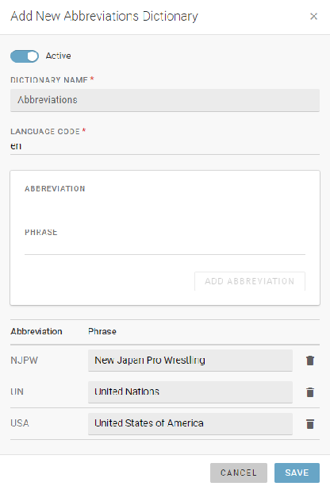

Before you can apply a Content Filter, you must first create at least one Filter Condition.

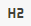

To create a new Filter Condition, click the *Filter Conditions* tab along the top of the pane, then click the \+*ADD NEW* button in the top right corner. A new window will open.


The NAME field is for labelling your filter condition. Using a descriptive NAME will help other users understand what your filter does.

The FIELD drop-down menu allows you to select which metadata fields of the item to look at when filtering. The complete list of your instance’s available metadata fields is shown below:

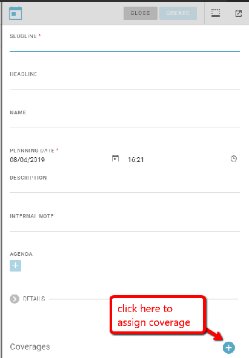

The OPERATOR field gives you logical operators to further define your condition. For fields where you select from controlled vocabularies (lists of items) it is simply: **in** or **nin** (not in), for those fields that refer to text box metadata fields, there are more operators such as: **like, notlike, startswith,** and **endswith.** Depending on which field you have chosen, a different subset of operators will be available.

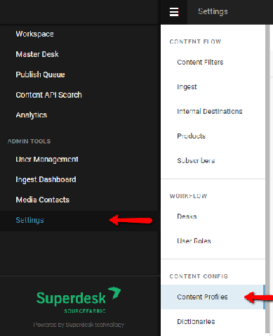

The VALUES selection will look different depending on which FIELD you have chosen. You might be required to input text, or you may need to choose a predetermined value from a drop-down menu. Note that if you select multiple values, the filter query will look for anything with either value 1 OR value 2\.

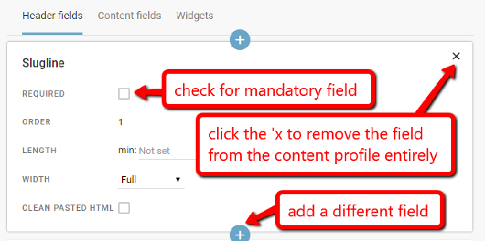

In the example above, we have selected values from a predetermined list of subjects, which is our chosen FIELD. Click the square Create icon in the values section to add multiple values. In the example above, we are creating a content filter for items which have either sport or education as their subject.

 To remove a value, mouse-over and click the ‘x’.

Once you’ve entered your NAME, FIELD, OPERATOR and VALUES, save your Filter Condition.

#### Assemble and test Content Filters

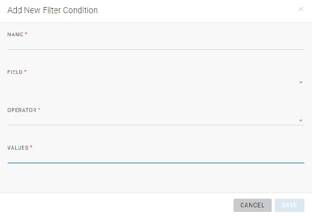

To create a new Content Filter, click the FILTERS tab, then click the \+*ADD NEW* button in the top right corner of the Filters tab.

Note that your Content Filters can be made up of a single condition or a set of multiple conditions. For clarity, the NAME for your Content Filter should reflect the types of conditions that it is using.

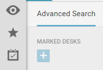

**Global Block \-** When a filter is configured as a 'Global Block' the content it defines will be blocked by default to all Subscribers. It is unblocked for specific Subscribers by deactivating it on the Applied Global Block Filters tab of the Subscriber form.

**Archived Block \-** 'Archived Block' allows definition of a filter or filters to control what content is actually sent to the Archive, and what is simply deleted on expiry. Some routine content or news items of ephemeral-interest may not be considered worth archiving.

A single Filter Statement can search for multiple overlapping conditions. You can set up the statement to search for more than one condition in a single operation by adding multiple conditions to the same Filter Statement. First, create a ***Filter Statement 1*** by selecting one of your previously created Filter Conditions*.* Then click on the *ADD* button within the filter statement box. You will see the filter conditions that you have already added at the bottom of the Filter Statement box.


Clicking the *ADD FILTER STATEMENT* button at the bottom of the window will add another Filter Condition in a new statement. Each separate Filter Statement will give you another query in addition to the one that you have currently input.

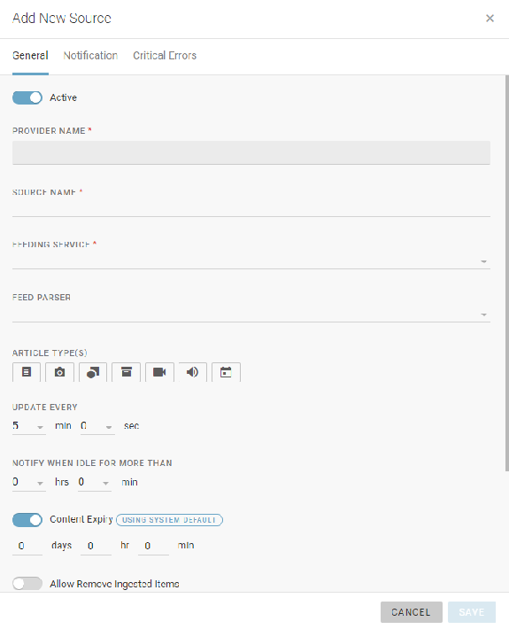

Once you have input Filter Conditions, you will see text appear in the FILTER PREVIEW, below the filter statements. The conditions will be separated by **AND** or **OR** depending on if they were input in the same Filter Statement (AND) or separate Filter Statements (OR).

You can also use other Content Filters to create a query, and you can even combine multiple conditions with filters. (Condition X AND Filter Y). You can have any number of Filter Statements in a single Content Filter, but you can only apply one Filter per Product.

#### Testing the Content Filter

You can test the filter to ensure that it is working correctly. To do so, copy an article GUID (from the article information tab in the article editing window) and paste it to the Filter Test field at the bottom of the window. You will see if your target test article matches the Filter Condition or not.

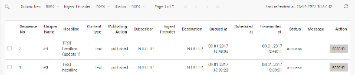

#### Filter Search

Along the top of the Content Filters pane, you will also see the Filter Search tab.

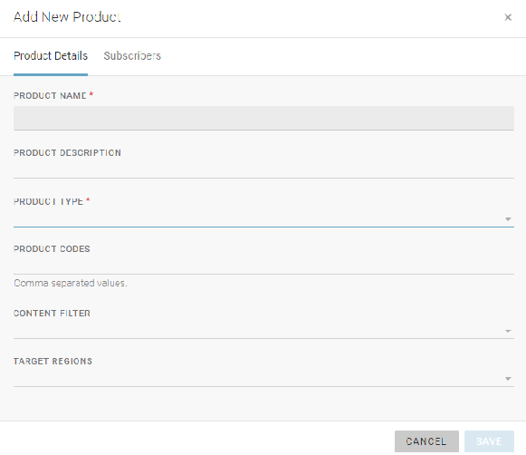

Filter Search is an important tool. This feature allows you to see which existing Content Filters contain your query Conditions. Superdesk will also show you if the defined query is currently being used, and if it is being used, where it is being used. This knowledge is especially important if you decide to edit or delete a Filter Condition.

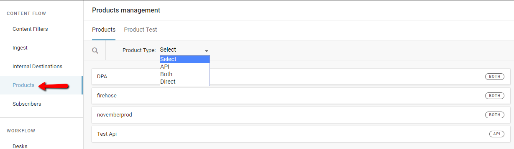

Select your FIELD, OPERATOR and VALUE used to create the Condition, then click the *SEARCH* button. To the right, you will see which Conditions are associated with your query, which Content Filters contain those conditions, and which Subscribers are using those Content Filters.

#### Edit, test or delete an existing Content Filter

Once you’ve created your Content Filter, you will see it appear in the Filters tab. Hovering over the Filter will show you options to test, edit or delete your Filter.

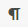

Testing the Content Filter using this checkmark icon will open a new window to display a list of all articles that match the Filter conditions. You can also view a list of articles that do not match by clicking on the Non-Matching parameter, displayed below.

	

###

### Internal Destinations

The Internal Destinations feature allows you to route a copy of a published article to Desk(s). This allows you to reuse content without having to create it again from scratch. There are several reasons you might want to set up Internal Destinations. Some common uses of Internal Destinations include making it available to translators in a ready-to-use format or creating shortened versions of news items for further distribution.

To configure an Internal Destination, select the *Hamburger menu \> Settings \> Internal Destinations*.

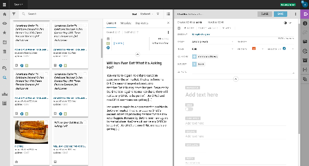

When you publish a news item in Superdesk, if you have Internal Destinations configured, the article will not only be published to your subscribers, but also to the designated Desk(s) as defined by these settings.

Generally, Publishing sends the news item to a Destination in a specific output format. With Internal destinations, the story being published is **copied and sent to a selected Desk**. In both cases, the story is first checked against Content Filters and the publishing action is performed only if the content matches the filter criteria.

Users can select the Desk, Stage, and a macro to be run on the content (optional). The macro is usually used to modify the content (e.g. changes its metadata).

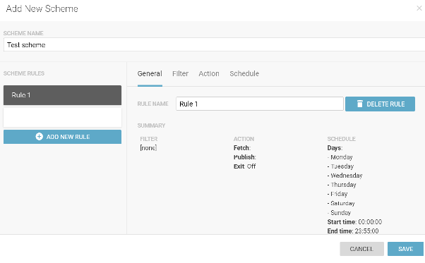

To create an Internal Destination, click the Create icon in the top-right corner of the Internal Destinations pane.


In the example above, the news items matching the "Desk \= Karel" Content Filter will be copied and sent to the "Ontario" Desk: "Working" Stage, and an "Extract Html Macro" macro will be applied. In other words, everything published from the Desk Karel will be sent to Desk Ontario, and modified by a macro.

Internal Destinations can be enabled or disabled using the *Active* toggle at the top of the Edit Destination window.

###  **Creating Products**

Products can be thought of as another layer of Content Filters. A typical Product might be the same as the application of Content Filter before an item gets published. However within the Product interface, you can further define the Product by adding a territorial restriction. Within the Products section, you can also apply the inverse of a Content Filter by saving it as a "blocking" filter.

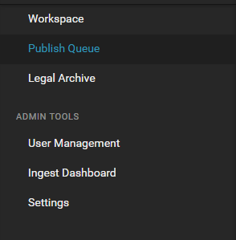

You can access the Products menu from the Hamburger menu, then select Settings \> Products.

The Product Management pane will display a list of your current Products. From here, they can be edited if you mouse-over them and click the pencil icon.


To get started creating new Products, click on the \+*ADD NEW* button in the top right corner of the Product Management pane.

The simplest version of a Product would be "use no filters" Product. You only need to give it a name and then all content that you publish will be a part of your Product.


**Product Name** \- Superdesk-internal name. The name you give your Product will not be seen by Subscribers.It’s for Superdesk-internal use only. This field is mandatory.

**Product Description \-** Superdesk-internal description. It is usually used to communicate which Filters are being applied to this Product, and maybe which regions are being targeted. This field is not mandatory, but suggested.

**Product Type-** Choose between API, Direct or Both.

**Product Codes** \- Allow the assignment of proprietary/niche content descriptors and designators. For example, our client AAP currently uses them to implement our 'selector code' product permissioning system, but they could as easily be used with any private or public categorisation scheme to provide further service definition for upstream use.

**Content Filter** \- You can only apply one filter per Product. If you need to filter multiple conditions you must set that up within the Content Filter section. (In that case, select Hamburger menu \> Settings \> Content Filters.) If you don’t assign any Content Filter, every item that is published in your Superdesk instance will be sent to your subscribers. Content Filters are not mandatory. If you select a Content Filter in this step, you will need to also select a Content Filter type: Permitting or Blocking.

**Content Filter Type** \- A **permitting filter** will allow only articles defined by the conditions to be selected as part of the product. A **blocking filter** will prevent all the articles that match the conditions from being selected. In this case, it would be ***all but** Filter XY*.

**Target Regions** \- If your version of Superdesk is configured with regions, you can use this drop-down menu to further define your Product. Only regions selected here would receive your Product.

### Define Subscribers

Admins can set up Subscribers by accessing the Hamburger menu, then click on *Settings \> Subscribers*.

In the Content Flow section of the Settings menu, users can define:

* Subscribers (to whom)
* Products (what they should receive, application of content filters, regional restrictions)
* Destinations (where to send it)
* Formats (how it should be send)

Subscribers are customers. Each Subscriber can receive a mixture of Products, to any number of Destinations. A Subscriber can also be another distribution system or systems. For a digital publisher, the Subscriber can be a website, mobile app or other asset.


To define your Subscribers, click on the *Hamburger menu \> Settings \> Subscribers*. Click on the \+*ADD NEW* button in the top right corner of the corner of the Subscribers pane.

Note that many of the values in these menus can be configured to suit your company’s particular needs. The fields and values available in the form for Subscribers are defined in .../server/data/**vocabularies.json** file.

This file contains controlled vocabularies (mainly lists of metadata). The Subscribers are under *subscriber\_types* definition and specifies the types and formats available. Example:

```json
{
  "is_active": true,
  "name": "All",
  "qcode": "all",
  "formats": [
    {"name": "NTBNITF", "qcode": "ntbnitf"},
    {"name": "NINJS", "qcode": "ninjs"},
    {"name": "AAP NewsML 1.2", "qcode": "newsml12"},
    {"name": "NewsML G2", "qcode": "newsmlg2"}
  ]
}
```

Below is an example of a typical new Subscriber window, and descriptions of the various fields you might find:

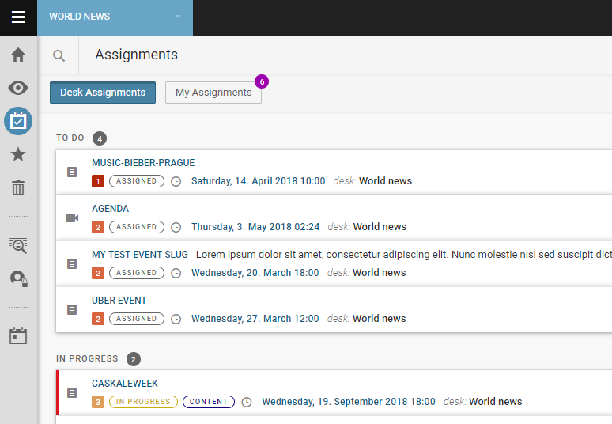

**Status:** Active / inactive switch.

**Email to broadcast kill events:** Email address used to send notifications on "killed" articles. This is used by some organisations in case they want to recall a story and notify their subscribers. If you do not plan to use "kills", simply fill in any email address in a valid format. You must fill out an email address in this field.

**Target type:** The target type drop-down menu is configured to suit your particular situation. In the example above you can choose between digital targets, paper targets, or both.

**Media type:** The media type drop-down menu is configured to suit your particular situation. For example, you might choose between media and non-media types. Media customers might include newspapers, magazines, news websites, etc. Non-media types might include banks, governments, businesses. Depending on your definitions, you can also use this drop down menu to distinguish between a free and paid website, etc.

**Subscriber Codes:** These provide a way of assigning a subscriber-specific token or key for use by upstream distribution platforms.

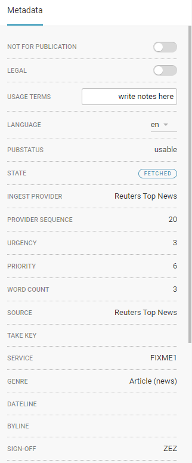

**Targetable by Users:** Enabling this toggle lets editors select the Subscriber when they create a story and send it to the Subscriber directly even if the story doesn't match any of the Products (Content Filters) that the Subscriber set up to receive.

**Products:** You can select multiple products from this list. As noted in the previous section, Products are applications of Content Filters and regional restrictions. If you don’t select any Product here, all news items that are published can be sent to this Subscriber.

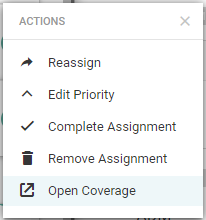

**Sequence number settings:** Sequence numbers are a range of IDs in the Publish Queue. These Transmission Sequence Numbers are intended to be passed to end users as part of the delivered document format. Historically they provided a way for a Subscriber to detect a break in transmission continuity on a given wire and quote back to the source the range of sequence numbers missed so that a retransmission could be arranged. Nowadays they are largely called for in order to support legacy data formats which expect a sequence number (for example: ANPA 1312 and IPTC 7901), although they can also be used in the construction of some of the metadata required within NewsML. Conventionally sequence numbers would run either 1-999 or 1-9999 with a rollover at either the upper numerical limit, or at midnight each day. It was considered good practice to not have a sequence number repeated within a 24 hour news cycle, and this would usually dictate both the upper numerical value and the rollover method chosen.

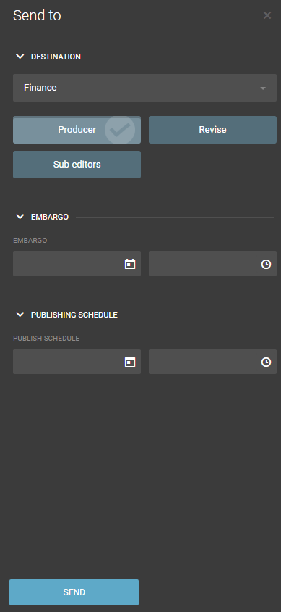

**Destination**: Destinations are the *where* in the publishing process. You can have multiple destinations for one Subscriber.


**Delivery Type**: You can select from the previously configured formats and delivery types (pictured above). Depending on your selection, you may have additional fields to define.

To add an additional Destination, click on the *\+ ADD NEW DESTINATION* button at the bottom of the Add New Subscriber window. Note that for Content-API-only Subscribers, you are not required to add a Destination.

### Publishing your news items

You are now ready to publish your news items\! When you click the PUBLISH button in Superdesk, it will send your news items through the Content Filters to determine which Subscribers will be sent the news item that you’ve published. You can check the Publish Queue for further details about the Headline, Destination, Subscriber and status.

## Publish Queue

The Publish Queue contains a list of all published items and their associated destinations. Depending on user permissions, not all users will be able to access the information in the Publish Queue. Users can access the Publish Queue from the Hamburger menu in the top-left corner of the Superdesk interface.

 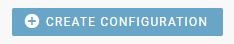

If an article failed to publish successfully, you will see that recorded in the Publish Queue and you have the option to resend the item directly from the Publish Queue panel.

When content is labeled as "published" in Superdesk, it only means that somebody hit the *PUBLISH* button. If the news item doesn’t pass through Content Filters, get assigned to a Product and Subscriber with a Destination, the content stays in Superdesk but can still be marked as published within the Monitoring view.

The Publish Queue gives Superdesk users an overview on what has been sent out, and what has actually been received by your Subscribers.

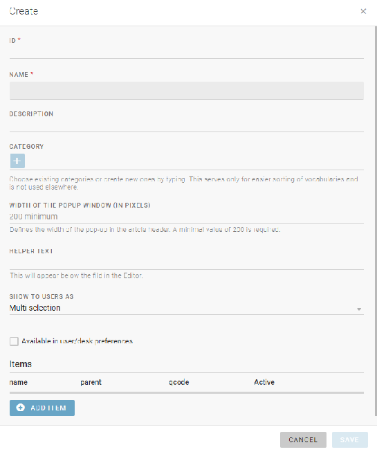

Within the Publish Queue can see and search for published content items. You can also search by Subscriber, Destination, and their publishing *status*. Within the Publish Queue, you can also cancel or resend the items.

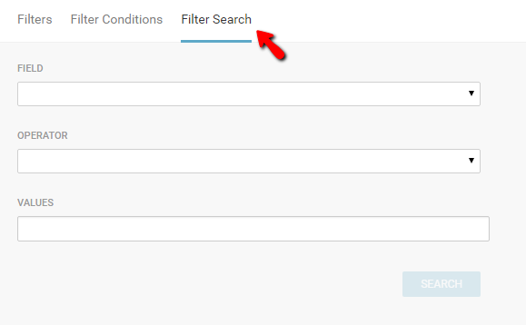

The Publish Queue displays a list of all of the items that are scheduled to be published, or have been published. Every article in the Publish Queue comes with a unique number identifier and a sequence number. The Status column will tell you if an article failed to publish successfully.

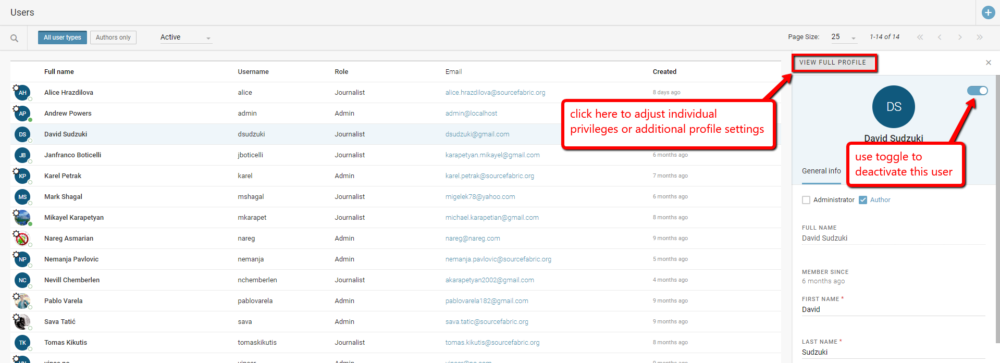

The action column on the far right of the article entry has a button to resend an article. It is possible to resend articles that have successfully published, as well as items that have failed to publish. **If you choose to resend an article, the Unique Name identifier will stay the same, but a new sequence number will be assigned.**

Clicking on an article in the Publish Queue will open a tab on the right with an article summary. You will see tabs for item content, metadata, duplicates and full item history. Note that items cannot be edited from the Publish Queue.

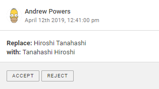

Navigate through the Publish Queue by using the page arrows beside the search icon at the top of the Publish Queue window.


Sort the view order of the news items in the Publish Queue list, by clicking the Subscriber, Ingest Provider, Content type, or Status drop-down menus along the top of the Publish Queue window and selecting from the displayed options. For example, the Status drop-down menu is displayed above.

Search the Publish Queue by clicking on the search icon and inputting keywords from the article headline.

Double clicking on an item in the Publish Queue will open a pane on the right from which you can see three tabs: Content, Metadata and Item History.

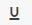

The Content tab shows a preview of the news item. The Metadata tab displays all of the info that would be shown in the info tab of the editor including its unique name, GUID and state. The Item History tab shows all of the article’s versions and what was updated in each version.

## Legal Archive

Your Superdesk instance might also include a Legal Archive. As with most modules within Superdesk, the Legal Archive is an optional addition to the interface. Your particular instance of Superdesk might ***not*** include the Legal Archive.

The Legal Archive is an immutable forensic record of every item published, from its ingest or creation and including every subsequent edit action: what was changed, when and by whom. This archive is kept as an evidential record to use in cases of commercial dispute or legal action.

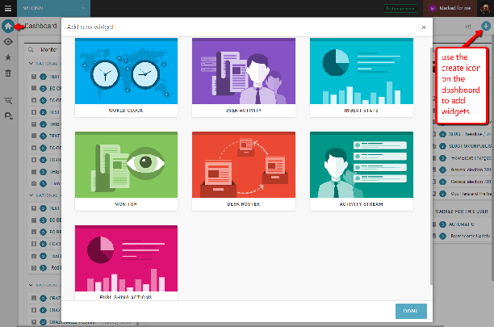

Admin users can access the Legal Archive from the Hamburger menu in the top-left corner of the Superdesk interface.

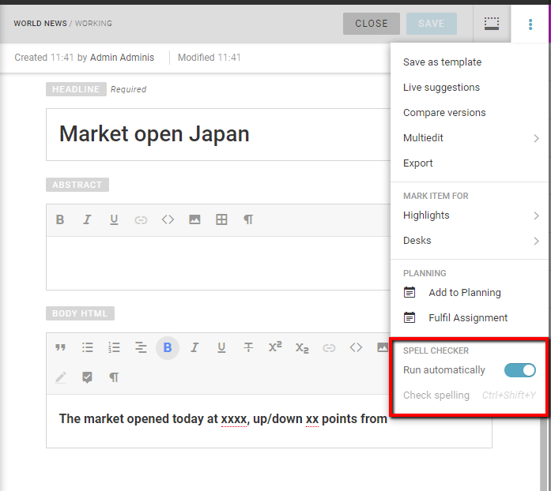

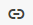 This is the  Advanced Search icon.

You can search the articles in the Legal Archive by clicking the search icon in the upper-left corner of the Legal Archive window. This will open a tab on the left where you can input search criteria in various text boxes.

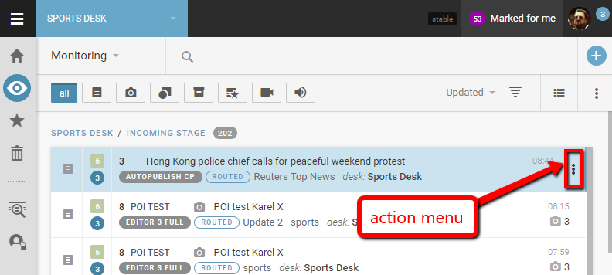

You can search by Story ID, Headline, Slugline, Story Text keywords, or by publishing dates. You can adjust how many entries are displayed per page by using the drop-down menu beside Page Size at the top of the search window.


Just as with other list views within Superdesk, articles from the Legal Archive can be previewed by left-clicking on them once. A tab will open on the right with an overview of the article metadata. To open the article in its full form, click the Action menu and select *Open*. Note that articles in the Legal Archive cannot be edited or deleted.
