# Content Configuration

The Superdesk Hamburger menu is where most of the newsroom workflow is set up. In the Admin tools section, under the Settings heading is where you can create Desks and Stages, manage Content Profiles, create Highlight lists, set default user privilege profiles, edit your Subscribers, create Templates and more.

There are three sections within the Settings area: **Content Flow**, **Workflow**, and **Content Configuration**.

The **Content Flow** section contains settings pertaining to how news items move from Superdesk to your customers or other Superdesk-internal locations (Internal Destinations). You will find the features in this section described in the Superdesk [Publishing chapter](#steps-to-publishing-in-superdesk).

The **Workflow** section contains settings pertaining to [user roles,](#user-roles) [desk creation and desk stages](#desk-creation-and-desk-management).

The **Content Configuration** section contains settings pertaining to metadata fields for new item creation, highlight creation, templates and vocabularies. The content configuration section of the Settings menu is described below:

## Content Profiles

Content Profiles are used to define metadata for new item creation. Content Profiles determine which fields are available, and which fields are required when a news item is created.

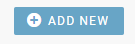

To get started with Content Profile creation, click the Hamburger menu, then select *Settings \> Content Profiles.*

Admins can create new Content Profile templates by clicking on the \+ADD NEW button at the top right of the Content Profiles tab.

The first step is to assign your new Content Profile with a name and a description. Once you have entered those, and pressed the *SAVE & CONTINUE* button, you will then be able to customise the metadata and fields in the next window.

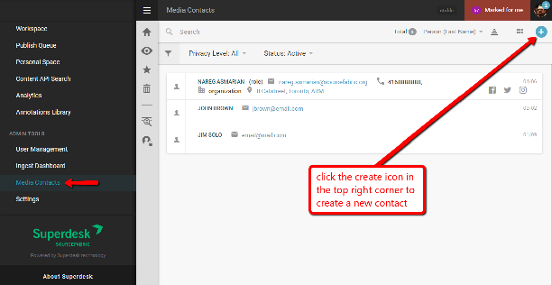

You will see three tabs in the middle of the Edit Content Profile window: Header Fields, Content Fields and Widgets.

* **Header fields** are fields that are not transmitted to readers. These fields are mostly used for Superdesk-internal communication.
* **Content fields** are fields that are transmitted to readers.
* **Widgets** tab dictates which items are present in the Editor Sidebar of the article creation window.

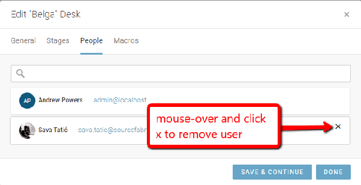

You can specify there is a mandatory field, by clicking on the ‘Required’ checkbox. For most text fields, you can also specify a minimum and maximum character length.
Clicking the Create icon above or below each field allows you to add additional fields. Custom fields can be configured by selecting *Hamburger menu \> Settings \> Metadata*.

## Dictionaries

The Dictionaries tab allows you to select which dictionary Superdesk will use for internal spell check. Superdesk allows admins and users to use multiple dictionaries for spell checking.

If you prefer not to use the Superdesk-internal Spell Check described below, Superdesk can also be integrated with 3rd party tools such as [Tansa](https://www.tansa.com/).

To configure a Superdesk-internal Spell Checker, select the *Hamburger menu \> Settings \> Dictionaries*, as shown below.

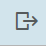

Clicking the Create icon in the top-right corner of the Dictionary Management pane will give you the option to add a global dictionary, a personal dictionary, or an abbreviations dictionary.

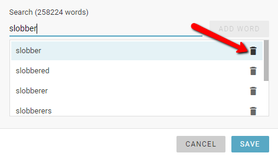

In the Add New Dictionary window, you will need to add a unique name and ISO language code in the textboxes provided. You can [check a list of language codes](http://www.lingoes.net/en/translator/langcode.htm) if you are unsure of which code to use. Any global dictionary or personal dictionary will also require you to upload a reference file. **Dictionary files must be in .txt format, with one entry per line.**

Personal dictionaries are only available for the user that creates it, whereas global dictionaries are available for all Superdesk users in your organization. Once created, you may need to **logout** and then log back in to begin using the newly created dictionary.

Don’t forget to set the dictionary to active using the toggle at the top of the dictionary configuration window.

It is possible to have multiple dictionaries with the same language code; for example, a medical dictionary, and a general one. When checking articles, Superdesk will use all of the active dictionaries that match the news item’s language code concurrently. (Note the toggle at the top of the dictionary configuration window can be used to temporarily disable a dictionary).

You can view your news item’s current language code by using the *information button* in the Editor Sidebar when you are editing an article.

#### Adding additional entries to a Dictionary

Once a Dictionary is created, you can add additional entries by selecting *Hamburger Menu \> Settings \> Dictionaries*, then select the edit icon when you mouse over the Dictionary that you would like to add an entry to.

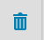

In the Edit Dictionary window, you can search the Dictionary for a word using the search textbox at the bottom of the window.

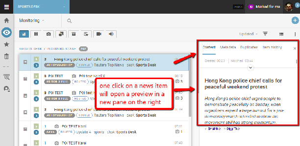

If the word is not in the Dictionary, use the ADD WORD button beside the search textbox. Entries can also be added to the dictionary from the article editing window, in which case the word will be added to the user’s personal dictionary.

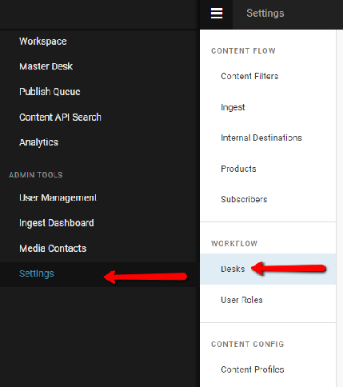

If you wish to delete an entry from the dictionary, use the trash icon beside the searched entry to remove it.

#### Using the Spell Check feature

Once your Dictionaries are configured, you can use the spell check by selecting the action menu in the top-right corner of an article that is open for editing. If the *Run Automatically* toggle is on (blue), it will check the words as you are typing, otherwise, you can manually run the Spell Check by using *(ctrl \+ shift \+y)*.

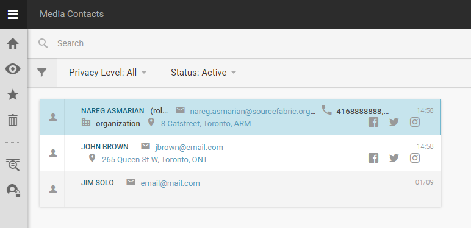

The Spell Check will scan the Headline, Body and Abstract fields for spelling errors.

####  **Abbreviations Dictionary**

The abbreviations dictionary is a personal dictionary tool that enables automatic text expansion while writing articles. This can be a handy time-saving tool. Some Superdesk users will find that they use it extensively, others less so.

To set up your abbreviations dictionary:

* Go to *Hamburger Menu \> Settings \> Dictionaries*.
* Click *the Create icon* in the top-right corner of the dictionary management pane, then select the *Abbreviations Dictionary* option.
* A new window should open titled "Add New Abbreviations Dictionary".  Enter a language code. (for example: EN for English). This is so the abbreviation dictionary can be bound to articles of a certain language, similar to the main dictionary.
* Enter the abbreviation to be replaced.
  (for example: UN)
* Enter the phrase you want the abbreviation to be replaced with.
  (for example: United Nations)
* Click the *ADD ABBREVIATION* button. Your new abbreviation will appear below the button. You can add further abbreviations, or click the *Save* button to close the window.

With the example above, when you are typing in the body text of any article if you type **UN\*** and hit space, the automatic editor will replace it with “**United Nations**”. It’s a good idea to create a list of commonly used abbreviations for your newsroom.

You only need to click the Create icon the first time you’re adding a dictionary. Once the dictionary exists, you can edit your dictionaries from the Dictionary management section by clicking on the pencil-shaped icon beside the dictionary you wish to edit. Editing an abbreviations dictionary in this manner also lets you add more items to it.

## Highlights

Highlights section of the Settings menu allows for the creation and configuration of Highlights.

Highlight lists are desk-specific curated lists of news items. They are commonly used for making top-10 lists, section features and other types of user-curated lists. Highlights can be automatically generated against user-specified metadata, or manually curated. Highlight lists can be easily published or simply used for Superdesk internal communication of important news items.
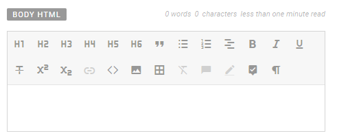

New Highlight lists can only be created from this menu: *Hamburger menu \> Settings \> Highlights*.

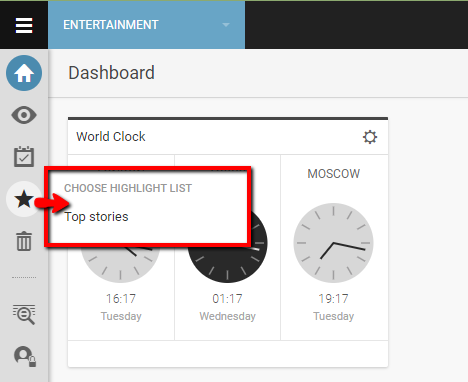

To create a new Highlight, click the CREATE *CONFIGURATION* button located in the upper-right corner of the Highlights Configurations window. This opens a new window with options for creating your new Highlight list.
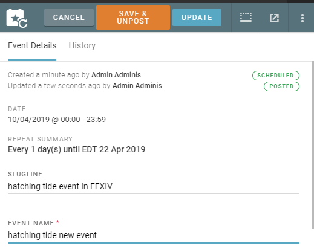

**CONFIGURATION NAME**: This field allows you to name the Highlight.
**TEMPLATE:** This drop-down menu chooses the template that will be applied when a new article is added to  this Highlight.
**ASSIGNED DESKS:** These are the desks which will be able to view the Highlight, additionally, these are the desks that items are automatically added from upon creation of the Highlight. **AUTOMATICALLY INSERT ITEMS:** This drop-down menu allows you to choose the timeframe in which items are automatically added to the Highlight upon creation. For example, if you check the Adelaide desk and select 12 hours from the AUTOMATICALLY INSERT ITEMS FROM drop-down menu, all items from the Adelaide desk from the last 12 hours will be added upon creation. Otherwise, after a Highlight is created, all curation is done manually. If you want to create a Highlight that is entirely curated manually, do not select any desk on creation. This Highlight will then be available to *all desks* and those users with appropriate privileges will be able to add content to the Highlight.

## Metadata

Within Superdesk, most of the fields are configurable in order to meet the needs of your organization. The metadata section of the Settings menu allows users to define fields not only for news item creation, but also media contacts, events and planning, etc.

To get started defining metadata fields, select the *Hamburger menu \> Settings \> Metadata*.
At the top of the Metadata Management pane, you may see various tabs: Vocabularies, Custom Text fields, etc. Previously defined entries will show up in the Metadata Management pane. The grey number bubble beside the entry indicates the number of defined options within each entry.

To define a new field, click on the \+ADD NEW button in the top-right corner of the Superdesk interface.

**ID**:
**NAME**: The title of the metadata field as it appears in Superdesk.
**DESCRIPTION**: This Superdesk-internal description is only visible in this metadata management pane. Use this to describe what the field is used for.
**CATEGORY**: The Vocabulary list in the Metadata management pane can be broken down into categories. This is important for organizing
**WIDTH**: Enter the size of the field in pixels.
**HELPER TEXT**: Explainer text for fields in the Editor. The extra text will only appear if it’s a field in the content fields of a content profile.
**SHOW TO USERS AS**: Choose from single selection, multi-selection or neither. Sometimes
**ITEMS**: If the field has multiple values, enter the values that users can choose from in this section. Use the \+ADD ITEM button to add further values.

## Search Providers

The Search Providers tab enables administrators to set up external content providers for external image searches within Superdesk, for example.

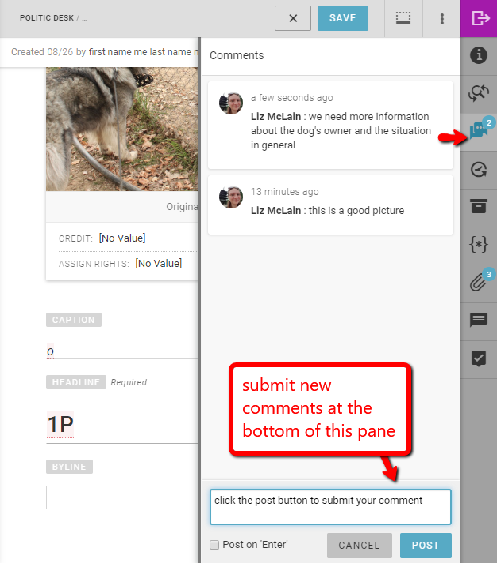
Click the \+ADD NEW button in the upper-right corner of the Search providers window to add a new Search Provider.

The window that opens enables you to toggle the Search Provider on or off, select the provider type and enter the source name. The username and password credentials must also be entered in this window in order to configure the Search Provider functionality.

## Templates

The Templates pane displays all current Templates for your Superdesk instance. Templates are Content Profiles that contain metadata fields that are already filled-in.  Templates have several uses within Superdesk. They can save time in routine news item creation, they can be used to auto-generate articles, they can be the generic kill notification sent to subscribers, or they can be used to auto-format items in a Highlight List.

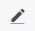

Clicking on the Create icon in the top-right corner of the Templates pane, will allow you to create a new Template. Once created, each Template will appear in a box in the Templates pane. Each box in the Templates pane displays the template type, the Desk and Stage it’s assigned to (if any) and its automated item creation schedule (if any).

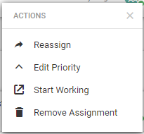 This is the Template Action menu.

Existing Templates can be edited by selecting the Action Menu and selecting the *Edit* option. To delete a template, click the Action menu and select the *Remove* option.

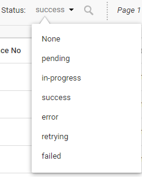

Within the Edit Template window, you can enter (or update) any of the Template information.

There are two halves to the Edit Templates window.
On the left side of the Edit Template window, you will need to add a name for the Template.

Setting the ***Make Public*** **toggle** to the *on* position (blue) will enable users other than the template creator to use the template.  In the *off* position, Template will only be for personal use.
You can choose a **Content Profile** from the drop-down menu at the top of the window.  Depending on which Content Profile you choose, you will see a different set of metadata fields below the *Make Public* toggle.
The **Template Type** drop-down menu will let you choose between a Create or Highlight-type template.

The bottom-half of the left-side of the Template creation window will contain various content fields for you to fill in. Any information entered here will appear in every news item created using this Template. The fields that are present will depend on which Content Profile is selected from the drop-down menu above.
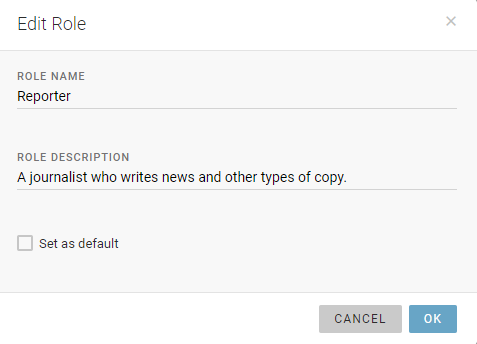

On the right side of the Edit Template window, if the Template is set to *public*, you will see a Desks tab. You can select desks that will have access to the Template. When you expand the Desks tab, a complete list of desks will be shown. Desks that are in blue will have access to the Template.

By expanding the metadata tab, you can also edit other Template settings such as Language, Not for publication toggle, target regions, etc.
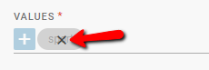

Below the metadata tab, you will find an ‘AUTOMATICALLY CREATE ITEM’ toggle. Switching the toggle to the ‘on’ position (blue) will expand the scheduling options. Automatically created items will appear in the assigned Desk stage at the chosen times. This feature is especially useful for **recurrent weekly news items**.

Click the SAVE button at the bottom of the window to create your Template.
