# Ingesting News Items and Events

Ingested news items are news items that arrive in Superdesk from outside sources. New Ingest sources can be configured in the Hamburger menu by selecting *Hamburger menu \> Settings \> Ingest*.

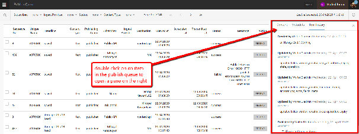

Ingest is the way in which articles from other news sources arrive in Superdesk. This section of the Settings menu allows you to configure the sources of your external news content. This Ingest menu item is also where the Planning Component’s ingested Event metadata is configured. [Read more about the Superdesk Planning Component.](#superdesk-planning-component)

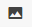

##

## Creating New Ingest Sources

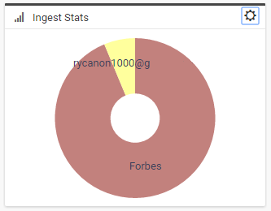

To add a new source to ingest from, click \+*ADD NEW* in the upper-right corner of the Ingest sources pane.

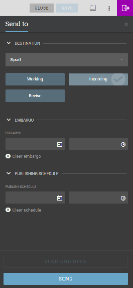

**Status** \- The toggle at the top of the Add New Source pane allows you to adjust the status of the ingest source. Status can be set to active or closed. If the status is set to active, Superdesk will ingest from this source. If it is closed, Superdesk will not ingest any further content from this source. Closed sources are saved, and can be reopened at a later date.

**Provider Name** \- The name of the entity providing you with this feed. This is not used for any type of authentication and is only for labeling purposes within Superdesk.

**Source Name** \- Similar to provider name, but this is what any content ingested from this source will be tagged with this Source Name under the Source field in the article metadata.

**Feeding Service**
Select a service type from the drop-down menu. Some examples are below:

* **Email** \- Superdesk will ingest new messages received at the email address. You will then need to fill in login credentials for the email account you would like Superdesk to monitor.
* **File Feed** \- Superdesk will monitor a file folder on the server Superdesk is installed on and ingest anything appropriate.
* **FTP** \- Superdesk will monitor the FTP destination and ingest any content that is appropriate.
* **Reuters Feed API \-** Superdesk will attempt to ingest the target if it is in Reuters Feed API format.
* **RSS \-** Superdesk will ingest the content coming in from the RSS feed set up here.

**Feed Parser**
The Feed Parser field lets Superdesk know what format to expect the content to be in.
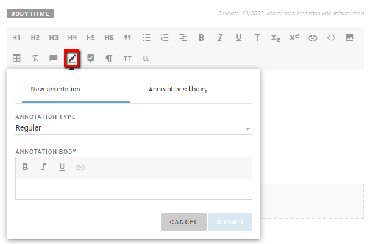

**Article Types**
The Article Types buttons enable you to select what type of content Superdesk will ingest from this feed.
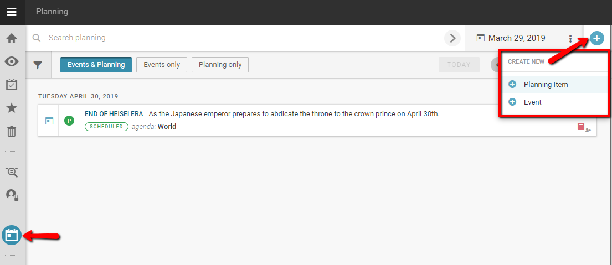
For example, you could set it to ingest only text articles and ignore picture items and composite items from a particular source. When you select an article type, it will be highlighted in blue. If you want to ingest Events for your Superdesk Planning Component, select the Events icon (far right).

**Update Every**
How often Superdesk will check and refresh this ingest source for new content.
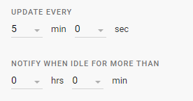

**Notify When Idle for More Than**
This setting will notify all users if the ingest source does not update with new content in the set amount of time. If you have email notifications enabled, you will also receive an email.

**Content Expiry**
If an article is older than the expiry limit, it will not be ingested.
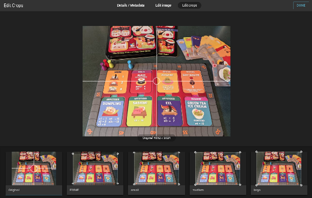
This Superdesk feature is great for making sure your newsroom is only publishing the most current and relevant news. If no expiry is selected, Superdesk will use the default desk expiry, if any.

**Allow Remove Ingested Items**
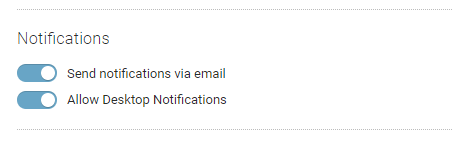

With this enabled, users with appropriate permissions are able to remove ingested items that haven’t been fetched to a desk.

**Rule Sets**
Choose which, if any Rule Set to apply to the items upon ingest. These Rule Sets allow Ingested articles to be modified between when they are sent out from the source and when they arrive in Superdesk.

**Routing**
With routing scheme, you can tell Superdesk to fetch items to a specific desk, set the items to a specific stage, or even publish the items immediately after ingest.

#### Creating New Ingest Rule Sets

Adding new Rule Sets must be done from the Rule Set tab found at the top of the Ingest settings page. Click the ADD NEW RULESET button in the top-right corner.

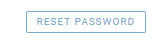

The first field allows you to name your Rule Set. Once you have named your Rule Set, and clicked the *\+ADD RULE* button, a new line will appear: the old and new fields are effectively **‘find and replace’** functions.
Enter your desired replacement rule and then click the *Save* button at the bottom of the Add New Rule Set window. Upon ingest, Superdesk will find any instance of the old word or phrase and replace it with what is inside the new field. You are able to set up multiple Rules inside a single Rule Set.

#### Creating New Ingest Routing

With routing scheme, you can tell Superdesk to fetch items to a specific desk, set the items to a specific stage, or even publish the items immediately after ingest.

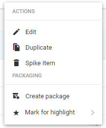
Routing schemes must be created from the Routing Scheme page accessible through the *Routing* tab at the top of the Ingest settings page. To create a new Scheme, click \+*ADD NEW* button on the top-right corner of the Ingest Routing pane.

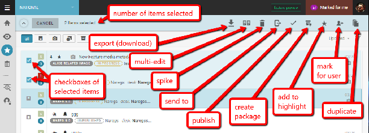
The RULE NAME field is where you will name your routing rules. These rules are different from what’s found in Rule Sets. The General tab also displays the current settings for the Rule. The Filter tab allows you to select what Content Filter to apply during ingest, this will let you decide which items you'd like to apply this routing scheme to.

The Action tab dictates what will be done when an ingested article meets the content filters criteria. You are able to publish items at this point or fetch them to a desk. Setting up these schemes properly can save journalists a lot of time searching through the Ingest manually. The *Exit* setting will exit the routing scheme once the criteria is met. The *Preserve Desk* switch, if enabled, will not change the desk of an ingested article if it already has a destination desk set elsewhere. Schedule allows you to decide when this Routing Scheme is applied, an example would be if you have a specific desk for urgent news outside of office hours.

## Ingest Dashboard

The Ingest Dashboard can be found in the Admin Tools section of the Hamburger menu.

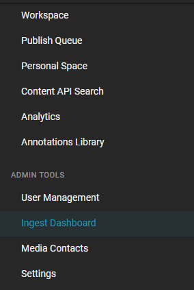

The Ingest Dashboard allows admins to monitor the status of these external news sources that provide news material to Superdesk.

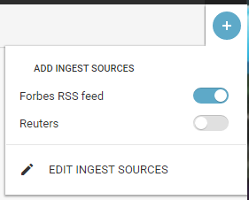

Clicking on the Create icon in the top-right corner of the Ingest Dashboard pane will open a window from which you can manage the items on your Ingest Sources Dashboard.

Toggling the Ingest Sources to the on-position (blue) will display the selected source for monitoring on the Ingest Dashboard. Clicking on the EDIT INGEST SOURCES link at the bottom of the window will take you to the Ingest section of the Hamburger menu.

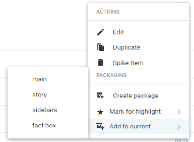

When an Ingest Source is being monitored on the Ingest Dashboard, it will look like the image above. You can click on the action menu on the top-left of the individual source display to adjust the information being displayed about the Ingest Source.

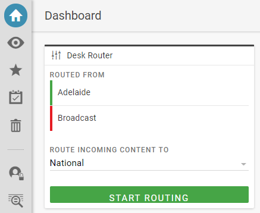

Customisable information is as follows:

**Status** \- Shows if the Source is successfully connected to Superdesk.

**Number of Items** \- Show number of articles ingested from this source in the past 24 hours.

**Time** \- How long since the last update and article had been ingested from this source.

**Log Messages** \- Communications and notes from the Source.

Clicking on the EDIT INGEST SOURCE link at the bottom of the action menu will take you to the Ingest section of the Hamburger menu, described in the previous section of this manual.

#
