# Superdesk Planning Component

The Superdesk Planning Component is an optional module for Superdesk that enables editors and journalists to create a database of upcoming events and plan their coverage well ahead of time. With the component, editors can assign these stories to Desks, or to specific users.

The Superdesk Planning Component can ingest external customer-facing calendars to automatically generate scheduled Events. Assignments work with Superdesk-internal journalist workflows to improve Superdesk internal communication and task completion.

External calendar and event metadata can be ingested and applied to the content that journalists produce, saving them from entering routine details when they need to focus on delivering a story to your audience. With the Superdesk Planning Component, Superdesk’s internal notifications will keep users on track and informed. The component’s alerts can also be integrated with 3rd party programs, such as Slack.

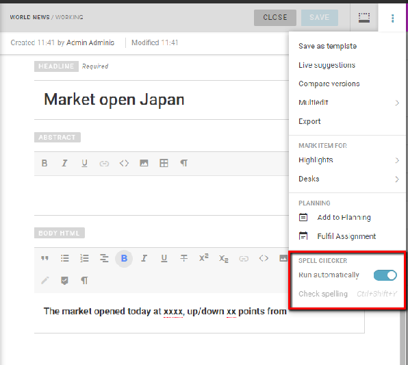 Planning icon 	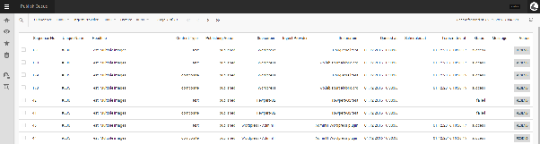 Assignments icon

If your organization is using the Superdesk Planning Component, you may see the Planning icon and the Assignments icon in the Workspace Panel.

Clicking the Planning icon in the Workspace Panel will take you to the Planning panel.

In the Planning panel, you can create two different types of items: Events and Planning Items. These items are created by clicking the Create icon in the top-right corner of the panel.

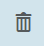

**Events** \- Events have a duration, and can either be recurring, or a one-time occurence. Events can be ingested from Superdesk-external calendars and automatically generated. Events are not assigned to users, but rather exist within Superdesk to organize coverage. Once an Event is created or ingested, it can be used to generate a Planning Item.

**Planning Items** \-  Planning Items are used to assign coverage details to your Superdesk team. Each Planning Item can have several elements of assigned coverage, each of which can be assigned to different users. Planning Items can be exported from the Planning pane to generate articles in the Superdesk Monitoring view. Planning Items can be created independently of Events.

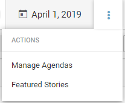

The action menu in the top right corner of the Planning pane allows you to create Agendas and designate Featured Stories. Featured Stories allow users to curate specific Agenda items to send to Newshub. Featured Stories form a digest of the day’s most important events. Users can then view these Featured Stories by using a toggle within Newshub.

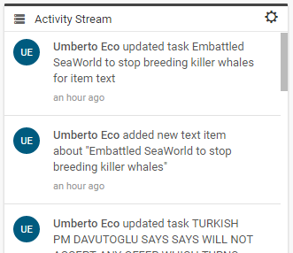

**Agendas** are used to group Planning Items together. Agendas are optional and they will appear in the Planning Item description in the list view of the Planning pane, as shown above.
Items marked as **Featured Stories** will appear with a red star in the Planning pane list view.  Just as in the Superdesk Monitoring view, items that are marked with a red stripe on their left margin are currently locked. This means they cannot be edited by users other than the user that has it opened, unless the item is unlocked by an admin.
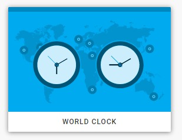
When a Planning Item or Event has been **posted** you will see a green ‘p’ to the left of the item’s slugline. Posted Events and Planning Items are items that have been made public. In order for an Agenda item to appear in Newshub, it must be posted.

#### Creating New Planning Items

Clicking on the Create icon in the top-right corner of the Planning pane will allow you to create a new Planning Item.

The metadata fields are as follows:

**Slugline**: This is the main description for the Planning Item. It appears in bold in the list view of the Planning pane.

**Headline**: This is the suggested headline from the user that created the Planning Item. When a user starts work on this item, the metadata will be filled in with the info from the Planning Item.

**Name**: It’s a good idea to include the name of the user who created this Planning Item so that your journalists know who to contact should they have further questions.

**Planning Date (required)**: This is the intended creation date for the article. By default, on Planning Item creation, this field will be populated with the current date and time, but this can be manually changed to any date.

**Description**: When this item is exported as an article, the description provided by the user that created the Planning Item will appear in the body text field.  The description will also be displayed in the Planning list view, beside the designated slugline.

**Internal Note:** Used for Planning Component internal notes. The notes can be viewed by the user that is fulfilling any associated assignment but will not appear in the Editor during item creation.

**Agenda:** Agendas are a useful way to sort Planning Items. The Agenda will appear in the list view of the Planning pane.

**Details:** In the Details section, you can add Editorial Notes, Category, Subject, and Urgency. These fields correspond to the metadata fields in new item creation.

**Coverages**: Once the Planning item is created, additional coverage cannot be added once the Planning Item is posted, so be sure to assign all the pieces you need here before posting. If you need to add additional coverage, you will need to unpost the Planning Item before adding more. Click on the Create icon to add a coverage type. Some examples are shown below:

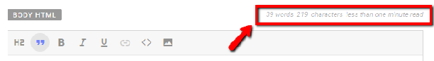

When assigning coverage, be sure to **assign it to a Desk**, and optionally to a specific user within that Desk. If you do not assign a Desk or coverage, and export the Planning Item, it will be created in the most recently assigned Desk.

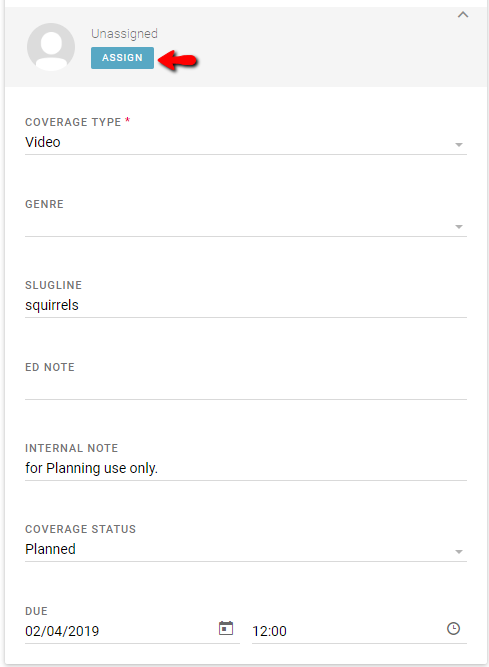

Click the ASSIGN button on the coverage section to select a specific Desk and assignee. Be sure to choose the type of coverage you want and the due date. Once you have entered all the details, be sure to hit the CREATE button to make the Planning Item.

##### Adding Coverage to the Assignments tab

You will need to add any assigned coverage to the workflow in order for it to be visible in the Assignments tab for your selected Desk or users. Find the coverage in the Planning Item editing pane, then use the action menu at the top of each coverage to select the ‘Add to Workflow’ option.

Once the coverage is added to the workflow, the coverage will appear as an assignment in the Assignments tab for the selected user.

#### Creating New Events

Like Planning Items, Events are also created in the Planning pane by clicking the Create icon in the top-right corner of the Planning pane.

Events are used to organize Planning Items. Once created, Events can be used to generate associated Planning Items. **Events can be created manually, or they can be ingested automatically from a Superdesk-external source**.

##### Automatically ingesting external Events

To configure an **automatic Event ingest feed**, click *Hamburger menu \> Settings \> Ingest* and then click the ADD NEW button in the top-right corner of the pane. [Read more about creating an Event ingest feed here.](#ingesting-news-items-and-events)

##### Manually creating Events

To **manually create an Event**, click the Create icon in the top-right corner of the Planning Pane.

In the Event creation pane, fill in as much information as possible:
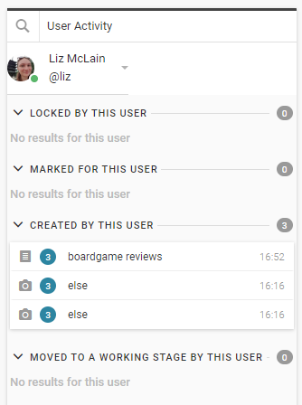

**Repeat toggle**: If the repeat toggle is active (blue), you can choose how often the Event occurs. Choose from options such as daily, every x days, weekly, every x weeks, once monthly, yearly etc.

**Event start / Event end**: These fields are required. Specify a start date. If you activate the *All Day* toggle (blue) you will not need to specify a start time or end time. The Event will run from midnight to midnight.

**Timezone:** If the Event is occuring in Japan, for example, you should specify Asia/Tokyo as the time zone.

**Slugline**: This is the main description for the Event. It will appear in bold in the Planning list view. Sluglines can be searched using the Planning Advanced Search icon at the top-left of the

**Event name**: The Event Name will appear beside the Event Slugline in the Planning list view.

**Description**: Use this field to give further details about the Planning Item.

**Occurrence Status (configurable)**: Choose options from a drop-down menu on how likely the Event is to occur.

**Calendars (Event Calendars):** Are controlled vocabularies created under Settings/Metadata to group events into certain categories like Sports, Entertainment or Politics for example.

**Location:** Define the Event location by typing in the textbox. Use the OPENSTREETMAP button to search suggested options based on the information you entered, or use the ADD NEW LOCATION button to add location details to your list of commonly used locations. The fields in the ADD NEW LOCATION pop-up sh own below:

  

**Contacts:** Contact details for the Event creator should be entered here. If the contact doesn’t automatically appear when you type their name, use the ADD NEW CONTACT button to create a new entry. The pop-up window is shown below:

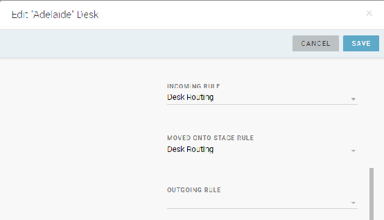

**Details**: The Details section of the Event creation pane allows you to add additional metadata details to your Event: category, subject, long description, internal note, editorial note.

**Attached files**: Attach reference files to give journalists and editors further information about the Event.

**External links**: Enter URLs as reference information for journalists and editors.

#### Events Action menu

Once your Event is created, you can create an associated Planning Item, using the action menu to the right of the Event entry in the Planning pane list view.

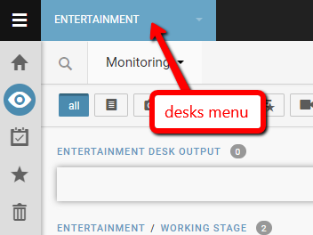

The action menu for each created Event is displayed below:

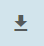

#### Export a Planning Item

Once you have created a Planning Item, you can export it to a Desk’s Monitoring view, in order to have your journalists begin work on the article.

**Step 1\)** In order to export an article from the Planning interface to a Monitoring view, close the Planning item, if it’s open.

**Step 2\)** Use the checkbox in the left-most column of the Planning view to select the item, as shown below:
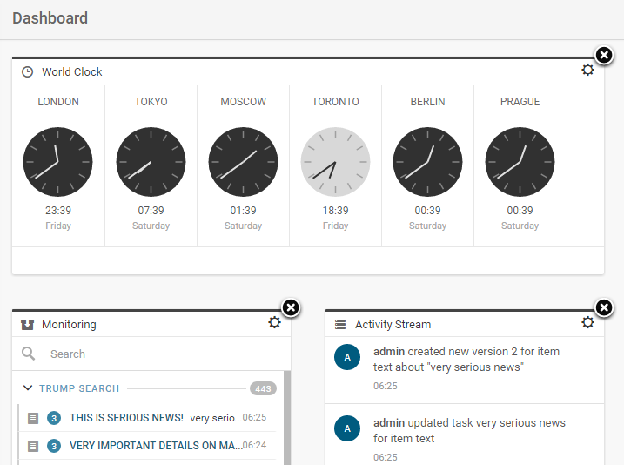

**Step 3\)** With the checkbox selected, click the EXPORT AS ARTICLE button to send the Planning Item to the Monitoring view. If you assigned coverage in the Planning Item to a Desk, the item will be created in that Desk. If you didn’t assign any coverage, the article will be created in the most recent Desk.

Alternatively, when you assign coverage to a specific Desk and user, they can create the article when they take control of the assignment.

#### Posting Events and Planning Items

Both Planning Items and Events can be posted. This means, depending on your setup, that your Planning Item or Event will be visible to your subscribers. In order to post an Event or Planning Item, you will need to open the item, and then click the green POST button at the top of the pane.

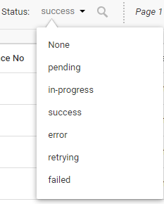

Once posted, you will see a green ‘p’ next to the item in the Planning list view.
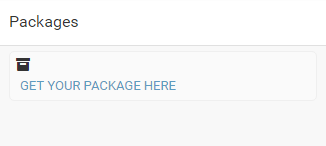
If you are editing the Event or Planning Item that you have created, you will see options to update or unpost the item.

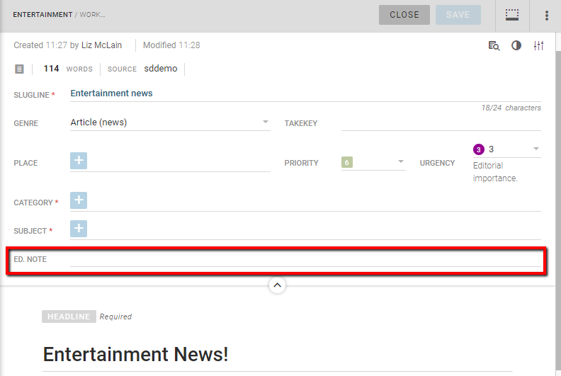

#### Assignments and Assigned Coverage

When you are assigned coverage via the Superdesk Planning Module, you can view your assigned tasks, and tasks that have been assigned to your Desk in the Assignments tab.

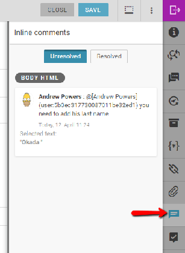 Assignments tab

You will notice two buttons at the top of the Assignments pane: Desk Assignments and My Assignments:

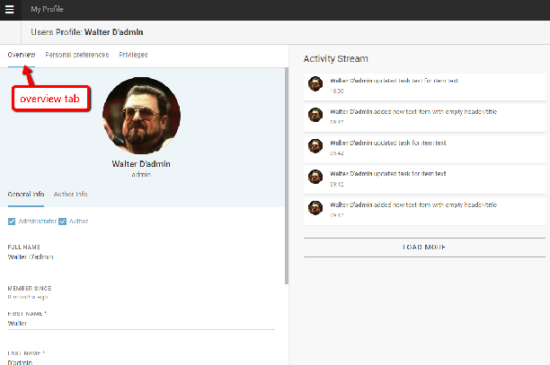

The Desk Assignments will vary depending on which Desk you are viewing. Be sure to check the current Desk, as noted by the Desks menu. In the example above, we are viewing the Desk Assignments in the World News Desk. The coverage that has been assigned to you directly is shown in the My Assignments list view. These are visible only to you.

Clicking on an item in the Assignments list view, will provide several options. The options may vary depending on your permissions and the state of the assignment:
 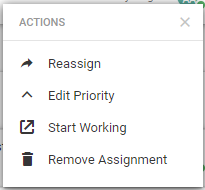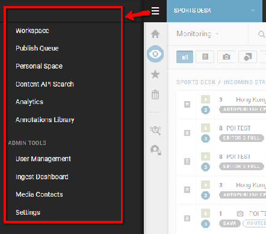

**Reassign:** If the task was assigned to you by mistake, or if you think the task was assigned to the wrong Desk, use this *Reassign* option to send the task to the correct location.

**Edit Priority:** As news stories unfold, sometimes it will become more important or less important. You can change the relative urgency of the Assignment here.

**Remove Assignment:** Choosing the *Remove Assignment* option will permanently delete the task, but the Planning Item will remain, with unassigned coverage. Removing the Assignment will also remove other linked Assignments. You will be prompted to confirm your choice to delete the Assignment in a pop-up window.

**Confirm Availability:** Choosing the Confirm Availability will send the Assignment to the *Completed* section of the Assignments pane.

**Start Working:** If you select the *Start Working* option, you will be required to select a template from the pop-up window, after which the item will be opened in the Editor pane, and the assignment status will be changed to *In Progress*.
