# Superdesk \- Glossary and Terminology Guide

**Action menu** \-  Designated by a line of three small dots, an action menu provides additional options for actions such as editing, deleting or fetching to a specific desk. Action menus appear throughout Superdesk. Clicking on an action menu will enable a pop-up menu with further options.

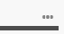 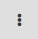    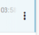

**Activity Stream \-** A Dashboard widget which tracks tasks and item progress across all Desks. It can be customised for the number of items displayed.

**Advanced Search icon** \-  The Advanced Search appears on the Search tab. Clicking on the Advanced Search icon allows you to define additional parameters for your search. The Advanced Search icon is shaped like a golf tee.

**Agenda** \- Agendas are part of the Superdesk Planning Module. They are used to organize Events into related groups. New Agendas can be created using the action menu in the top-right corner of the Planning pane.

**Analytics** \- An analytics module for Superdesk can be installed to measure publishing, desk activity and user activity. You can read more about that plug-in here:
[https://github.com/superdesk/superdesk-analytics\#archive-reports](https://github.com/superdesk/superdesk-analytics#archive-reports)

**Article** / **News Item / Content Item** \- These are generic terms for any content in Superdesk including text articles, photos, videos, packages, used throughout this manual.

**Byline \-** A metadata field on an article which usually contains the author’s name and the date of creation.

**Create icon** \- The Create icon is located in the top-right corner of the Superdesk interface. When on the Dashboard, it allows you to add widgets. From other Workspace Panel tabs, it allows you to create new items or import new items into Superdesk. Overall, the uses of the Create icon are context driven. You will see the uses of the Create icon vary in the settings menu and in the article editing window.
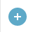

**Custom Workspace** \- Your Custom Workspace is a private desk configuration that you can create in the Desks menu. Custom Workspaces are a great way to create custom Monitoring and a private Dashboard to suit your needs. Items created in your Custom Workspace will show up in the Default Desk of the current user.

**Content Profile** \- You can set up content profiles in the settings section of the Settings menu. Content Profiles define the metadata fields for new item creation within Superdesk.

**Content Filter** \- Content Filters allow you to create a series of criteria through which Superdesk can narrow down the news items and create news item groupings. Content Filters allow you to build various Products for distribution. You can use any number of Filter Conditions, or Content Filters to automatically select the content for the Product. Content Filters are optional. If you choose not to use any Content Filters, every news item that you publish will be part of your Product.

**Dashboard** \- You can access your desk Dashboard by clicking on the house-shaped icon in the Superdesk Workspace Panel. Your Dashboard provides an overview of content and information with customisable Widgets. Dashboard widgets on desks are set up by the desk administrators. Custom Workspaces can be customised with their own widgets by each user for their individual needs.
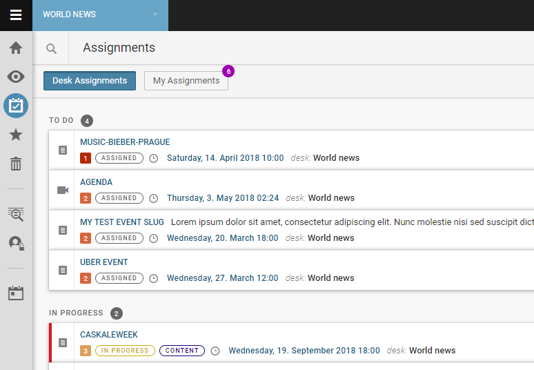

**Desks** \- Desks are the basic organisational unit within Superdesk. They are similar to topic desks, or news beats that would be found in a traditional newsroom; for example a sports desk, foreign news desk, entertainment desk, etc. The Desks menu is the blue drop-down menu found to the right of the Hamburger Menu icon. It always displays the name of the Desk you are currently working on. Users can only view the desks to which they are assigned. A single user can work on multiple desks.

**Destinations** \- Destinations are the *where* in the publishing process. You can have multiple destinations for a single Subscriber.

**Editor Sidebar** \- The toolbar that appears on the right-hand side of the Superdesk interface when an article editing window is open. Available tools may include Send To, Find and Replace, Packaging, Versioning, Comments, Suggestions and others. The availability of the icons in the Editor Sidebar is determined by the Content Profile you are using.

**Embargo** \- When an article is flagged with an embargo, it lets Superdesk users know that the article should not be published until a certain date and time. Note: The embargo does not actually prevent the article from being published before the flagged date.

**Events** \- Events are part of the Superdesk Planning Module interface. Events can either be created manually, or automatically ingested from a Superdesk-external Calendar.

**Fetch** \- The process of moving an article to a Desk. Usually specifically refers to moving an article from *Ingest* to a Desk.

**Flag**: Flags are coloured article status markers that appear beneath the headline denoting the status of an article. Examples include; Legal, Not for Publication, Ingest, Published, Killed, Takes, etc.

**Global Read \-** A toggle setting on a Desk stage or a Saved Search which allows it to be added to any Monitoring widget or Monitoring tab.

**Global Search \-** A Search that encompasses all the articles in Superdesk, other than articles created in Personal Spaces.

**Grid** / **list icon** \- The grid icon is found on the Search tab and in the Legal archive. Clicking on it allows you to change between a list view and thumbnail view. Thumbnail views are great for viewing images. Click on the list icon to switch back to the list view.
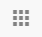

**GUID \-** This is a field in the Info section of the Editor Sidebar. It provides a unique global identifier for your item. It cannot be changed or edited. GUID identifiers can be used to test Content Filters.

**Hamburger Menu** \- Located in the top left corner of the Superdesk interface, the Hamburger Menu is a black and white. The items available in this menu will vary depending on your user role and permissions. This menu allows access to more advanced features such as Desk configuration, User Management, Ingest configuration and Superdesk-internal Analytics.
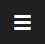

**Headline** \- The main idea of a story, presented in a few words. It’s usually presented in a larger font above the body of the news item.

**Highlights \-** Desk-specific curated lists of important articles. Commonly used for making top 10 lists, section features and other types of user-curated lists. Highlights can be automatically generated against user-specified metadata, or manually curated. Highlight lists can be easily published or simply used for Superdesk-internal communication of important news items.

**Ingest** \- As a verb, “Ingest” refers to the way in which articles from other news sources arrive or are imported into Superdesk. As a noun, the ingest refers to the list of articles that have arrived in Superdesk from external sources.

**Ingest feed** \- A search containing only newly ingested articles and news items.

**Ingest Source / Source** \- An Ingest Source is a feed from which Superdesk will bring in externally created news items.

**Kill** \- The rescinding / take-down of a news item that has been published \- or distributed to customers for publication \- usually due to legally problematic material. Killing a news item notifies all people who received it that it must not be used (and gives the reason why) and must be taken down if it has been published. The kill action removes the article content from everywhere except the Legal Archive (provided your version of Superdesk contains that feature).

**Macro** \- A specific set of rules and transformations that are applied to an article. Macros can be applied while editing an article. Macros are created in the backend.

**Metadata** \- Metadata is information about news items and articles in Superdesk. This information, which is attached to all items, may include fields like:
Slugline \- a Superdesk-internal article description which appears adjacent to the headline.
Priority \- a news value rating between 1 and 6\. A value of 1 means it has the highest value.
Urgency \- a rating between 1 and 6 on the relative significance of an article. 1 is the highest.
Genre \- a drop-down menu to select an article type, for example: interview, analysis, feature.
Place \- a drop-down menu for where the article is being written.
Subject \- a drop-down menu for selecting the topic, for example: politics, arts, sports, health.
The more complete your metadata is, the easier it will be to search for and update it.

**Monitoring** \- Monitoring refers to a tab in the Workspace Panel. Monitoring for desks is set up by the desk administrator. The Monitoring tab can be set up to show desk Stages and Saved Searches. The Monitoring tab in the Custom Workspace can be individually adjusted to monitor several desk stages or saved searched in one spot.

**Monitoring Widget** \- A Dashboard widget which can be adjusted to show desk Stages and Saved Searches. It can be used on desks, or custom workspace Dashboards.

**Multiedit** \- A feature in Superdesk which allows you to have more than one article open at the same time, side by side.

**Open Items icon** \- Located in the bottom left corner of the Superdesk interface, clicking on the Open Items icon will bring you to a grid view of all your open items.
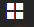

**Output** \- Articles from a desk that are ready to be published. Output rules can be applied to these articles.

**Package** \- A number of items (articles and/or images) that Superdesk users can group together. Packages can be published as a single item. Packages have their own metadata outside of the metadata attached to their individual components.

**Personal Items** \- Articles or Items that have been created in your Personal Space. These articles are private until sent to a Desk. Items created in your Personal Space will not show up in Global Searches.

**Planning Item** \- Planning Items are part of the Superdesk Planning Module interface. Planning items are used to assign coverage to specific desks or users. They can be generated from Events, or they can be created manually. Each Planning Item can contain several pieces of coverage, each assigned to a different user. Planning Items can be exported from the Planning pane to generate articles within the assigned Desk.

**Personal Space** \- Each user has a Personal Space in which they can create Personal Items. You can access the Personal Space from either the Hamburger menu, or the Personal Space icon in the Workspace Panel. The Personal Space is available independently from the Custom Workspace.

**Products \-** Products can be thought of as another layer of Content Filters. A typical Product might be the same as the application of Content Filter before an item gets published. However within the Products interface in Superdesk, you can further define the Product by adding territorial restrictions. A Product that has no Content Filters applied will contain every item that is published in your instance of Superdesk.

**Publish** \- The act of sending a completed item to your subscribers. News items can be published across multiple formats.

**Publishing queue** \- A section in the settings menu which contains a list of published items and the publish destination (clients). If an article failed to publish successfully, you will see that recorded in the publishing queue and you have the option to resend the item from the Publishing Queue tab.

**Pyramid icon** \- The pyramid icon is found in the Monitoring view and in the Search tab beside the *Sort* drop-down menu. It allows you to reverse the order in which a list appears based on your *Sort* criteria. The inverted pyramid allows you to switch back to the previous view.
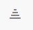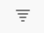

**Roles** \- A role is your designated job within Superdesk. Your role comes with a set of privileges and permissions. Some examples of roles are: journalist, editor, manager, reporter, bureau-chief, copytaker, producer, etc. Permissions for each role are customisable from the Settings menu.

**Saved Search \-** A Saved Search is a set of parameters which have been generated by a user in Superdesk to find articles. Saved Searches can be displayed in Monitoring Widgets and Monitoring tabs on desks if the Global Read toggle is set to the on position.

**Subscribers \-** Subscribers are customers. Each Subscriber can receive a mixture of Products, to any number of Destinations. A Subscriber can also be another distribution system or systems. For a digital publisher, the Subscriber can be a website, mobile app or other asset.

**Superdesk Publisher \-** Superdesk Publisher is a lightweight open source renderer for news articles and other content delivered via an API feed. It was designed to work with Superdesk. Superdesk Publisher serves as a central dashboard to route and manage content flow to all of your media assets. Your overview of content is continuously updated in real time throughout its lifecycle.

**Slugline** \- While articles are in production, it is common practice for journalists to designate them with a short name or “slug” to describe the article story or subject. In the article editing window, users can enter this name in the slugline text box. Note that sluglines are Superdesk-internal and do not appear in the published version of an article. Sluglines can be used for grouping Related Items.

**Spike** \- Spiking removes articles from the desk workflow. Spiked articles aren’t deleted, but are moved to the Spiked Items section of that desk. You can’t spike items that are locked or currently open. To view a Desk’s spike, click on the trash icon in the Workspace Panel.

**Stage** \- In Superdesk, content within desks are divided into Stages. Usually there’s an input area to which articles are fetched, an area for newly created items, an area for editing, an area for published items, etc. These areas are called Stages. Stage names (i.e. input, output, etc.) are defined by the desk administrator and can be unique to each Desk.

**Take** \- A take is a piece of a story, often written as the story unfolds. Selecting the New Take option creates a news item with the same headline, slugline and metadata but the body text is blank.Takes are numbered using the sequential takekey numbers as new takes are created. A take can be created from any text item, even after it has been published. Takes cannot be created for packages or media other than plain text.

**Takekey** \- For articles that are broken up into more than one piece, the takekey number indicates the order in which they should be delivered. A higher number indicates a later part of the article. The takekey text box is also modified for articles that have been updated. For articles that aren’t broken up into takes, the takekey number is blank.

**Username** \- Superdesk users log in using their username. Usernames are chosen at the time of profile creation. Comments directed towards a particular user can use @*username* to tag the user in a comment. Once the user profile is created, the username cannot be changed.

**User icon** \- The user icon is a round icon found in the top-right corner of the Superdesk interface. Clicking a user icon enables the editing of your user profile and the option to log out of Superdesk. You can customise the image in your user icon by editing it in your profile. By default, your user icon is a blue circle containing your initials. If you have new system notifications, you will see a light blue numbered bubble attached to your user icon.
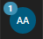

**Widget** \- Widgets are tools that you can place on your Superdesk Dashboard. They allow for a quick overview of information and content. There are four different types of widgets available: Monitoring, Ingest, World Clock and Activity Stream. You can customise your personal Dashboard in your Custom Workspace. Shared desk Dashboards are usually configured with Widgets by the admin and each user on the Desk will see the same configuration of Widgets..

**Workspace Panel** \- The Workspace Panel is the column of icons along the left side of the Superdesk interface. From top to bottom: Dashboard, Monitoring, Highlights, Tasks, Spike, Personal Space, Search, etc..
